# 8. Workflow diagrams

> **In this chapter:** every flowchart in this handbook in one place, with the roles involved and where the workflow
> is explained. **Who should read it:** anyone who wants the big picture of how work flows through PeopleOS.

> **Note.** This file is generated from the flowcharts in the other chapters (the source of truth). The diagrams
> follow the business rules implemented in the application; each chapter explains the steps in detail.

PeopleOS documentation contains **40 flowcharts**.

| # | Flowchart | Chapter |
|---|---|---|
| 1 | From purchase to first successful use | [Your complete guide to buying and getting started](02-buyer-guide.md) |
| 2 | From organisation creation to daily use | [Getting started](03-getting-started.md) |
| 3 | Signing in and what you can see | [Your workspace: signing in, Home, My work and approvals](modules/01-workspace-and-self-service.md) |
| 4 | First sign-in from an invitation | [Your workspace: signing in, Home, My work and approvals](modules/01-workspace-and-self-service.md) |
| 5 | Resetting a forgotten password | [Your workspace: signing in, Home, My work and approvals](modules/01-workspace-and-self-service.md) |
| 6 | Deciding an item in the Approval Center | [Your workspace: signing in, Home, My work and approvals](modules/01-workspace-and-self-service.md) |
| 7 | Hiring a new employee and onboarding | [People and the employee lifecycle](modules/02-people-and-employee-lifecycle.md) |
| 8 | Employee lifecycle states | [People and the employee lifecycle](modules/02-people-and-employee-lifecycle.md) |
| 9 | Bulk import of employees | [People and the employee lifecycle](modules/02-people-and-employee-lifecycle.md) |
| 10 | Issuing a letter | [People and the employee lifecycle](modules/02-people-and-employee-lifecycle.md) |
| 11 | Exit and full and final settlement | [People and the employee lifecycle](modules/02-people-and-employee-lifecycle.md) |
| 12 | Requesting and approving leave | [Time and leave: attendance, shifts, holidays and leave](modules/03-time-and-leave.md) |
| 13 | How a leave balance is calculated | [Time and leave: attendance, shifts, holidays and leave](modules/03-time-and-leave.md) |
| 14 | From punch to attendance record to exception and regularisation | [Time and leave: attendance, shifts, holidays and leave](modules/03-time-and-leave.md) |
| 15 | Setting up time and leave for a new location | [Time and leave: attendance, shifts, holidays and leave](modules/03-time-and-leave.md) |
| 16 | Monthly payroll run | [Pay: payroll, compensation and statutory compliance](modules/04-payroll-compensation-and-compliance.md) |
| 17 | Employee tax declaration and proof | [Pay: payroll, compensation and statutory compliance](modules/04-payroll-compensation-and-compliance.md) |
| 18 | Compensation change approval | [Pay: payroll, compensation and statutory compliance](modules/04-payroll-compensation-and-compliance.md) |
| 19 | Preparing a statutory return | [Pay: payroll, compensation and statutory compliance](modules/04-payroll-compensation-and-compliance.md) |
| 20 | Performance cycle from launch to acknowledgement | [Growth: performance, learning, skills and talent](modules/05-performance-learning-and-talent.md) |
| 21 | Setting goals and checking in | [Growth: performance, learning, skills and talent](modules/05-performance-learning-and-talent.md) |
| 22 | Learning: from assignment or request to certificate | [Growth: performance, learning, skills and talent](modules/05-performance-learning-and-talent.md) |
| 23 | Succession planning for a critical position | [Growth: performance, learning, skills and talent](modules/05-performance-learning-and-talent.md) |
| 24 | Setting up your organisation structure (recommended order) | [Organisation, workforce planning and assets](modules/06-organisation-workforce-and-assets.md) |
| 25 | Position, vacancy and hire | [Organisation, workforce planning and assets](modules/06-organisation-workforce-and-assets.md) |
| 26 | Headcount plan approval | [Organisation, workforce planning and assets](modules/06-organisation-workforce-and-assets.md) |
| 27 | Asset lifecycle | [Organisation, workforce planning and assets](modules/06-organisation-workforce-and-assets.md) |
| 28 | An HR service request from submission to closure | [Services and communication: My HR, service desk, grievances, announcements and surveys](modules/07-services-and-communication.md) |
| 29 | Raising and handling a grievance | [Services and communication: My HR, service desk, grievances, announcements and surveys](modules/07-services-and-communication.md) |
| 30 | Publishing an announcement that needs acknowledgement | [Services and communication: My HR, service desk, grievances, announcements and surveys](modules/07-services-and-communication.md) |
| 31 | Running an employee survey | [Services and communication: My HR, service desk, grievances, announcements and surveys](modules/07-services-and-communication.md) |
| 32 | What a Workforce pulse drill-down shows you | [Insights: analytics, reports, audit trail and AI assistance](modules/08-insights-analytics-and-ai.md) |
| 33 | Building, running and scheduling a report | [Insights: analytics, reports, audit trail and AI assistance](modules/08-insights-analytics-and-ai.md) |
| 34 | Investigating a change with the audit trail | [Insights: analytics, reports, audit trail and AI assistance](modules/08-insights-analytics-and-ai.md) |
| 35 | How an AI answer is produced | [Insights: analytics, reports, audit trail and AI assistance](modules/08-insights-analytics-and-ai.md) |
| 36 | Inviting a user and giving access | [Administration: users, roles, configuration, security and integrations](modules/09-administration-and-security.md) |
| 37 | Changing configuration through the Change Centre | [Administration: users, roles, configuration, security and integrations](modules/09-administration-and-security.md) |
| 38 | Designing and running a workflow | [Administration: users, roles, configuration, security and integrations](modules/09-administration-and-security.md) |
| 39 | Requesting a full data export | [Administration: users, roles, configuration, security and integrations](modules/09-administration-and-security.md) |
| 40 | Setting up a new organisation | [Administrator guide](07-administrator-guide.md) |

## 8.1 From purchase to first successful use

*From:* [Your complete guide to buying and getting started](02-buyer-guide.md)

The real path an organisation follows today; organisation creation and invitations are done by Markedge. *Roles:* buyer, Markedge, first administrator, HR, managers, employees. *Starts:* evaluation. *Ends:* daily use of PeopleOS.



Mermaid source

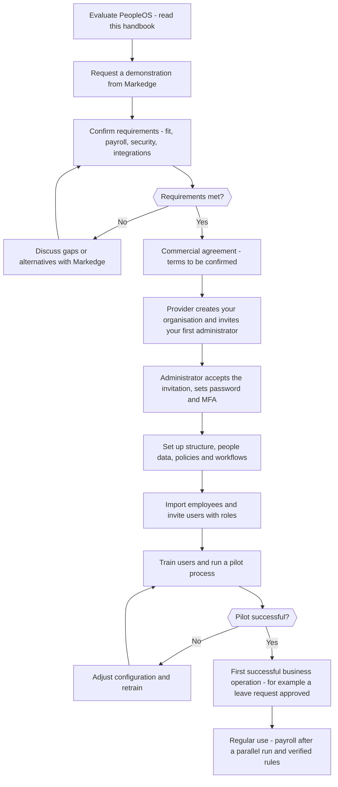
```mermaid
flowchart TD
    A["Evaluate PeopleOS - read this handbook"] --> B["Request a demonstration from Markedge"]
    B --> C["Confirm requirements - fit, payroll, security, integrations"]
    C --> D{{"Requirements met?"}}
    D -- "No" --> E["Discuss gaps or alternatives with Markedge"]
    E --> C
    D -- "Yes" --> F["Commercial agreement - terms to be confirmed"]
    F --> G["Provider creates your organisation and invites your first administrator"]
    G --> H["Administrator accepts the invitation, sets password and MFA"]
    H --> I["Set up structure, people data, policies and workflows"]
    I --> J["Import employees and invite users with roles"]
    J --> K["Train users and run a pilot process"]
    K --> L{{"Pilot successful?"}}
    L -- "No" --> M["Adjust configuration and retrain"]
    M --> K
    L -- "Yes" --> N["First successful business operation - for example a leave request approved"]
    N --> O["Regular use - payroll after a parallel run and verified rules"]
```

## 8.2 From organisation creation to daily use

*From:* [Getting started](03-getting-started.md)

How a new organisation goes from creation to its first approved request. *Roles:* Markedge, first administrator, HR, employees, managers. *Starts:* Markedge creates the organisation. *Ends:* daily use. *Exception path:* an expired invitation is re-sent.



Mermaid source

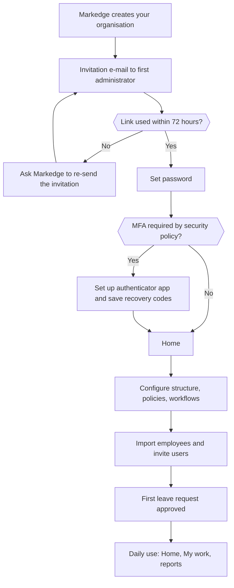
```mermaid
flowchart TD
    A["Markedge creates your organisation"] --> B["Invitation e-mail to first administrator"]
    B --> C{{"Link used within 72 hours?"}}
    C -- "No" --> D["Ask Markedge to re-send the invitation"]
    D --> B
    C -- "Yes" --> E["Set password"]
    E --> F{{"MFA required by security policy?"}}
    F -- "Yes" --> G["Set up authenticator app and save recovery codes"]
    F -- "No" --> H["Home"]
    G --> H
    H --> I["Configure structure, policies, workflows"]
    I --> J["Import employees and invite users"]
    J --> K["First leave request approved"]
    K --> L["Daily use: Home, My work, reports"]
```

## 8.3 Signing in and what you can see

*From:* [Your workspace: signing in, Home, My work and approvals](modules/01-workspace-and-self-service.md)

What happens between the sign-in page and Home. *Roles:* everyone. *Starts:* you open the sign-in page. *Ends:* Home opens, composed for your role.



Mermaid source

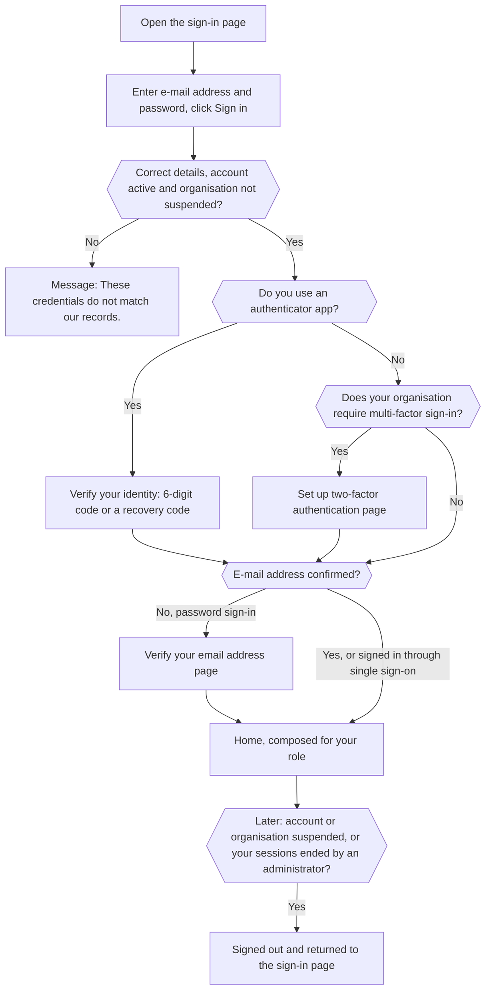
```mermaid
flowchart TD
    A["Open the sign-in page"] --> B["Enter e-mail address and password, click Sign in"]
    B --> C{{"Correct details, account active and organisation not suspended?"}}
    C -- "No" --> D["Message: These credentials do not match our records."]
    C -- "Yes" --> E{{"Do you use an authenticator app?"}}
    E -- "Yes" --> F["Verify your identity: 6-digit code or a recovery code"]
    E -- "No" --> G{{"Does your organisation require multi-factor sign-in?"}}
    G -- "Yes" --> H["Set up two-factor authentication page"]
    G -- "No" --> J{{"E-mail address confirmed?"}}
    F --> J
    H --> J
    J -- "No, password sign-in" --> K["Verify your email address page"]
    J -- "Yes, or signed in through single sign-on" --> L["Home, composed for your role"]
    K --> L
    L --> M{{"Later: account or organisation suspended, or your sessions ended by an administrator?"}}
    M -- "Yes" --> N["Signed out and returned to the sign-in page"]
```

## 8.4 First sign-in from an invitation

*From:* [Your workspace: signing in, Home, My work and approvals](modules/01-workspace-and-self-service.md)

*Roles:* administrator, new user. *Starts:* the administrator creates the user. *Ends:* the new user reaches Home.



Mermaid source

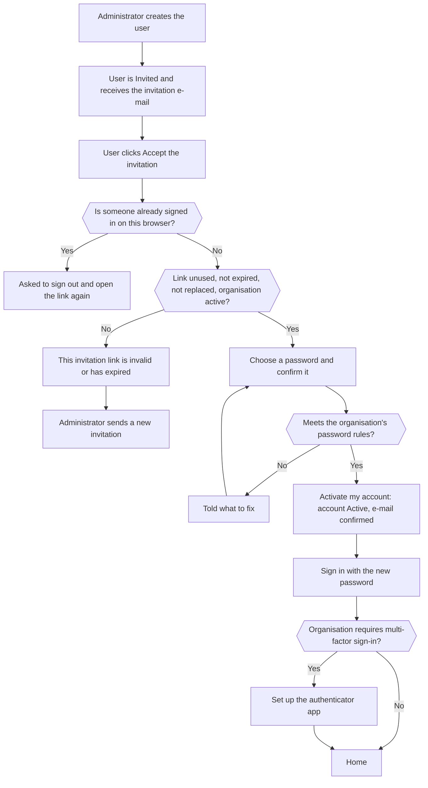
```mermaid
flowchart TD
    A["Administrator creates the user"] --> B["User is Invited and receives the invitation e-mail"]
    B --> C["User clicks Accept the invitation"]
    C --> D{{"Is someone already signed in on this browser?"}}
    D -- "Yes" --> E["Asked to sign out and open the link again"]
    D -- "No" --> F{{"Link unused, not expired, not replaced, organisation active?"}}
    F -- "No" --> G["This invitation link is invalid or has expired"]
    G --> G2["Administrator sends a new invitation"]
    F -- "Yes" --> H["Choose a password and confirm it"]
    H --> I{{"Meets the organisation's password rules?"}}
    I -- "No" --> J["Told what to fix"]
    J --> H
    I -- "Yes" --> K["Activate my account: account Active, e-mail confirmed"]
    K --> L["Sign in with the new password"]
    L --> M{{"Organisation requires multi-factor sign-in?"}}
    M -- "Yes" --> N["Set up the authenticator app"]
    M -- "No" --> O["Home"]
    N --> O
```

## 8.5 Resetting a forgotten password

*From:* [Your workspace: signing in, Home, My work and approvals](modules/01-workspace-and-self-service.md)

*Roles:* any user. *Starts:* Forgot password? on the sign-in page. *Ends:* the user signs in with the new password.



Mermaid source

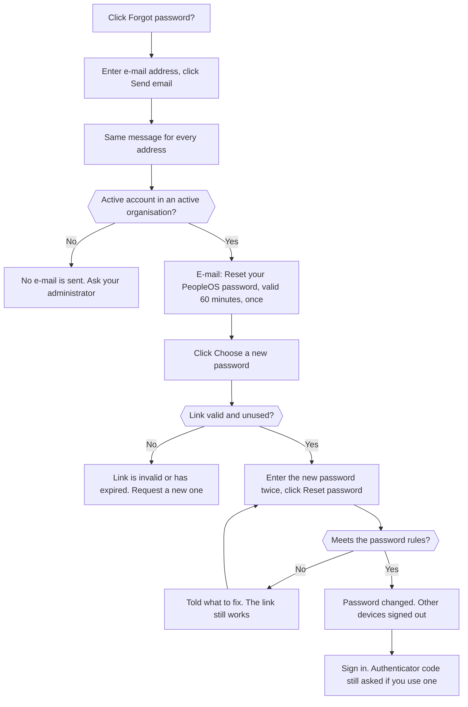
```mermaid
flowchart TD
    A["Click Forgot password?"] --> B["Enter e-mail address, click Send email"]
    B --> C["Same message for every address"]
    C --> D{{"Active account in an active organisation?"}}
    D -- "No" --> E["No e-mail is sent. Ask your administrator"]
    D -- "Yes" --> F["E-mail: Reset your PeopleOS password, valid 60 minutes, once"]
    F --> G["Click Choose a new password"]
    G --> H{{"Link valid and unused?"}}
    H -- "No" --> I["Link is invalid or has expired. Request a new one"]
    H -- "Yes" --> J["Enter the new password twice, click Reset password"]
    J --> K{{"Meets the password rules?"}}
    K -- "No" --> L["Told what to fix. The link still works"]
    L --> J
    K -- "Yes" --> M["Password changed. Other devices signed out"]
    M --> N["Sign in. Authenticator code still asked if you use one"]
```

## 8.6 Deciding an item in the Approval Center

*From:* [Your workspace: signing in, Home, My work and approvals](modules/01-workspace-and-self-service.md)

*Roles:* manager, HR, payroll or administrator (approver); employee (requester). *Starts:* a request needs your decision. *Ends:* the decision is applied by the owning module and the requester can see it.



Mermaid source

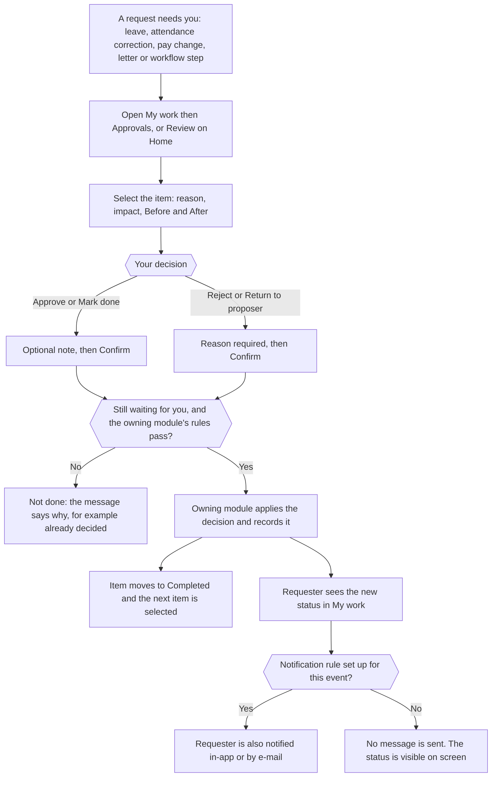
```mermaid
flowchart TD
    A["A request needs you: leave, attendance correction, pay change, letter or workflow step"] --> B["Open My work then Approvals, or Review on Home"]
    B --> C["Select the item: reason, impact, Before and After"]
    C --> D{{"Your decision"}}
    D -- "Approve or Mark done" --> E["Optional note, then Confirm"]
    D -- "Reject or Return to proposer" --> F["Reason required, then Confirm"]
    E --> G{{"Still waiting for you, and the owning module's rules pass?"}}
    F --> G
    G -- "No" --> H["Not done: the message says why, for example already decided"]
    G -- "Yes" --> I["Owning module applies the decision and records it"]
    I --> J["Item moves to Completed and the next item is selected"]
    I --> K["Requester sees the new status in My work"]
    K --> L{{"Notification rule set up for this event?"}}
    L -- "Yes" --> M["Requester is also notified in-app or by e-mail"]
    L -- "No" --> N["No message is sent. The status is visible on screen"]
```

## 8.7 Hiring a new employee and onboarding

*From:* [People and the employee lifecycle](modules/02-people-and-employee-lifecycle.md)

What happens from the hire wizard to a finished onboarding checklist. *Roles:* HR (Tenant HR Admin, HR Manager, HR Executive), the new employee, their manager. *Starts:* HR clicks **Hire employee**. *Ends:* the onboarding plan is Completed.



Mermaid source

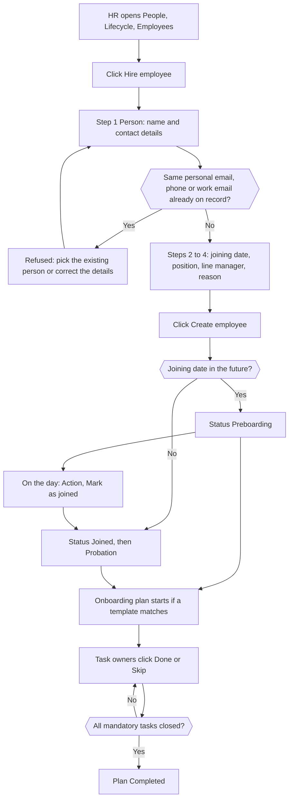
```mermaid
flowchart TD
    A["HR opens People, Lifecycle, Employees"] --> B["Click Hire employee"]
    B --> C["Step 1 Person: name and contact details"]
    C --> D{{"Same personal email, phone or work email already on record?"}}
    D -- "Yes" --> E["Refused: pick the existing person or correct the details"]
    E --> C
    D -- "No" --> F["Steps 2 to 4: joining date, position, line manager, reason"]
    F --> G["Click Create employee"]
    G --> H{{"Joining date in the future?"}}
    H -- "Yes" --> I["Status Preboarding"]
    H -- "No" --> J["Status Joined, then Probation"]
    I --> K["On the day: Action, Mark as joined"]
    K --> J
    I --> L["Onboarding plan starts if a template matches"]
    J --> L
    L --> M["Task owners click Done or Skip"]
    M --> N{{"All mandatory tasks closed?"}}
    N -- "Yes" --> O["Plan Completed"]
    N -- "No" --> M
```

## 8.8 Employee lifecycle states

*From:* [People and the employee lifecycle](modules/02-people-and-employee-lifecycle.md)

The main moves PeopleOS allows. The table below lists every allowed move. *Roles:* Tenant HR Admin, HR Manager; some moves are made by PeopleOS itself. *Starts:* a hire or a pre-employee record. *Ends:* Alumni (a former employee can return to Active).



Mermaid source

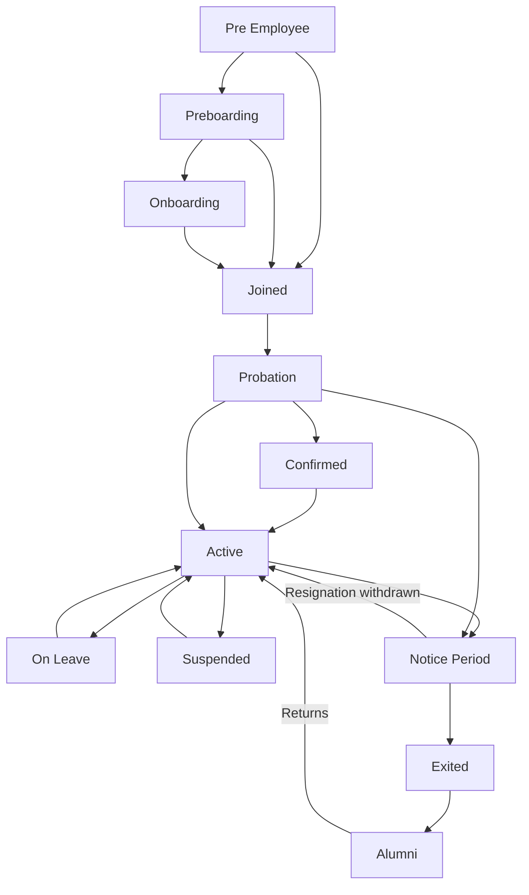
```mermaid
flowchart TD
    PE["Pre Employee"] --> PB["Preboarding"]
    PE --> JN["Joined"]
    PB --> OB["Onboarding"]
    PB --> JN
    OB --> JN
    JN --> PR["Probation"]
    PR --> CF["Confirmed"]
    CF --> AC["Active"]
    PR --> AC
    AC --> OL["On Leave"]
    OL --> AC
    AC --> SU["Suspended"]
    SU --> AC
    AC --> NP["Notice Period"]
    PR --> NP
    NP -- "Resignation withdrawn" --> AC
    NP --> EX["Exited"]
    EX --> AL["Alumni"]
    AL -- "Returns" --> AC
```

## 8.9 Bulk import of employees

*From:* [People and the employee lifecycle](modules/02-people-and-employee-lifecycle.md)

The designed steps of an import. *Roles:* Tenant HR Admin or Account Owner. *Starts:* **Upload CSV**. *Ends:* the import is **imported**, or **discarded**.



Mermaid source

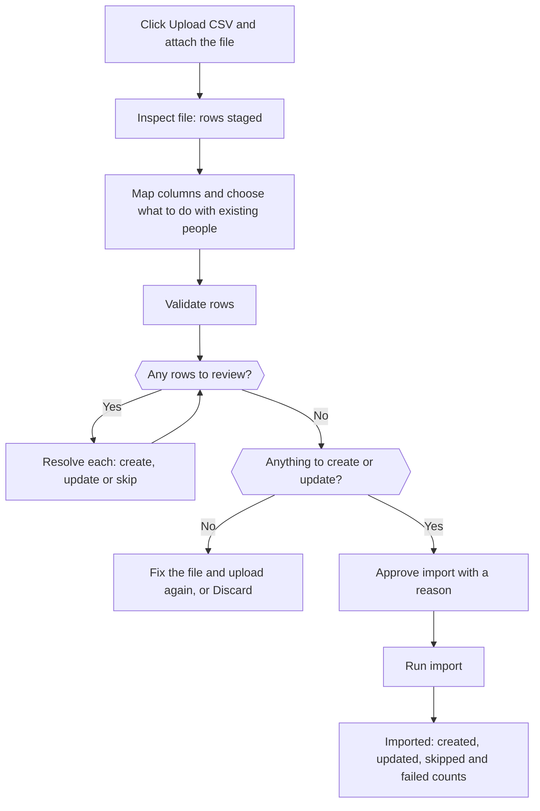
```mermaid
flowchart TD
    A["Click Upload CSV and attach the file"] --> B["Inspect file: rows staged"]
    B --> C["Map columns and choose what to do with existing people"]
    C --> D["Validate rows"]
    D --> E{{"Any rows to review?"}}
    E -- "Yes" --> F["Resolve each: create, update or skip"]
    F --> E
    E -- "No" --> G{{"Anything to create or update?"}}
    G -- "No" --> H["Fix the file and upload again, or Discard"]
    G -- "Yes" --> I["Approve import with a reason"]
    I --> J["Run import"]
    J --> K["Imported: created, updated, skipped and failed counts"]
```

## 8.10 Issuing a letter

*From:* [People and the employee lifecycle](modules/02-people-and-employee-lifecycle.md)

*Roles:* HR (Tenant HR Admin, HR Manager); a second HR person approves. *Starts:* **Generate letter**. *Ends:* the letter is **Issued** (or **Rejected**).



Mermaid source

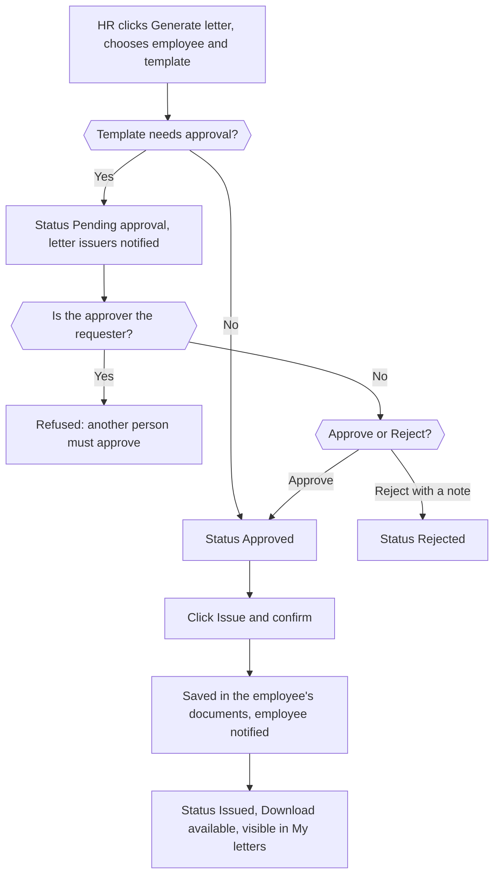
```mermaid
flowchart TD
    A["HR clicks Generate letter, chooses employee and template"] --> B{{"Template needs approval?"}}
    B -- "No" --> C["Status Approved"]
    B -- "Yes" --> D["Status Pending approval, letter issuers notified"]
    D --> E{{"Is the approver the requester?"}}
    E -- "Yes" --> F["Refused: another person must approve"]
    E -- "No" --> G{{"Approve or Reject?"}}
    G -- "Reject with a note" --> R["Status Rejected"]
    G -- "Approve" --> C
    C --> H["Click Issue and confirm"]
    H --> I["Saved in the employee's documents, employee notified"]
    I --> J["Status Issued, Download available, visible in My letters"]
```

## 8.11 Exit and full and final settlement

*From:* [People and the employee lifecycle](modules/02-people-and-employee-lifecycle.md)

*Roles:* HR (Tenant HR Admin, HR Manager), the employee, the line manager and the clearance owners. *Starts:* **Initiate exit** or **Resign**. *Ends:* the employee is Exited, or Alumni once the profile is created.



Mermaid source

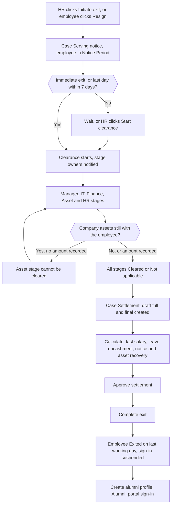
```mermaid
flowchart TD
    A["HR clicks Initiate exit, or employee clicks Resign"] --> B["Case Serving notice, employee in Notice Period"]
    B --> C{{"Immediate exit, or last day within 7 days?"}}
    C -- "No" --> D["Wait, or HR clicks Start clearance"]
    D --> E["Clearance starts, stage owners notified"]
    C -- "Yes" --> E
    E --> F["Manager, IT, Finance, Asset and HR stages"]
    F --> G{{"Company assets still with the employee?"}}
    G -- "Yes, no amount recorded" --> H["Asset stage cannot be cleared"]
    H --> F
    G -- "No, or amount recorded" --> I["All stages Cleared or Not applicable"]
    I --> J["Case Settlement, draft full and final created"]
    J --> K["Calculate: last salary, leave encashment, notice and asset recovery"]
    K --> L["Approve settlement"]
    L --> M["Complete exit"]
    M --> N["Employee Exited on last working day, sign-in suspended"]
    N --> O["Create alumni profile: Alumni, portal sign-in"]
```

## 8.12 Requesting and approving leave

*From:* [Time and leave: attendance, shifts, holidays and leave](modules/03-time-and-leave.md)

How a leave request moves from the form to a decision. *Roles:* employee, manager or HR. *Starts:* the employee clicks **Request leave**. *Ends:* the request is approved, rejected or cancelled.



Mermaid source

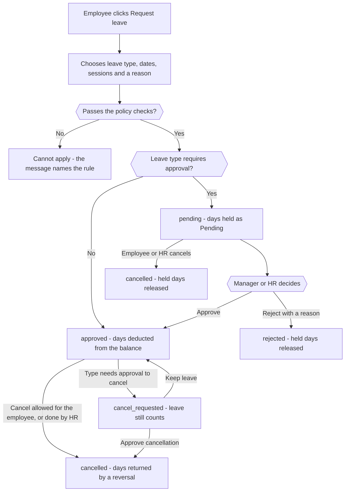
```mermaid
flowchart TD
    A["Employee clicks Request leave"] --> B["Chooses leave type, dates, sessions and a reason"]
    B --> C{{"Passes the policy checks?"}}
    C -- "No" --> D["Cannot apply - the message names the rule"]
    C -- "Yes" --> E{{"Leave type requires approval?"}}
    E -- "No" --> G["approved - days deducted from the balance"]
    E -- "Yes" --> F["pending - days held as Pending"]
    F --> H{{"Manager or HR decides"}}
    H -- "Approve" --> G
    H -- "Reject with a reason" --> I["rejected - held days released"]
    F -- "Employee or HR cancels" --> J["cancelled - held days released"]
    G -- "Cancel allowed for the employee, or done by HR" --> K["cancelled - days returned by a reversal"]
    G -- "Type needs approval to cancel" --> L["cancel_requested - leave still counts"]
    L -- "Approve cancellation" --> K
    L -- "Keep leave" --> G
```

## 8.13 How a leave balance is calculated

*From:* [Time and leave: attendance, shifts, holidays and leave](modules/03-time-and-leave.md)

Every number in Balances is the sum of ledger entries for one person, leave type and leave year. *Roles:* none (automatic). *Starts:* any ledger entry. *Ends:* the Available figure the employee sees.



Mermaid source

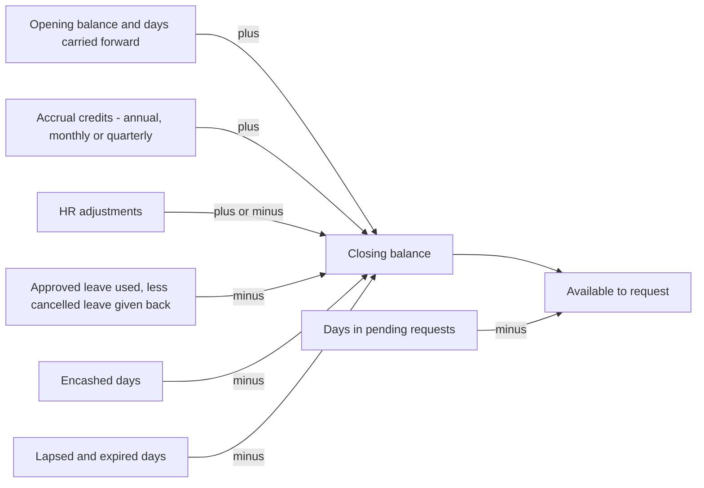
```mermaid
flowchart LR
    A["Opening balance and days carried forward"] -- "plus" --> X["Closing balance"]
    B["Accrual credits - annual, monthly or quarterly"] -- "plus" --> X
    C["HR adjustments"] -- "plus or minus" --> X
    D["Approved leave used, less cancelled leave given back"] -- "minus" --> X
    E["Encashed days"] -- "minus" --> X
    F["Lapsed and expired days"] -- "minus" --> X
    X --> Y["Available to request"]
    P["Days in pending requests"] -- "minus" --> Y
```

## 8.14 From punch to attendance record to exception and regularisation

*From:* [Time and leave: attendance, shifts, holidays and leave](modules/03-time-and-leave.md)

*Roles:* employee, manager or HR, attendance administrator. *Starts:* a punch arrives. *Ends:* the day is complete, or corrected and recalculated.



Mermaid source

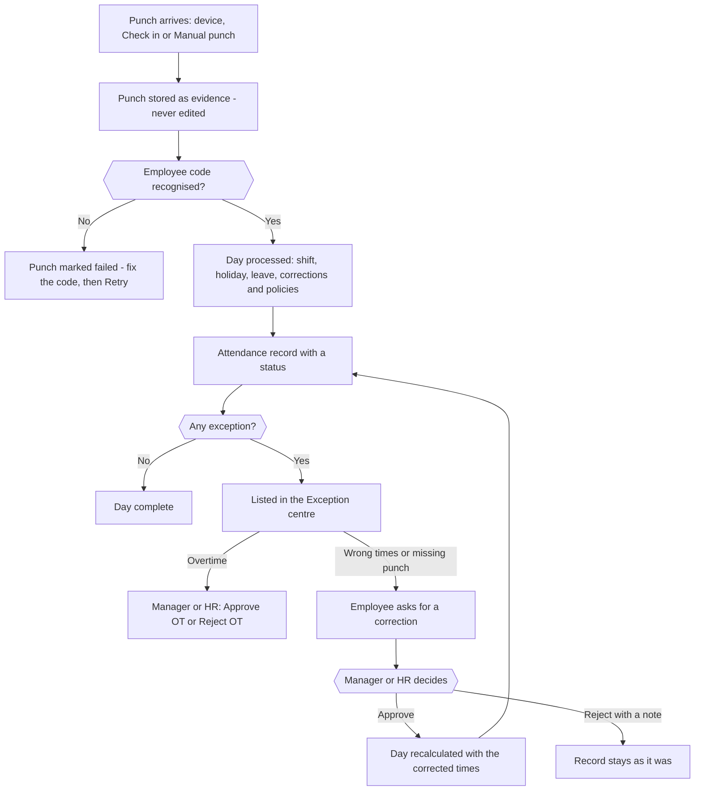
```mermaid
flowchart TD
    A["Punch arrives: device, Check in or Manual punch"] --> B["Punch stored as evidence - never edited"]
    B --> C{{"Employee code recognised?"}}
    C -- "No" --> D["Punch marked failed - fix the code, then Retry"]
    C -- "Yes" --> E["Day processed: shift, holiday, leave, corrections and policies"]
    E --> F["Attendance record with a status"]
    F --> G{{"Any exception?"}}
    G -- "No" --> H["Day complete"]
    G -- "Yes" --> I["Listed in the Exception centre"]
    I -- "Overtime" --> N["Manager or HR: Approve OT or Reject OT"]
    I -- "Wrong times or missing punch" --> J["Employee asks for a correction"]
    J --> K{{"Manager or HR decides"}}
    K -- "Approve" --> L["Day recalculated with the corrected times"]
    K -- "Reject with a note" --> M["Record stays as it was"]
    L --> F
```

## 8.15 Setting up time and leave for a new location

*From:* [Time and leave: attendance, shifts, holidays and leave](modules/03-time-and-leave.md)

*Roles:* Tenant HR Admin, Attendance Admin. *Starts:* the location exists in Organisation. *Ends:* employees there can request leave and their attendance is calculated.



Mermaid source

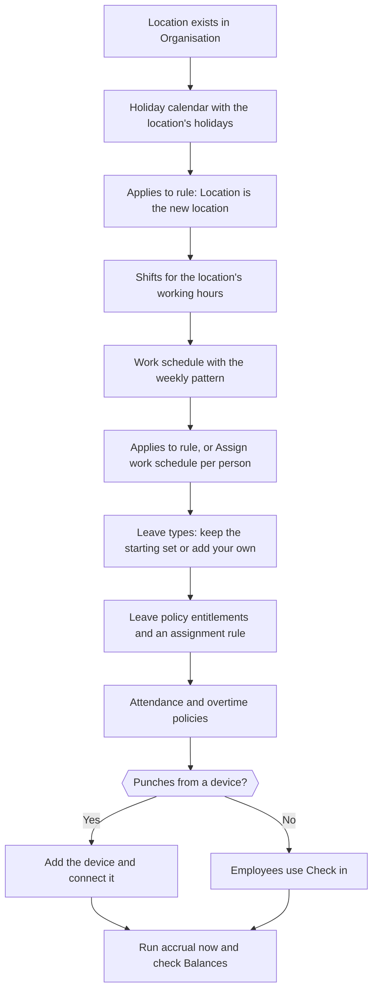
```mermaid
flowchart TD
    A["Location exists in Organisation"] --> B["Holiday calendar with the location's holidays"]
    B --> C["Applies to rule: Location is the new location"]
    C --> D["Shifts for the location's working hours"]
    D --> E["Work schedule with the weekly pattern"]
    E --> F["Applies to rule, or Assign work schedule per person"]
    F --> G["Leave types: keep the starting set or add your own"]
    G --> H["Leave policy entitlements and an assignment rule"]
    H --> I["Attendance and overtime policies"]
    I --> J{{"Punches from a device?"}}
    J -- "Yes" --> K["Add the device and connect it"]
    J -- "No" --> L["Employees use Check in"]
    K --> M["Run accrual now and check Balances"]
    L --> M
```

## 8.16 Monthly payroll run

*From:* [Pay: payroll, compensation and statutory compliance](modules/04-payroll-compensation-and-compliance.md)

The real steps of a run and who may act. *Roles:* Payroll Admin or Tenant HR Admin (preparer, finaliser), a second payroll person (approver). *Starts:* a run is opened for a company and month. *Ends:* the run is Paid.



Mermaid source

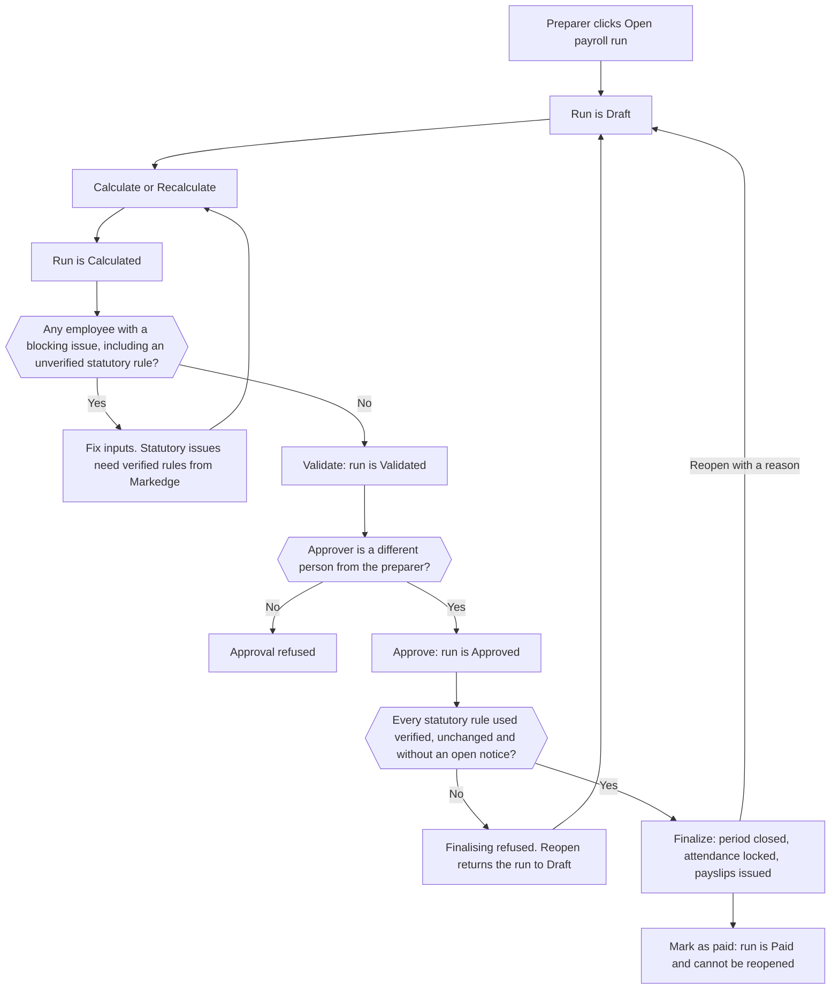
```mermaid
flowchart TD
    A["Preparer clicks Open payroll run"] --> B["Run is Draft"]
    B --> C["Calculate or Recalculate"]
    C --> D["Run is Calculated"]
    D --> E{{"Any employee with a blocking issue, including an unverified statutory rule?"}}
    E -- "Yes" --> F["Fix inputs. Statutory issues need verified rules from Markedge"]
    F --> C
    E -- "No" --> G["Validate: run is Validated"]
    G --> H{{"Approver is a different person from the preparer?"}}
    H -- "No" --> I["Approval refused"]
    H -- "Yes" --> J["Approve: run is Approved"]
    J --> K{{"Every statutory rule used verified, unchanged and without an open notice?"}}
    K -- "No" --> L["Finalising refused. Reopen returns the run to Draft"]
    L --> B
    K -- "Yes" --> M["Finalize: period closed, attendance locked, payslips issued"]
    M --> N["Mark as paid: run is Paid and cannot be reopened"]
    M -- "Reopen with a reason" --> B
```

## 8.17 Employee tax declaration and proof

*From:* [Pay: payroll, compensation and statutory compliance](modules/04-payroll-compensation-and-compliance.md)

*Roles:* Employee, Payroll Admin, Tenant HR Admin. *Starts:* the employee opens Tax declarations. *Ends:* the declaration is Verified.



Mermaid source

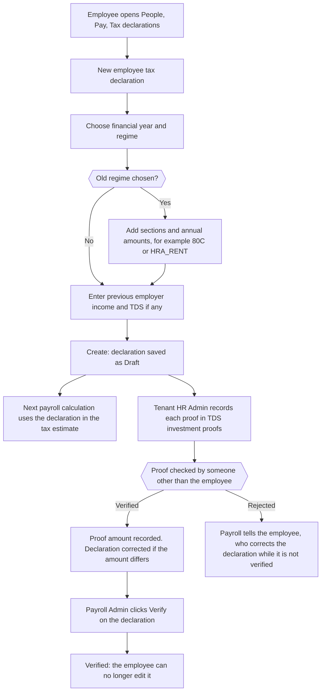
```mermaid
flowchart TD
    A["Employee opens People, Pay, Tax declarations"] --> B["New employee tax declaration"]
    B --> C["Choose financial year and regime"]
    C --> D{{"Old regime chosen?"}}
    D -- "Yes" --> E["Add sections and annual amounts, for example 80C or HRA_RENT"]
    D -- "No" --> F["Enter previous employer income and TDS if any"]
    E --> F
    F --> G["Create: declaration saved as Draft"]
    G --> H["Next payroll calculation uses the declaration in the tax estimate"]
    G --> I["Tenant HR Admin records each proof in TDS investment proofs"]
    I --> J{{"Proof checked by someone other than the employee"}}
    J -- "Verified" --> K["Proof amount recorded. Declaration corrected if the amount differs"]
    J -- "Rejected" --> L["Payroll tells the employee, who corrects the declaration while it is not verified"]
    K --> M["Payroll Admin clicks Verify on the declaration"]
    M --> N["Verified: the employee can no longer edit it"]
```

## 8.18 Compensation change approval

*From:* [Pay: payroll, compensation and statutory compliance](modules/04-payroll-compensation-and-compliance.md)

*Roles:* proposer, reviewer, approver and executor — four different people. *Starts:* a proposal on the employee record. *Ends:* the change is Effective.



Mermaid source

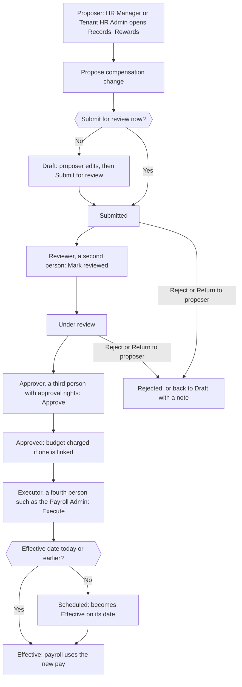
```mermaid
flowchart TD
    A["Proposer: HR Manager or Tenant HR Admin opens Records, Rewards"] --> B["Propose compensation change"]
    B --> C{{"Submit for review now?"}}
    C -- "No" --> D["Draft: proposer edits, then Submit for review"]
    D --> E["Submitted"]
    C -- "Yes" --> E
    E --> F["Reviewer, a second person: Mark reviewed"]
    F --> G["Under review"]
    G --> H["Approver, a third person with approval rights: Approve"]
    H --> I["Approved: budget charged if one is linked"]
    I --> J["Executor, a fourth person such as the Payroll Admin: Execute"]
    J --> K{{"Effective date today or earlier?"}}
    K -- "Yes" --> L["Effective: payroll uses the new pay"]
    K -- "No" --> M["Scheduled: becomes Effective on its date"]
    M --> L
    E -- "Reject or Return to proposer" --> N["Rejected, or back to Draft with a note"]
    G -- "Reject or Return to proposer" --> N
```

## 8.19 Preparing a statutory return

*From:* [Pay: payroll, compensation and statutory compliance](modules/04-payroll-compensation-and-compliance.md)

Shows where the verified-rule gate stops the process. *Roles:* Tenant HR Admin (generator), a second person (approver), a third person (filer). *Starts:* a payroll month. *Ends:* the return is Reconciled.



Mermaid source

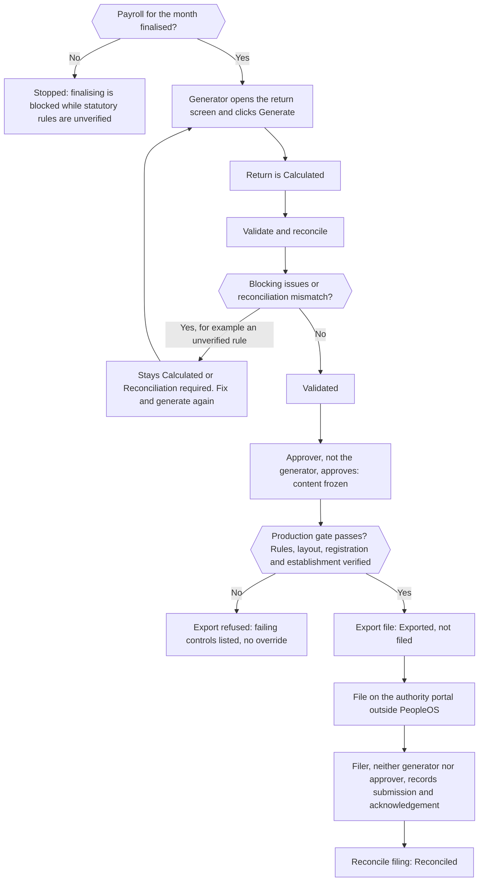
```mermaid
flowchart TD
    A{{"Payroll for the month finalised?"}} -- "No" --> B["Stopped: finalising is blocked while statutory rules are unverified"]
    A -- "Yes" --> C["Generator opens the return screen and clicks Generate"]
    C --> D["Return is Calculated"]
    D --> E["Validate and reconcile"]
    E --> F{{"Blocking issues or reconciliation mismatch?"}}
    F -- "Yes, for example an unverified rule" --> G["Stays Calculated or Reconciliation required. Fix and generate again"]
    G --> C
    F -- "No" --> H["Validated"]
    H --> I["Approver, not the generator, approves: content frozen"]
    I --> J{{"Production gate passes? Rules, layout, registration and establishment verified"}}
    J -- "No" --> K["Export refused: failing controls listed, no override"]
    J -- "Yes" --> L["Export file: Exported, not filed"]
    L --> M["File on the authority portal outside PeopleOS"]
    M --> N["Filer, neither generator nor approver, records submission and acknowledgement"]
    N --> O["Reconcile filing: Reconciled"]
```

## 8.20 Performance cycle from launch to acknowledgement

*From:* [Growth: performance, learning, skills and talent](modules/05-performance-learning-and-talent.md)

The path a cycle and its appraisals take. *Roles:* HR administrator, Employee, Manager, peer reviewers. *Starts:* a draft cycle. *Ends:* an archived cycle.



Mermaid source

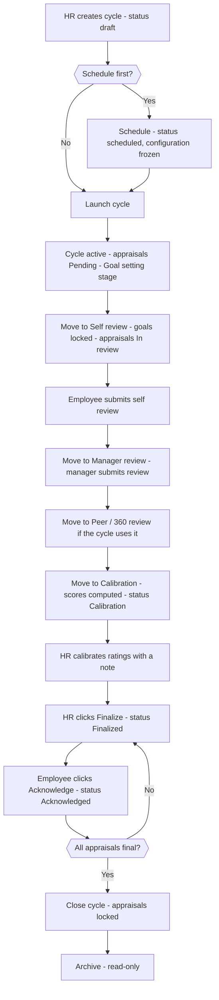
```mermaid
flowchart TD
    A["HR creates cycle - status draft"] --> B{{"Schedule first?"}}
    B -- "Yes" --> C["Schedule - status scheduled, configuration frozen"]
    B -- "No" --> D["Launch cycle"]
    C --> D
    D --> E["Cycle active - appraisals Pending - Goal setting stage"]
    E --> F["Move to Self review - goals locked - appraisals In review"]
    F --> G["Employee submits self review"]
    G --> H["Move to Manager review - manager submits review"]
    H --> I["Move to Peer / 360 review if the cycle uses it"]
    I --> J["Move to Calibration - scores computed - status Calibration"]
    J --> K["HR calibrates ratings with a note"]
    K --> L["HR clicks Finalize - status Finalized"]
    L --> M["Employee clicks Acknowledge - status Acknowledged"]
    M --> N{{"All appraisals final?"}}
    N -- "No" --> L
    N -- "Yes" --> O["Close cycle - appraisals locked"]
    O --> P["Archive - read-only"]
```

## 8.21 Setting goals and checking in

*From:* [Growth: performance, learning, skills and talent](modules/05-performance-learning-and-talent.md)

How goals are set, updated and used in the review. *Roles:* HR administrator, Employee, Manager. *Starts:* the Goal setting stage of a cycle. *Ends:* goals completed when they are closed or the cycle closes.



Mermaid source

```mermaid
flowchart TD
    A["HR sets company and department goals"] --> B["Employee or manager clicks New goal"]
    B --> C["Choose Aligned to, weight, measure and target"]
    C --> D{{"Weights within the cycle's required total?"}}
    D -- "No" --> E["Not saved - lower a weight"]
    E --> C
    D -- "Yes" --> F["Goal Active"]
    F --> G["Check in on the goal - value and confidence"]
    F --> H["My check-in with goal progress rows"]
    H --> I["Submit to my manager - status Submitted"]
    I --> J["Manager clicks Respond - status Reviewed"]
    G --> K["Progress kept as permanent history and rolled up to aligned goals"]
    I --> K
    K --> L["Self review stage opens - goal definition locked"]
    L --> M["Goals rated in self and manager reviews"]
    M --> N["Goal closed or cycle closed - Completed"]
```

## 8.22 Learning: from assignment or request to certificate

*From:* [Growth: performance, learning, skills and talent](modules/05-performance-learning-and-talent.md)

*Roles:* HR administrator, Manager, Employee. *Starts:* an assignment, a request or a session registration. *Ends:* a certificate or a closed enrolment.



Mermaid source

```mermaid
flowchart TD
    A["Assignment applied - daily or Apply now"] --> B["Enrolment Assigned"]
    C["Employee clicks Request learning"] --> D{{"Requests need approval?"}}
    D -- "No" --> E["Enrolment Enrolled"]
    D -- "Yes" --> F["Pending approval"]
    F --> G{{"Manager or HR decides"}}
    G -- "Reject" --> H["Rejected"]
    G -- "Approve" --> I["Approved"]
    J["Register for a training session"] --> K{{"Seat free?"}}
    K -- "Yes" --> E
    K -- "No" --> L["Waitlisted"]
    B --> M["Started - modules and assessment"]
    E --> M
    I --> M
    M --> N{{"Passed and all modules done?"}}
    N -- "Attempts used up" --> O["Failed"]
    N -- "Yes" --> P["Completed - certificate Valid if the course has a validity"]
    P --> Q["Certificate Expiring then Expired - enrolment Expired - repeating assignment re-enrols"]
```

## 8.23 Succession planning for a critical position

*From:* [Growth: performance, learning, skills and talent](modules/05-performance-learning-and-talent.md)

*Roles:* HR administrator. *Starts:* a role identified as critical. *Ends:* a closed plan.



Mermaid source

```mermaid
flowchart TD
    A["HR clicks Designate critical position"] --> B["Record criticality, impact and reason"]
    B --> C["Create succession plan - status Draft"]
    C --> D["Add successor - never the incumbent or yourself"]
    D --> E["Record readiness label - valid 12 months"]
    E --> F["Development action - neutral item in the employee's development plan"]
    F --> G["Change status to Active"]
    G --> H{{"Workflow configured?"}}
    H -- "Yes" --> I["Approval workflow decides"]
    H -- "No" --> J["Plan Active"]
    I --> J
    J --> K["Periodic review - Under review then back to Active"]
    K --> L{{"Still needed?"}}
    L -- "Yes" --> E
    L -- "No" --> M["Close plan with a reason"]
```

## 8.24 Setting up your organisation structure (recommended order)

*From:* [Organisation, workforce planning and assets](modules/06-organisation-workforce-and-assets.md)

The order in which administrators fill the organisation screens. *Roles:* Markedge, Tenant Super Admin or Account Owner (legal entities and establishments), Tenant HR Admin. *Starts:* your organisation exists in PeopleOS. *Ends:* you can add employees, positions and assets.



Mermaid source

```mermaid
flowchart TD
    A["Markedge sets up your organisation and its first administrator"] --> B["Companies: add each company"]
    B --> C["PeopleOS creates a primary legal entity and a principal establishment"]
    C --> D["Legal Entities and Establishments: check details, set the state, submit for verification"]
    D --> E["Locations: each needs a company"]
    E --> F["Cost Centres and Profit Centres"]
    F --> G["Business Units, Divisions, Departments, Teams"]
    G --> H["Organisation Designer: place every unit in the tree"]
    H --> I["Levels, then Grades and Job Families"]
    I --> J["Review Employment Types, Employee Categories, Work Modes"]
    J --> K["Designations: link level, grade, job family, department"]
    K --> L["Document types"]
    L --> M["Add employees: a company is required"]
    M --> N{{"Do you manage approved seats?"}}
    N -- "Yes" --> O["Workforce: positions, then headcount plans"]
    N -- "No" --> P["Assets: categories, models, register"]
    O --> P
```

## 8.25 Position, vacancy and hire

*From:* [Organisation, workforce planning and assets](modules/06-organisation-workforce-and-assets.md)

How a seat goes from an idea to a filled position. *Roles:* Tenant HR Admin (proposer), a second Tenant HR Admin or approver, HR recording the hire or transfer. *Starts:* a new position is created. *Ends:* the seat is filled, or the position is frozen, abolished or closed.



Mermaid source

```mermaid
flowchart TD
    A["New position: status Draft"] --> B["Lifecycle: Propose"]
    B --> C{{"Approved by a different person with approval rights?"}}
    C -- "No, sent back" --> A
    C -- "Yes" --> D["Approved"]
    D --> E["Mark planned"]
    D --> F["Open"]
    E --> F
    F --> G{{"Any free seats today?"}}
    G -- "Yes" --> H["Shown in Vacancies"]
    H --> I["HR records the hire or transfer: Transfer / promote, Position (seat)"]
    I --> J{{"Position open on the start date, seat and FTE free, employee not left?"}}
    J -- "No" --> K["Refused with a message, nothing changes"]
    J -- "Yes" --> L["Employee occupies a seat, occupancy updates"]
    L --> G
    G -- "No" --> M["Fully occupied"]
    F --> N["Freeze or Put on hold: reason required"]
    F --> O["Abolish or Close: refused while anyone occupies it"]
```

## 8.26 Headcount plan approval

*From:* [Organisation, workforce planning and assets](modules/06-organisation-workforce-and-assets.md)

From a draft plan to an active plan. *Roles:* planner (submits), reviewer and approver (different people). *Starts:* a new plan. *Ends:* an active plan version, or a rejected or archived one.



Mermaid source

```mermaid
flowchart TD
    A["New plan: version 1 is a Draft"] --> B["Add line: movement, headcount, effective date"]
    B -- "Submit" --> C["Submitted, content locked"]
    C -- "Start review, by another person" --> D["Under review"]
    C -- "Return for changes, note required" --> A
    D -- "Return for changes" --> A
    C -- "Reject, note required" --> R["Rejected"]
    D -- "Reject" --> R
    D -- "Approve, by an approver who did not submit" --> E["Approved"]
    E -- "Publish (make active)" --> F["Active, the previous active version becomes Superseded"]
    E --> P["Propose position from line: creates a Proposed position that still needs approval"]
    F --> P
    F -- "New version (correction)" --> N["New Draft version with the lines copied"]
    R -- "New version (correction)" --> N
```

## 8.27 Asset lifecycle

*From:* [Organisation, workforce planning and assets](modules/06-organisation-workforce-and-assets.md)

The statuses an asset moves through and the action that moves it. *Roles:* Asset Admin or Tenant HR Admin; the employee acknowledges receipt; HR runs exit clearance. *Starts:* an asset is received. *Ends:* the asset is disposed of.



Mermaid source

```mermaid
flowchart TD
    R["Receive asset"] --> S1["In stock"]
    S1 -- "Assign to a current employee" --> S2["Assigned"]
    S2 -- "Employee: Acknowledge receipt" --> S2
    S2 -- "Transfer to a new custodian" --> S2
    S2 -- "Take back" --> S1
    S1 -- "Send for repair" --> S3["In repair"]
    S2 -- "Send for repair" --> S3
    S3 -- "Back from repair" --> S1
    S1 -- "Report lost" --> S4["Lost"]
    S2 -- "Report lost" --> S4
    S4 -- "Found" --> S1
    S1 -- "Retire" --> S5["Retired"]
    S3 -- "Retire" --> S5
    S4 -- "Retire" --> S5
    S5 -- "Dispose" --> S6["Disposed"]
    S1 -- "Dispose" --> S6
    S3 -- "Dispose" --> S6
    S4 -- "Dispose" --> S6
    S2 -- "Employee leaves" --> X["Asset clearance stays open until the item is taken back or a recoverable amount is recorded"]
```

## 8.28 An HR service request from submission to closure

*From:* [Services and communication: My HR, service desk, grievances, announcements and surveys](modules/07-services-and-communication.md)

The path a request takes, including approval and the separate "apply the change" step for changes to employee records. *Roles:* Employee, approver, HR agent, a third HR person. *Starts:* the employee submits a request. *Ends:* the request is closed.



Mermaid source

```mermaid
flowchart TD
    A["Employee submits a request in My HR"] --> B["Submitted - service-hours clock starts"]
    B --> C{{"Does the service need approval?"}}
    C -- "No" --> I["HR agent takes the case - In progress"]
    C -- "Yes" --> D["Awaiting approval - clock paused"]
    D --> E{{"Approval workflow outcome"}}
    E -- "Rejected" --> F["Resolved as Not approved - proposed values deleted"]
    E -- "Approved by the requester or the employee" --> G["Approval refused - HR uses Restart approval"]
    G --> D
    E -- "Approved by someone else" --> I
    I --> J{{"Does it change an employee record?"}}
    J -- "Yes, Ready to execute" --> K["A third HR person clicks Apply the change"]
    K --> N["HR resolves with a resolution - Resolved"]
    J -- "No" --> L{{"Need information from the employee?"}}
    L -- "Yes" --> M["Waiting for employee - clock paused until they reply"]
    M --> I
    L -- "No" --> N
    N --> O{{"Employee satisfied?"}}
    O -- "Yes" --> P["Closed - rated by the employee or automatically after five days"]
    O -- "No" --> Q["Reopened with a reason - back to In progress"]
    Q --> I
```

## 8.29 Raising and handling a grievance

*From:* [Services and communication: My HR, service desk, grievances, announcements and surveys](modules/07-services-and-communication.md)

Confidential handling from complaint to closure. *Roles:* Employee, grievance handler, grievance manager. *Starts:* the employee raises a grievance. *Ends:* the case is closed.



Mermaid source

```mermaid
flowchart TD
    A["Employee clicks Raise a grievance"] --> B{{"Category allows anonymous and employee chose it?"}}
    B -- "Yes" --> C["Anonymous case - no name stored, cannot be followed up"]
    B -- "No" --> D["Named case - employee can add information or withdraw"]
    C --> E["Case number GRV and due date from the category deadline"]
    D --> E
    E --> F{{"Handler roles set for the category?"}}
    F -- "Yes" --> G["Least busy handler assigned - Under review"]
    F -- "No" --> H["Submitted - a grievance manager assigns a handler"]
    H --> G
    G --> I["Handler builds the case file - Investigating, Action taken"]
    I --> J{{"Past the due date?"}}
    J -- "Yes" --> K["Daily reminder to the handler"]
    K --> I
    J -- "No" --> L["Handler resolves with an outcome - Resolved"]
    D -- "Employee withdraws" --> M["Withdrawn"]
    L --> N["Handler clicks Close case - Closed"]
    M --> N
```

## 8.30 Publishing an announcement that needs acknowledgement

*From:* [Services and communication: My HR, service desk, grievances, announcements and surveys](modules/07-services-and-communication.md)

From draft to acknowledged, with separation of duties. *Roles:* Preparer (HR), approver (a second HR person), employees. *Starts:* HR composes an announcement. *Ends:* employees acknowledge it.



Mermaid source

```mermaid
flowchart TD
    A["HR composes a draft with Employees must acknowledge"] --> B["Submit for approval - content and audience frozen"]
    B --> C{{"Approver - a different person who covers the audience"}}
    C -- "Return to draft with a note" --> A
    C -- "Cancel with a reason" --> X["Cancelled"]
    C -- "Approve" --> D["Approved"]
    D --> E["Publish"]
    E --> F{{"Publish at in the future?"}}
    F -- "Yes" --> G["Scheduled until the publish time"]
    G --> H["Published - audience snapshot taken"]
    F -- "No" --> H
    H --> I["In-app and email delivery - optional types follow preferences"]
    I --> J["Employee reads it in Announcements or My HR"]
    J --> K["Employee clicks I acknowledge - recorded and counted"]
    H --> L{{"Correction needed?"}}
    L -- "Yes" --> M["New version - when published the old one is archived"]
```

## 8.31 Running an employee survey

*From:* [Services and communication: My HR, service desk, grievances, announcements and surveys](modules/07-services-and-communication.md)

From draft to results, with the privacy thresholds. *Roles:* Survey preparer (HR), approver (a second HR person), employees. *Starts:* HR creates a survey. *Ends:* results are read.



Mermaid source

```mermaid
flowchart TD
    A["HR creates a survey - version 1 Draft"] --> B["Add questions, audience and privacy settings"]
    B --> C["Submit for approval - content frozen, In review"]
    C --> D{{"Approver - a different person"}}
    D -- "Return to draft with a note" --> B
    D -- "Approve" --> E["Approved"]
    E --> F["Publish - Scheduled for the opening time"]
    F --> G["Open - audience snapshot and invitations"]
    G --> H["Employees answer in My HR - Submit my response"]
    H --> I["Closes on its date or with Close now"]
    I --> J{{"At least 5 respondents?"}}
    J -- "No" --> K["Results suppressed to protect respondents"]
    J -- "Yes" --> L["Totals shown - groups only with 5 or more, small groups merged or hidden"]
    L --> M{{"At least 10 respondents and 10 comments?"}}
    M -- "Yes" --> N["Comments shown overall only, shuffled, unattributed"]
    M -- "No" --> O["Comments suppressed"]
    G -- "Identified survey only" --> P["Results can be viewed while open"]
```

## 8.32 What a Workforce pulse drill-down shows you

*From:* [Insights: analytics, reports, audit trail and AI assistance](modules/08-insights-analytics-and-ai.md)

The same click shows different detail depending on your access. *Roles:* Executive, Tenant HR Admin, Auditor. *Starts:* you click a movement figure. *Ends:* the drawer lists people or department counts.



Mermaid source

```mermaid
flowchart TD
    A["Click a figure, for example Exits"] --> B{{"May you see people records?"}}
    B -- "Yes" --> C["Names, department and date for people in your scope"]
    B -- "No" --> D["Counts by department only"]
    D --> E{{"Fewer than 5 people in a department?"}}
    E -- "Yes" --> F["Shown as fewer than 5"]
    E -- "No" --> G["Shown as the number of people"]
```

## 8.33 Building, running and scheduling a report

*From:* [Insights: analytics, reports, audit trail and AI assistance](modules/08-insights-analytics-and-ai.md)

*Roles:* HR Manager, Tenant HR Admin (export and schedules); anyone who can open Reports (run). *Starts:* you need figures. *Ends:* results on screen, a CSV file, or a scheduled export.



Mermaid source

```mermaid
flowchart TD
    A["Open Insights › Analytics › Reports"] --> B{{"Does a starter report answer the question?"}}
    B -- "Yes" --> C["Click Run on that report"]
    B -- "No" --> D["Click New report"]
    D --> E["Choose a dataset and tick the fields"]
    E --> F["Optional: calculated field, Show as, Row limit"]
    F --> G["Review and click Create report"]
    G --> C
    C --> H{{"May you use this dataset?"}}
    H -- "No" --> I["Message: You cannot report on the dataset"]
    H -- "Yes" --> J["Chart and table from records in your scope"]
    J --> K{{"Need a file?"}}
    K -- "Yes" --> L["Export CSV: file downloads, run saved in Runs and the audit trail"]
    J --> M{{"Your own report, needed regularly?"}}
    M -- "Yes" --> N["Edit › Schedules › Add schedule"]
    N --> O["Every hour PeopleOS runs due schedules with the owner's access"]
    O --> P["Export stored in Runs, recipients get an in-app notice"]
```

## 8.34 Investigating a change with the audit trail

*From:* [Insights: analytics, reports, audit trail and AI assistance](modules/08-insights-analytics-and-ai.md)

*Roles:* Tenant HR Admin, HR Manager, Payroll Admin, Auditor, Account Owner. *Starts:* someone asks why a record looks the way it does. *Ends:* you know who changed it, when, why and whether the record is intact.



Mermaid source

```mermaid
flowchart TD
    A["Question: who changed this record, and why?"] --> B["Open Insights › Audit › Change intelligence"]
    B --> C["Filter by Employee, Module, Action or dates, then Apply filters"]
    C --> D{{"Is the record inside your organisation scope?"}}
    D -- "No" --> E["It is not listed. Ask someone with wider access"]
    D -- "Yes" --> F["Read When, Action, Who and Why"]
    F --> G["Click Explain"]
    G --> H["See approval, integration, correlation and the changed values"]
    H --> I{{"Are values masked?"}}
    I -- "Yes" --> J["Sensitive values stay hidden unless you may see sensitive data"]
    I -- "No" --> K{{"Need the full technical record?"}}
    K -- "Yes" --> L["Change history › View: Who and where, Integrity"]
    L --> M{{"Does Hash verified show a tick?"}}
    M -- "Yes" --> N["The entry is unchanged since it was written"]
    M -- "No" --> O["Tell your administrator and Markedge at once"]
    L --> P["Auditor or Tenant Super Admin can run Verify integrity"]
```

## 8.35 How an AI answer is produced

*From:* [Insights: analytics, reports, audit trail and AI assistance](modules/08-insights-analytics-and-ai.md)

*Roles:* everyone with an assistant. *Starts:* you ask a question or click **Summarise**. *Ends:* a sourced answer, logged, with suggestions you decide on.



Mermaid source

```mermaid
flowchart TD
    A["You ask a question, pick an example or click Summarise"] --> B{{"Assistant switched on and included in your role?"}}
    B -- "No" --> C["Message: not available, or You do not have access"]
    B -- "Yes" --> D{{"Within your limit of questions per minute?"}}
    D -- "No" --> E["Message: Too many questions in a short time"]
    D -- "Yes" --> F["The assistant reads facts through the same rules as your screens"]
    F --> G{{"Does the topic need access you do not have?"}}
    G -- "Yes" --> H["Polite refusal: it only answers from data you may see"]
    G -- "No" --> I["PeopleOS computes the answer with key facts and sources"]
    I --> J{{"AI language model switched on and allowed by your data policy?"}}
    J -- "No, the default" --> L["Shown as Computed from data you can see"]
    J -- "Yes" --> K["Only permitted facts are sent, secrets never"]
    K --> L2["Reworded answer shown with an AI-generated badge"]
    L --> M["The question and answer are saved in AI interactions"]
    L2 --> M
    M --> N["Suggested actions only open screens. You decide and confirm there"]
```

## 8.36 Inviting a user and giving access

*From:* [Administration: users, roles, configuration, security and integrations](modules/09-administration-and-security.md)

From the administrator's invitation to the person's first sign-in. *Roles:* administrator (Tenant HR Admin, Account Owner or Tenant Super Admin), the invited person. *Starts:* New user. *Ends:* the person works in PeopleOS with their roles and scope.



Mermaid source

```mermaid
flowchart TD
    A["Administrator opens Admin › Setup › Users"] --> B["New user: name, e-mail, roles, access scope"]
    B --> C{{"May you give every role chosen?"}}
    C -- "No" --> D["Refused with a message naming the role"]
    C -- "Yes" --> E["Create user: status Invited"]
    E --> F["E-mail with a one-time invitation link"]
    F --> G{{"Link used before it expires?"}}
    G -- "No" --> H["Administrator sends a new invitation"]
    H --> F
    G -- "Yes" --> I["Person chooses a password that meets the policy"]
    I --> J["Status becomes Active"]
    J --> K["Person signs in"]
    K --> L{{"Organisation requires multi-factor sign-in?"}}
    L -- "Yes" --> M["Set up an authenticator app first"]
    L -- "No" --> N["Workspace opens with the roles and access scope given"]
    M --> N
```

## 8.37 Changing configuration through the Change Centre

*From:* [Administration: users, roles, configuration, security and integrations](modules/09-administration-and-security.md)

How a governed edit travels when change approval is switched on. *Roles:* administrator who edits, approver (Tenant Super Admin). *Starts:* saving an edit form. *Ends:* the change is published, rejected or discarded.



Mermaid source

```mermaid
flowchart TD
    A["Administrator saves an edit to a configuration record"] --> B{{"Approval on and risk at or above the threshold?"}}
    B -- "No" --> C["Change applies at once and is audited"]
    B -- "Yes" --> D["Submitted for approval: record unchanged"]
    D --> E["Change Centre: Pending Approval"]
    E --> F{{"Decision"}}
    F -- "Reject with a note" --> G["Rejected: nothing changes"]
    F -- "Discard" --> H["Discarded: nothing changes"]
    F -- "Approve" --> I{{"Effective date in the future?"}}
    I -- "Yes" --> J["Scheduled until the date or Publish now"]
    I -- "No" --> K["Published: record updated"]
    J --> K
    K --> L{{"Need to undo it?"}}
    L -- "Roll back with a reason" --> M["New rollback change restores the previous values"]
    M --> B
```

## 8.38 Designing and running a workflow

*From:* [Administration: users, roles, configuration, security and integrations](modules/09-administration-and-security.md)

From an empty workflow to a finished run. *Roles:* Tenant HR Admin (design), approvers and assignees (tasks). *Starts:* New workflow. *Ends:* the run is completed.



Mermaid source

```mermaid
flowchart TD
    A["New workflow: name, trigger event, runs on"] --> B["Draft v1 with Start and End"]
    B --> C["Open builder: add nodes and edges"]
    C --> D{{"Check finds problems?"}}
    D -- "Yes" --> C
    D -- "No" --> E["Publish draft: live version"]
    E --> F{{"How does it start?"}}
    F -- "Started manually" --> G["Start a run from the workflow or the Employee 360"]
    F -- "Event" --> H["Event happens and start conditions match"]
    G --> I["Run moves to the next node"]
    H --> I
    I --> J{{"What kind of node?"}}
    J -- "Approval or task" --> K["Task in the inbox, reminders and escalation"]
    J -- "Wait" --> L["Run waits for the set hours"]
    J -- "Notification, webhook or update" --> I
    J -- "End" --> M["Run Completed"]
    K --> N{{"Decision"}}
    N -- "Approved or done" --> I
    N -- "Rejected without its own edge" --> M
    L --> I
```

## 8.39 Requesting a full data export

*From:* [Administration: users, roles, configuration, security and integrations](modules/09-administration-and-security.md)

*Roles:* Tenant Super Admin or Account Owner. *Starts:* Request a full export. *Ends:* the package is opened, or it expires.



Mermaid source

```mermaid
flowchart TD
    A["Open Admin › Platform › Data export"] --> B["Request a full export with a reason"]
    B --> C{{"An export already being prepared?"}}
    C -- "Yes" --> D["The request joins that export"]
    C -- "No" --> E["Status Queued"]
    D --> F["Status Generating in the background"]
    E --> F
    F --> G{{"Prepared successfully?"}}
    G -- "No" --> H["Status Failed: contact Markedge"]
    G -- "Yes" --> I["Status Ready: encrypted ZIP package"]
    I --> J["Download with a personal link valid for minutes"]
    I --> K["Show passphrase: recorded in the audit trail"]
    J --> L["Open the package with the passphrase"]
    K --> L
    I --> M["After the availability period: Expired"]
```

## 8.40 Setting up a new organisation

*From:* [Administrator guide](07-administrator-guide.md)

The recommended order for an administrator's first configuration. *Roles:* first administrator (Tenant Super Admin), Tenant HR Admin, HR, payroll. *Starts:* the first administrator signs in. *Ends:* employees are invited and a first process runs.



Mermaid source

```mermaid
flowchart TD
    A["First sign-in: password and authenticator app"] --> B["Security policy and a second Super Admin"]
    B --> C["Legal entities, companies, establishments"]
    C --> D["Locations, departments, teams, cost centres"]
    D --> E["Levels, grades, designations, employment types"]
    E --> F["Holiday calendars, shifts, work schedules"]
    F --> G["Leave types and leave policy"]
    G --> H["Workflows, notification rules, custom fields, forms"]
    H --> I["Users for HR and managers, with roles and scopes"]
    I --> J["Employees: hire or import, link user accounts"]
    J --> K{{"Running payroll in PeopleOS?"}}
    K -- "Yes" --> L["Salary components and structures, statutory profiles, parallel run"]
    K -- "No" --> M["Invite all employees"]
    L --> M
    M --> N["Pilot one process, then go live"]
```

