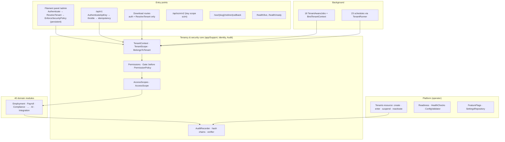

# SaaS.1 — Commercial Architecture & Gap Analysis

**Date:** 6 October 2026 · **Branch:** `feature/oct_1_phase_1` · **Starting commit:** `424a05d` (UX.19 final) · **Scope:** discovery and architecture only. No billing, subscription, payment, signup, entitlement or enforcement code was written. No migration was created, and no production behaviour changed.

| Document | Content |
|---|---|
| **This report** | Current state, readiness, gaps, summaries of the target, roadmap, decisions, verdict |
| [Target Architecture](SaaS-1-Target-Architecture.md) | Boundaries, plan model and versioning, signup, provisioning, lifecycle in the request path, export, offboarding, residency, control plane, audit, jobs, observability, failure recovery, compatibility |
| [Commercial Domain Model](SaaS-1-Commercial-Domain-Model.md) | Every proposed entity: ownership, scope, keys, status, effective dates, immutability, indexes, audit, retention; entities rejected |
| [Lifecycle State Machines](SaaS-1-Lifecycle-State-Machines.md) | Tenant, subscription, trial, access mode, invoice, payment, dunning, workflows |
| [Entitlement Architecture](SaaS-1-Entitlement-Architecture.md) | The capability catalogue, resolution, the contract, enforcement points, caching, units and counting, metering |
| [Billing, Provider Abstraction and GST](SaaS-1-Billing-Provider-Abstraction.md) | Provider contract, flows, India GST, provider webhooks, reconciliation, failure behaviour |
| [Security Threat Model](SaaS-1-Security-Threat-Model.md) | 20 commercial threats with controls mapped to the security chain; 14 existing weaknesses |
| [Decision register: proposed ADR-0017 to ADR-0026](../architecture/decision-register.md#saas1-proposed-decisions) | The architectural decisions that deserve their own record |

## 1. Executive Summary

**The question:** what must PeopleOS become technically and architecturally to operate as a real commercial multi-tenant SaaS product?

**The answer in one paragraph.**

PeopleOS has a **strong multi-tenant HCM foundation** and **no commercial layer**:
- tenant isolation is fail-closed and tested;
- the queues and scheduler are tenant-aware;
- audit is hash-chained;
- integrations are signed and idempotent;
- the configuration is versioned.

There are no plans, subscriptions, entitlements, billing, invoices, payments, metering, self-service signup or tenant offboarding. The `trial` status and `trial_ends_at` date are stored but never enforced. Eight feature flags exist; they are tenant-toggleable switches, not entitlements. The region field is a label that nothing routes on.

Verification also found **security gaps in the identity and platform foundation** that a paid service open to customers cannot carry:
- the tenant "MFA required" setting never takes effect, and no user can enrol MFA;
- there is no password reset;
- a platform operator can enter any tenant without a reason or an audit record;
- several request paths ignore tenant status.

These come first.

**The target** is a set of commercial bounded contexts inside the existing modular monolith: Catalog, Entitlements, Subscriptions, Billing, Tax, Metering, plus Platform lifecycle, provisioning, signup and offboarding. HCM modules ask exactly one contract, "is capability X available?", and never see plans or billing. Entitlements are:
- compiled from pinned, versioned plan terms into effective-dated snapshots;
- cached per tenant and version;
- enforced under the permission layer, in domain actions (with locks for count limits), in the API, and in jobs.

PeopleOS remains the commercial system of record:
- it issues its own GST invoices;
- payment providers are adapters;
- provider webhooks go through a verified, idempotent, platform-level event pipeline that never touches HCM data.

Tenant lifecycle and subscription lifecycle are separate state machines. They combine into one access mode that every entry point checks.

**What it takes:** nine implementation workstreams (§23). The first is not commercial at all: it fixes the identity and platform foundation. Paid production needs workstreams 1–5 and 7–9. Self-service signup (6) can follow a sales-led launch (decision D-9).

**Verdict:**
- **The SaaS architecture and gap analysis is complete. SaaS implementation has not started.**
- PeopleOS is **not** a commercial SaaS product today, and is not production-ready (§28).

**SaaS.1 — COMPLETE.**

## 2. Current SaaS Readiness

Scored separately, 0–5. Not collapsed into one figure, because the dimensions are independent.

**Scale:**
- 0 = absent;
- 1 = fragments or labels only;
- 2 = partial, operator-driven;
- 3 = functional with material gaps;
- 4 = strong, tested;
- 5 = production-grade commercial.

| Dimension | Score | Evidence (verified) |
|---|---|---|
| **Tenant Isolation** | **4** | Fail-closed `TenantScope` (`1 = 0` without a tenant); `BelongsToTenant` on 273 of 284 models, the 11 others allow-listed and justified; cross-tenant writes throw; `bypass()` confined to a 10-file allow-list enforced by test; tenant-aware jobs enforced by architecture tests; organisation and relationship scope; 106 composite unique indexes with `tenant_id`; isolation test suites. **Not 5:** download routes skip the tenant-status check (W5); a latent singleton/scoped mismatch in `AccessScopes` (W7); no per-tenant restore tool |
| **Identity** | **2** | Present: password login; 13 system roles; custom roles; 254 permissions in 49 groups; organisation scope; OIDC SSO with just-in-time provisioning; SCIM users; scoped, hashed, expiring API keys. Broken or absent: **MFA cannot be enforced or enrolled (W1)**; **no password reset, invite or e-mail verification (W2)**; SSO without ID-token validation or nonce check, linking by e-mail without `email_verified` (W3); password policy not enforced; `users.email` globally unique (W10) |
| **Provisioning** | **2** | `ProvisionTenantAction`: atomic, audited, seeds roles, flags, settings and defaults, creates the first admin. Operator-only; not idempotent; drops tier, region and trial on create (W14); no welcome e-mail; the operator sets the owner's password; no signup |
| **Entitlements** | **1** | Eight tenant-toggleable flags (two never read). No plan-based entitlement, limit, module licensing or platform lock. Flags can be changed by pack import without `features.update` (W13) |
| **Billing** | **0** | Nothing. "Invoice" exists only as `assets.invoice_number` (asset purchases); "payment" only as payroll bank files and settlements |
| **Subscription** | **0** | No subscription concept. `TenantStatus::Trial` grants full access; `trial_ends_at` is never read |
| **Metering** | **1** | AI tokens per interaction (external calls only); `api_keys.last_used_at`; `ux_metrics` product telemetry; some file sizes. No metering, aggregation or tenant usage |
| **Self-Service** | **0** | No signup, verification, onboarding or plan selection |
| **Tenant Lifecycle** | **1** | Provision → active ↔ suspended (reasoned, audited). No closing, retention, deletion or reactivation-after-cancellation. Suspension does not end sessions |
| **Platform Control** | **2** | Tenants resource (create, enter, suspend, reactivate), readiness page and CLI, health endpoints, heartbeat, config validator. No commercial control plane, per-tenant health, failed-job UI or granular platform permissions; tenant entry unaudited (W4) |
| **Observability** | **3** | Correlation ids end to end (requests, audit, webhooks, notifications, inbound events); tenant id in logs; redaction tap; slow-query log; failed-job log; health and readiness. Missing: user id in logs, a JSON channel, a metrics backend, redaction on two channels (W11) |
| **Commercial Security** | **1** | No commercial surface exists to secure. The foundation's controls (tenant chain, permissions, signed integrations, SSRF guard) are reusable, but W1–W5 must be fixed before money or owner-level powers exist |
| **Production Readiness** | **1** | The HCM production-readiness closure exists, but the DR target is not verified, statutory rules are 0/24 verified, and the commercial layer is absent. Not production-ready for a commercial launch |

## 3. Current-State Architecture



**The verified facts the target architecture builds on:**
- **One database.** `tenant_id` on every tenant-owned table (architecture test). Platform-level exceptions:
  - `tenants`, `users`, `permissions`;
  - audit events and changes;
  - platform compliance rules and layouts.
- **Tenant resolution.**
  - Session users resolve to their own tenant.
  - Platform admins resolve to the tenant entered (session key `platform.active_tenant_id`).
  - API keys resolve to the key's tenant, before route-model binding.
- **Suspension is enforced in four places** (panel access, API keys, jobs, scheduler), all keyed on `TenantStatus::Suspended`.
- **Audit.** Per-tenant hash chains plus a platform chain (tenant-less events). Append-only at the application layer.
- **Queues.** Every `ShouldQueue` under `app/` is a `TenantAwareJob` through `BindTenantContext`.
- **Scheduler.** Every schedule runs `withoutOverlapping()->onOneServer()` and iterates tenants via `TenantRunner`, which skips suspended tenants (retention purge excepted).
- **Integrations.**
  - Outbound webhooks are signed (`HMAC(timestamp.body)`), with leased retries, dead letters and replay.
  - Inbound events are API-key authenticated, signed, idempotent, encrypted and purged.
  - SSRF guard on every outbound call.
- **Configuration.**
  - Versioned and effective-dated policies, workflows, forms and Change Centre.
  - Settings and flags are **not** versioned.

## 4. Existing Capabilities (reusable for the commercial layer)

| Capability | Where | Reused for |
|---|---|---|
| Fail-closed tenancy, `runAs`, `bypass` allow-list | `app/Support/Tenancy` | Commercial jobs bind the tenant of their own record; platform-owned commercial records follow the `AuditEvent` precedent |
| Tenant-aware jobs, `TenantRunner`, claims | `BindTenantContext`, `TenantRunner`, `scheduler_claims` | Usage sampling, aggregation, exports, deletion steps; suspended and closed tenants skipped |
| `LifecycleEngine::transition()` as the only writer of `lifecycle_state` (verified: no unguarded writes in app code) | `app/Domain/Lifecycle` | **The single choke point for the active-employee limit**: hire, import, RMS conversion, mark joined, rehire, lifecycle API |
| `AuditRecorder` with platform chain, operation ids, immutability | `app/Domain/Audit` | All commercial audit; no second audit system |
| Inbound event machine (states, leased claims, backoff, dead letter, payload encryption and purge) | `app/Domain/Integration` | The pattern for provider webhooks (`billing_provider_events`) |
| `Signature` helper, constant-time compare, timestamp window | `Integration/Support/Signature.php` | Provider adapters (with provider-specific schemes) |
| `EnforceIdempotency`, idempotency keys | `app/Http/Middleware` | Commercial API endpoints |
| `NumberSequences` | `app/Support/Numbering` | Gap-free GST invoice numbers per series and financial year |
| Effective dating (`HasEffectiveDates`) and versioning (`*_versions`, publish/retire) | `app/Support/EffectiveDating`, configuration platform | Plan versions, items, overrides, snapshots, tax rules |
| Verified-rule gate (`compliance.enforce_verified_rules`, `verification_status`) | Compliance | Tax rules may not issue invoices unverified |
| Request-scoped service reset (`EXPERIENCE_SCOPED`, `RequestHandled`) and per-tenant caches (`tenant:{id}:features`) | `AppServiceProvider`, `FeatureFlags` | The entitlement snapshot memo and cache |
| Notification engine (in-app and e-mail, dedupe keys, `DeliverNotification`) | `app/Domain/Notifications` | Trial, dunning and invoice notices (platform-originated) |
| Warehouse feed (JSONL datasets with manifest; sensitive-field gating), audit CSV export, blueprint export | `app/Domain/Enterprise`, commands | Tenant data export |
| Health, readiness, config validator | `app/Support/Observability` | Control-plane health; readiness checks for commercial configuration |
| `UxMetrics` atomic daily counters | `app/Domain/Experience` | Pattern reference only (product telemetry stays separate) |

## 5. Gaps

### 5.1 Current-state inventory (45 domains)

Status is one of:
- **EXISTS**;
- **PARTIAL**;
- **MISSING**;
- **UNVERIFIED** (could not be confirmed here);
- **ARCH. INSUFFICIENT** (exists, but its design cannot carry the commercial requirement).

Gap ids refer to §5.2.

| # | Domain | Current implementation | Source files | Tables | Services | Routes / screens | Permissions | Jobs | Tests | Status | Gap |
|---|---|---|---|---|---|---|---|---|---|---|---|
| 1 | Tenant | Model with status, locale defaults, `tier` / `region` / `trial_ends_at` metadata | `Platform/Models/Tenant.php`, `Enums/TenantStatus.php` | `tenants`, `tenant_settings`, `tenant_features` | `SettingsRepository`, `FeatureFlags` | Tenants resource (Platform group) | `tenant.*` in catalogue, unused (`TenantPolicy` denies; platform via `Gate::before`) | — | `ProvisionTenantTest`, `AdminPanelAccessTest` | PARTIAL | G-LC-1 |
| 2 | Tenant lifecycle | active ↔ suspended; `trial` = active | `TenantsTable.php` | `tenants` | — | Suspend / Reactivate actions | platform | — | `AdminPanelAccessTest:39` | ARCH. INSUFFICIENT | G-LC-1, G-LC-3 |
| 3 | Tenant provisioning | One-transaction action: tenant, 13 roles, 8 flags, 44 settings, defaults, first admin, audit | `ProvisionTenantAction.php`, `CreateTenant.php` | seeds | `PermissionRegistry` | Tenants › Create | platform | — | `ProvisionTenantTest` | PARTIAL | G-PROV-1 |
| 4 | Tenant suspension | Reasoned, audited; enforced by `canAccessPanel`, `ApiKeys::resolve`, `BindTenantContext`, `TenantRunner` | `User.php:187`, `ApiKeys.php:48`, `BindTenantContext.php`, `TenantRunner.php` | `tenants` | — | Tenants actions | platform | skip | `AdminPanelAccessTest`, `ApiPlatformTest:86`, `OperationsHardeningTest` | PARTIAL | G-LC-3 (W5) |
| 5 | Identity | Users (tenant nullable, global unique e-mail, invited/active/suspended), platform flag | `Identity/Models/User.php` | `users` | — | Users | `user.*` | — | `PermissionTest` | PARTIAL | G-ID-2, W10 |
| 6 | Authentication | Filament password login (5-attempt limit), session auth, idle timeout, IP allow-list | `AdminPanelProvider.php:61`, `EnforceSecurityPolicy.php` | `sessions` | `SecurityPolicy` | `/admin/login` | — | — | `EnterpriseTest:81` | PARTIAL | G-ID-4 |
| 7 | MFA | TOTP and recovery codes; challenge only if a secret exists; tenant requirement evaluated at route registration (never applies); no enrolment UI | `AdminPanelProvider.php:204`, `User.php` | `users` (encrypted) | `SecurityPolicy` | none | `security.manage` | — | none | ARCH. INSUFFICIENT | **G-ID-1 (W1)** |
| 8 | SSO | OIDC auth-code via userinfo, JIT, domain allow-list, state check; no ID-token validation, no nonce, no `enforce` | `SsoController.php`, `Enterprise/Services/Sso.php` | `sso_connections` | `Sso` | `/sso/{slug}/*` | `sso.manage` | — | `EnterpriseTest:133`, `OutboundSsrfTest` | PARTIAL | G-ID-3 (W3) |
| 9 | Password recovery | None (`password_reset_tokens` unused) | — | `password_reset_tokens` | — | — | — | — | — | MISSING | **G-ID-2 (W2)** |
| 10 | Roles | 13 system roles (config), custom roles, system-role permissions editable | `config/peopleos.php` roles, `RoleResource` | `roles`, `permission_role`, `role_user` | `PermissionRegistry` | Roles | `role.*` | — | `PermissionTest` | EXISTS | W8 |
| 11 | Permissions | 254 keys in 49 groups; wildcards at provision; `Gate::before` | `config/peopleos.php`, `PermissionRegistry`, `AppServiceProvider:752` | `permissions` | `PermissionRegistry` | — | — | `sync-permissions` | `PermissionTest` | EXISTS | G-ENT-2 |
| 12 | Organisation scope | `user_access_scopes`, global `AccessScope`, `AccessScopes::allows` | `Identity/Scopes/AccessScope.php`, `Services/AccessScopes.php` | `user_access_scopes` | `AccessScopes` | Users | `user.*` | — | `AccessScopeTest` | EXISTS | W7 |
| 13 | Relationship scope | Typed effective-dated reporting; managers reach reports | `AccessScopes.php:94`, `PerformanceRelationships.php` | `reporting_relationships` | — | — | — | — | `AccessScopeTest:164`, `PlatformInvariantsTest:222` | EXISTS | — |
| 14 | Feature flags | 8 tenant-toggleable flags, cached, 2 never read | `Platform/Services/FeatureFlags.php` | `tenant_features` | `FeatureFlags` | Customisation › Feature flags | `features.*` | — | flag tests | PARTIAL | G-ENT-3 (W13) |
| 15 | Plans | None | — | — | — | — | — | — | — | MISSING | **G-PLAN-1** |
| 16 | Entitlements | None (flags only) | — | — | — | — | — | — | — | MISSING | **G-ENT-1** |
| 17 | Seats | None | — | — | — | — | — | — | — | MISSING | G-ENT-4 |
| 18 | Employee limits | None; three inconsistent headcount definitions | `WorkforceMetrics`, `PayrollRuns`, `LifecycleState::isEmployed` | `employees` | — | — | — | — | — | MISSING | **G-ENT-5**, G-MET-1 |
| 19 | Usage metering | None; product telemetry only | `UxMetrics.php` | `ux_metrics` | `UxMetrics` | — | — | — | — | MISSING | G-MET-1 |
| 20 | AI metering | Tokens per interaction (external calls), per-user 20/min limit; no tenant aggregation or budget | `AiGateway.php:85,121` | `ai_interactions` | `AiGateway` | AI log (`ai.admin`) | `ai.*` | retention purge | `AiTest`, `AiAssistiveControlsTest` | PARTIAL | G-MET-2 |
| 21 | Subscription | None | — | — | — | — | — | — | — | MISSING | **G-SUB-1** |
| 22 | Billing | None | — | — | — | — | — | — | — | MISSING | **G-BILL-1** |
| 23 | Payments | None (payroll bank files are HCM) | — | — | — | — | — | — | — | MISSING | **G-BILL-2** |
| 24 | Invoices | None (`assets.invoice_number` is an asset purchase field) | — | — | — | — | — | — | — | MISSING | **G-BILL-3** |
| 25 | GST / tax | None commercial. Statutory payroll compliance is separate; `gst` is rejected as a registration type | Compliance domain | `compliance_rules` (statutory) | — | — | — | — | `EstablishmentStatutoryTest:62` | MISSING | **G-TAX-1** |
| 26 | Payment failure / dunning | None | — | — | — | — | — | — | — | MISSING | G-BILL-4 |
| 27 | Trial | `TenantStatus::Trial` (full access) + `trial_ends_at` (never read; dropped on create) | `TenantStatus.php`, `TenantForm.php:39` | `tenants` | — | Tenants form | — | — | — | ARCH. INSUFFICIENT | **G-SUB-2** |
| 28 | Upgrade | None | — | — | — | — | — | — | — | MISSING | G-SUB-3 |
| 29 | Downgrade | None | — | — | — | — | — | — | — | MISSING | G-SUB-3 |
| 30 | Cancellation | None | — | — | — | — | — | — | — | MISSING | G-SUB-3 |
| 31 | Reactivation | Operator reactivation of a suspended tenant only | `TenantsTable.php:56` | `tenants` | — | Reactivate | platform | — | — | PARTIAL | G-LC-2 |
| 32 | Tenant offboarding | None (no closing state; delete denied by policy) | `TenantPolicy` | — | — | — | — | — | — | MISSING | G-OFF-1 |
| 33 | Data export | Warehouse feed (non-sensitive by default), audit CSV, report CSV, blueprint (configuration), read API. No full-tenant export | `WarehouseExport.php`, `ExportAudit.php`, `ReportExports.php`, `ExportBlueprint.php` | — | `WarehouseExport` | Reports; CLI | `warehouse.*`, `analytics.export` | `warehouse:export` daily | `EnterpriseTest:203` | PARTIAL | G-OFF-2 |
| 34 | Data deletion | None. 274 tenant FKs cascade; `audit_events` FK `restrictOnDelete` blocks tenant deletion | migrations | — | — | — | — | — | — | MISSING | G-OFF-3 |
| 35 | Retention | `retention:purge` for AI interactions, notification deliveries, report runs, webhook deliveries (fixed 90 days), inbound payloads. Never pruned: audit (by design), idempotency keys, `notifications`, `failed_jobs`, `scheduler_claims`, `ux_metrics`, export files. Statutory retention "to be verified"; no legal hold | `Enterprise/Services/Retention.php` | settings `retention.*` | `Retention` | Security policy page | `security.manage` | `retention:purge` daily | `EnterpriseTest:203` (partial) | PARTIAL | G-OFF-5 |
| 36 | Data residency | `region` label only; nothing routes on it; dropped on create | `TenantForm.php:24` | `tenants.region` | — | Tenants form | — | — | — | MISSING (label only) | G-RES-1 |
| 37 | Platform admin | `is_platform_admin` flag; `Gate::before` grants everything; Tenants resource; Enter (unaudited, no reason) | `User.php:128`, `AppServiceProvider:752`, `TenantsTable.php` | `users` | — | Platform group | flag | — | `AdminPanelAccessTest` | PARTIAL | **G-PLAT-1 (W4)** |
| 38 | Platform monitoring | Health live/ready (token), readiness page/CLI, heartbeat, config validator, dead-letter and failed-job counts | `HealthChecks.php`, `PlatformReadiness.php` | cache | `HealthChecks` | `/health/*`, Readiness page | platform | heartbeat | `PlatformReadinessTest`, `OperationsHardeningTest` | PARTIAL | G-PLAT-2 |
| 39 | Audit | Hash-chained, append-only (app level), per-tenant and platform chains, verifier, export | `Audit/Services/AuditRecorder.php` | `audit_events`, `audit_event_changes`, `audit_chain_locks` | `AuditRecorder`, `AuditIntegrityVerifier` | Audit resource | `audit.*` | `audit:verify` (not scheduled) | `AuditTrailTest`, `AuditHardeningTest` | EXISTS | G-PLAT-1 (platform-chain viewer, operator events) |
| 40 | Background jobs | 18 tenant-aware jobs; `BindTenantContext`; 23 schedules via `TenantRunner`; claims | `Support/Tenancy/Jobs/*`, `routes/console.php` | `jobs`, `failed_jobs`, `scheduler_claims` | `TenantRunner` | — | — | all | `ArchitectureTest:203`, `TenantAwareJobTest` | EXISTS | G-JOB-1 |
| 41 | Idempotency | API `Idempotency-Key`; domain keys (leave, goals, tickets, surveys…); inbound event keys | `EnforceIdempotency.php`, `InboundEvents.php` | `api_idempotency_keys`, `inbound_events` | — | `/api/v1` | — | — | `ApiPlatformTest:74`, `PlatformConcurrencyTest` | PARTIAL | W9 |
| 42 | Webhooks | Outbound signed, leased, dead letter, replay; inbound signed and idempotent (tenant API key) | `Enterprise/Services/Webhooks.php`, `Integration/*` | `webhook_endpoints`, `webhook_deliveries`, `integration_systems`, `inbound_events` | `Webhooks`, `InboundEvents` | Integrations resources | `webhook.manage`, `integration.manage` | `webhooks:deliver`, `integrations:process` | `IntegrationHubTest`, `BgvCallbackSecurityTest` | EXISTS (tenant) / MISSING (payment providers) | G-BILL-5 |
| 43 | Observability | Correlation ids; tenant id in log context; redaction tap; slow queries; failed-job log | `AssignRequestId.php`, `RedactSensitiveLogData.php` | — | — | — | — | — | `OperationsHardeningTest:84` | PARTIAL | G-OBS-1 (W11) |
| 44 | Notifications | In-app + e-mail (SMS, WhatsApp, push are log stubs); deliveries; dedupe | `Notifications/*` | `notification_*`, `notifications` | `Notifier` | Communication resources | `notification.*` | `DeliverNotification` | `NotificationEngineTest` | EXISTS (HCM) / MISSING (platform → customer) | G-PLAT-3 |
| 45 | Commercial reporting | None (no MRR, ARR, churn, trial conversion, collections) | — | — | — | — | — | — | — | MISSING | G-PLAT-4 |

### 5.2 Gap register

**Classification:**
- **P0** blocks commercial SaaS;
- **P1** is required before paid production;
- **P2** is important after launch;
- **P3** is future scale or enterprise.

| Id | Gap | Status | Priority | Workstream (§23) |
|---|---|---|---|---|
| **G-ID-1** | Tenant MFA requirement ineffective; no MFA enrolment UI; SSO bypasses MFA (W1) | ARCH. INSUFFICIENT | **P0** | 1 |
| **G-ID-2** | No password reset, invite (set-password) or e-mail verification (W2); `UserStatus::Invited` unused | MISSING | **P0** | 1 |
| G-ID-3 | SSO hardening: ID-token validation (JWKS) or PKCE, nonce, `email_verified` before e-mail linking, `enforce`, cross-tenant e-mail collision message (W3) | PARTIAL | P1 | 1 |
| G-ID-4 | Password policy (complexity, expiry) not enforced in forms or login; no login, MFA or idle-timeout tests | PARTIAL | P1 | 1 |
| **G-PLAT-1** | Platform operator powers are one all-powerful flag; tenant entry unaudited and reasonless; tenant record edits can land in the entered tenant's chain; platform-chain events not viewable (W4, T9) | PARTIAL | **P0** | 1 |
| **G-LC-1** | Tenant lifecycle lacks provisioning / closing / pending-deletion / deleted states; `trial` mixes commercial state into tenant status | ARCH. INSUFFICIENT | **P0** | 3 |
| G-LC-2 | No reactivation after cancellation, no closing retention window | MISSING | P1 | 3 |
| **G-LC-3** | Blocking checks keyed only on `Suspended` (panel, API, jobs, scheduler); download routes skip status and security policy; suspension keeps sessions; edit form changes status without the reason flow (W5, W6) | PARTIAL | **P0** | 1 (status gaps) + 3 (new states) |
| G-PROV-1 | Provisioning not idempotent or resumable; drops tier, region and trial (W14); no welcome or set-password; operator chooses the owner's password | PARTIAL | P1 | 1 (field fix, invite) + 6 (workflow) |
| **G-ENT-1** | No entitlement engine: capability catalogue, resolution, snapshot, contract, enforcement | MISSING | **P0** | 2 |
| G-ENT-2 | Permissions have no module mapping or read/write kind; role editor lists all keys including platform ones; sync re-adds removed system-role permissions (W8) | PARTIAL | P1 | 2 |
| G-ENT-3 | Flags are tenant-toggleable, unversioned, ungoverned (pack import bypasses `features.update`); two dead flags; no platform lock (W13) | PARTIAL | P1 | 2 |
| G-ENT-4 | No seat or user limits (admin and HR user definitions) | MISSING | P1 (if sold) | 4 |
| **G-ENT-5** | No active-employee limit; no canonical billable count (three conflicting headcount definitions) | MISSING | **P0** (if per-employee pricing, D-1) | 2 (counter) + 4 (enforcement) |
| **G-PLAN-1** | No plans, plan versions, prices, plan entitlements, grandfathering or plan migration | MISSING | **P0** | 2 |
| **G-SUB-1** | No subscription, items, transitions, renewals | MISSING | **P0** | 3 |
| **G-SUB-2** | Trial is a status and an unused date: no expiry, restriction, conversion or eligibility | ARCH. INSUFFICIENT | **P0** | 3 |
| G-SUB-3 | No upgrade, downgrade (scheduled), cancellation, proration | MISSING | P1 | 3 (state) + 5 (proration invoices) |
| **G-BILL-1** | No billing accounts, tax profiles, collection methods | MISSING | **P0** | 5 |
| **G-BILL-2** | No payment collection. A manual (bank transfer) gateway is P0 for a sales-led launch; an automatic provider (cards, mandates) is P1 | MISSING | **P0** / P1 | 5 |
| **G-BILL-3** | No invoices, credit and debit notes, gap-free numbering, PDFs | MISSING | **P0** | 5 |
| G-BILL-4 | No dunning or payment-failure handling | MISSING | P1 | 5 |
| G-BILL-5 | No platform-level provider webhook pipeline (tenant inbound events cannot be reused: wrong trust model) | MISSING | P1 | 5 |
| G-BILL-6 | No reconciliation (missed webhooks, settlements, invoice integrity) | MISSING | P1 | 5 |
| **G-TAX-1** | No GST component: supplier profile, customer GSTIN and place of supply, CGST/SGST/IGST, SAC, zero-rating, rounding, verified rules | MISSING | **P0** (Indian customers) | 5 |
| G-TAX-2 | E-invoicing (IRN) adapter, if the supplier's turnover crosses the threshold **[verify]**; GSTR-1 data export | MISSING | P1 / P2 | 5 / later |
| G-MET-1 | No usage events, aggregates or daily samples; no `BillableUnits` counter | MISSING | P1 (P0 for the billed metric) | 2 (counter) + 4 |
| G-MET-2 | AI and API usage not metered per tenant (tokens logged per interaction only; API calls not counted) | PARTIAL | P1 if limited or priced, else P2 | 4 |
| G-MET-3 | No storage ledger; several upload tables record no size | MISSING | P2 (storage limits) | 4 |
| G-SIGN-1 | No self-service signup, verification, duplicate detection, domain verification, terms acceptance | MISSING | P2 if sales-led (D-9), else P0 | 6 |
| G-OFF-1 | No offboarding workflow (closing, retention, cooling-off, deletion) | MISSING | P1 | 7 |
| G-OFF-2 | No full-tenant export (owner-requested, encrypted, expiring) | PARTIAL | P1 | 7 |
| G-OFF-3 | No tenant deletion, legal hold or deletion certificate; the cascade-delete FKs must not be relied on blindly | MISSING | P1 | 7 |
| G-OFF-4 | Tenant storage prefixes are inconsistent (six under `tenants/{id}`; learning, statutory, compliance evidence and warehouse elsewhere, warehouse by slug) | PARTIAL | P1 (complete deletion and export) | 7 (inventory) + 4 (ledger) |
| G-OFF-5 | Statutory and payroll retention periods unverified; tables never pruned; webhook retention hard-coded | PARTIAL | P1 | 7 |
| G-RES-1 | No data residency: the region label is not routed (multi-region cell model) | MISSING | P3 (single region at launch, D-11) | later |
| G-PLAT-2 | No commercial control plane, per-tenant health, failed-job UI or dual control | MISSING | P1 | 8 |
| G-PLAT-3 | No platform-to-customer notification channel (trial, dunning, invoices, lifecycle notices to owners and billing contacts) | MISSING | P1 | 3 / 5 |
| G-PLAT-4 | No commercial reporting (MRR, churn, conversion, collections, ageing) | MISSING | P2 | 8 |
| G-OBS-1 | No user id in log context; no JSON log channel or metrics backend; two channels without redaction (W11) | PARTIAL | P1 (commercial "why" questions) | 1 / 8 |
| G-JOB-1 | Unique jobs without lock TTL; two unique keys omit the tenant; `failed_jobs`, `scheduler_claims` never pruned; `audit:verify` not scheduled | PARTIAL | P2 | 1 |
| G-MIG-1 | Existing tenants have no subscription or plan: a default "Legacy" plan, backfill and observe-only rollout are needed (§20) | MISSING | **P0** (with G-ENT-1) | 2 |

### 5.3 Defects found outside the commercial scope (documented, not fixed)

These are not SaaS gaps, but SaaS.1 found them while verifying the code. They belong to their owners.

| # | Finding | Evidence | Suggested owner |
|---|---|---|---|
| H-1 | **The payroll population excludes non-existent states (`offer_accepted`, `candidate`) and does not exclude `preboarding`.** Pre-employees from the RMS hand-over have a null `joining_date`, so one with a position in the run's company on the period end date passes the joining-date filter | `PayrollRuns.php:58-83` | Payroll hardening: verify whether a preboarding employee can enter a payroll run, and align with `isEmployed()` or an explicit payroll rule |
| H-2 | Admin Centre checks permission keys that do not exist (`customfield.view`, `feature.view`; the real keys are `custom_field.view`, `features.view`) | `AdminCentre.php:65` | Platform / UX maintenance |
| H-3 | `peopleos.api.rate_limit_per_minute` is undefined (the 120 fallback always applies); the named `ai` limiter is unused | `AppServiceProvider.php:531-542` | Platform |
| H-4 | `AccessScopes` singleton holds a request-scoped `TenantContext` (W7) | `AppServiceProvider.php`, `AccessScopes.php:35` | Platform (before any long-lived worker acts as a user, or Octane) |
| H-5 | Seeder contains hard-coded development credentials (a platform admin and a tenant administrator) | `DatabaseSeeder.php:84-98` | Production readiness: confirm seeders never run in production (the readiness validator should check) |
| H-6 | The workflow webhook node sends unsigned requests (W12) | `SendWebhook.php:63-83` | Workflow / Integration |
| H-7 | API idempotency keys never expire or get purged; inbound uniqueness is on the idempotency key, not the external event id (W9) | `EnforceIdempotency.php:42-45`, `InboundEvents.php:64` | Integration |

## 6. Target Commercial Architecture

The commercial layer is a set of **bounded contexts inside the modular monolith**:
- `app/Domain/Commercial/{Catalog, Entitlements, Subscriptions, Billing, Tax, Metering}`;
- `app/Domain/Platform`, extended with tenant lifecycle, signup, the provisioning workflow, offboarding and control-plane read models.

It shares the database, tenancy, audit, queue, notification and integration primitives. It is not a separate service, because count limits must commit in the same transaction as the HCM write they guard ([ADR-0017](../architecture/decision-register.md#saas1-proposed-decisions)).

**Data flow:**
1. Commercial terms (plan versions) are pinned on subscription items.
2. The items, with add-ons and overrides, compile into effective-dated entitlement snapshots.
3. One gate evaluates snapshot ∧ access mode ∧ operational flag ∧ limit for every HCM question.
4. Money flows through PeopleOS invoices; providers collect.

Full design: [Target Architecture](SaaS-1-Target-Architecture.md) §1–§2.

**The starting hypothesis was refined by the existing code:**

| Hypothesis | Decision | Why |
|---|---|---|
| Catalog › Products | Not now | Single product |
| Catalog › Add-ons as their own entity | Plans with `kind = add_on` | Same versioning, pricing and entitlement shape |
| Entitlements as a sibling of Subscription | Entitlements as **the** contract HCM sees; Subscription feeds it | HCM must not know subscriptions exist |
| Subscription › Suspension | Suspension split: subscription `suspended` (commercial) vs tenant `suspended` (operator) vs derived access mode | Different causes, different powers (State Machines §1) |
| Billing › Tax | Tax as its own context, a pure calculator | Must never mix with statutory payroll compliance, and must be testable without the database |
| Metering › Counters | Counts sampled from authoritative HCM tables; events only for consumption | Avoids drift between an event stream and the employee table |
| Tenant Lifecycle | Stays in Platform, with the existing tenant model | The tenant is a platform concept; Commercial publishes events it reacts to |
| A commercial event log | Rejected; audit + transition tables | No second audit system |

## 7. Domain Boundaries

| Context | Owns | Others may |
|---|---|---|
| Catalog | plans, versions, prices, plan entitlements, plan migrations | read published versions |
| Entitlements | capability catalogue (config), overrides, snapshots, the gate | **HCM: call the contract only** |
| Subscriptions | subscriptions, items, transitions, trials, renewals | read state via services |
| Billing | accounts, tax profiles, mandates, invoices and notes, payments, refunds, dunning, provider events | — |
| Tax | supplier profiles, tax rules, calculator | Billing calls it |
| Metering | usage events, aggregates, samples, `UnitCounter` port | HCM implements counters; AI, API and storage record events |
| Platform | tenant lifecycle, signup, provisioning, offboarding, control plane | Commercial publishes events to it |

Dependency rules, each an architecture test: [Target Architecture §1](SaaS-1-Target-Architecture.md#1-shape-commercial-bounded-contexts-inside-the-modular-monolith).

## 8. Target Data Model

| Group | Entities (proposed) | Scope |
|---|---|---|
| Catalog | `plans` (base / add-on), `plan_versions`, `plan_prices`, `plan_entitlements` | platform |
| Billing identity | `billing_accounts`, `billing_tax_profiles`, `payment_mandates` | platform-owned, tenant-keyed |
| Subscription | `subscriptions` (one live per tenant via generated-column unique), `subscription_items` (pinned, end-dated), `subscription_transitions`, `checkout_sessions` | platform-owned, tenant-keyed |
| Invoicing | `invoices` (invoice / credit note / debit note), `invoice_lines`, `payments`, `payment_allocations` (incl. customer TDS), `refunds`, `dunning_attempts`, `billing_provider_events` | platform-owned, tenant-keyed (events: tenant resolved later) |
| Tax | `commercial_supplier_profiles`, `commercial_tax_rules` (verified) | platform |
| Entitlements | `entitlement_overrides`, `tenant_entitlement_snapshots` | platform-owned, tenant-keyed |
| Metering | `usage_events`, `usage_aggregates` | platform-owned, tenant-keyed |
| Lifecycle and data | `tenant_lifecycle_transitions`, `signups`, `provisioning_runs`, `tenant_domains`, `tenant_exports`, `tenant_deletion_requests`, `legal_holds` | platform |

**Rejected:**
- `products`;
- separate add-on and credit-note tables;
- a generic `CommercialEvent` or `WebhookEvent`;
- a `PaymentMethod` storing instrument data;
- event-summed counts.

Every entity's ownership, keys, uniqueness, status, effective dates, immutable and mutable fields, indexes, audit and retention: [Commercial Domain Model](SaaS-1-Commercial-Domain-Model.md).

**Why commercial records do not use `BelongsToTenant`:**
- Markedge's invoices are Markedge's books and must survive deletion of the tenant's data.
- Operators read across tenants without widening the `bypass()` allow-list.

This is the `AuditEvent` precedent: reads only through commercial services and the tenant billing read model, enforced by an architecture test.

## 9. Entitlement Architecture

```
allowed = AccessMode ∧ Entitlement(snapshot) ∧ OperationalFlag ∧ Limit  (∧ Permission ∧ Scope ∧ Field for users)
```

**Catalogue.**
- **Code-owned capabilities:** 19 modules mapped onto the 49 existing permission groups and the API scopes, plus features and limits.
- **Security is never an entitlement:** MFA, audit, encryption, sensitive-access auditing, offboarding export.

**Resolution.**
- Plan version entitlements, then add-ons, then overrides, effective-dated.
- Compiled into hashed snapshots on every change.
- Grandfathered by pinning.

**Contract.** `Entitlements::allows / decide / mode / limit / usage / within / consume`, with a `Decision` that always carries a reason.

**Enforcement:**

| Layer | What it enforces |
|---|---|
| Permission layer | Module licensing: drops keys of unlicensed or lapsed modules when a user's keys load, covering every existing `can()` |
| API | Scope → module |
| Domain actions (in-transaction, locked) | Count limits. **The active-employee limit lives in `LifecycleEngine::transition()`**, the verified single writer of employment state, covering every hire, import, conversion and rehire path |
| Middleware | Access mode |
| Jobs and scheduler | Module and access mode |
| UI | Explanation only |

**Performance.** One cached read per request; zero per permission check; counts only on writes.

Full design: [Entitlement Architecture](SaaS-1-Entitlement-Architecture.md).

## 10. Subscription Lifecycle

**States:** `pending → trialing | active`; `trialing → active | expired`; `active → past_due → active | suspended → active | ended`; `expired → active | ended`; `pending → abandoned`.

**Attributes, not states:** cancel-at-period-end, scheduled change, collection method.

**Triggers:**
- the customer (with `billing.manage`);
- payment events (verified, normalised, idempotent, forward-only);
- the scheduler (trial end, grace end, renewal, scheduled changes);
- operators (reasoned, audited).

**Trial** is a subscription in `trialing` with pinned dates and trial entitlement values. Its expiry is acted on by the scheduler and enforced by access mode everywhere. It is not a date on the tenant.

**Plan versioning.** v1, v2 and v3 coexist. Items pin versions. A new version reaches existing customers only through an explicit, announced, renewal-boundary **plan migration**. Nothing retroactive.

Diagrams and transition tables: [Lifecycle State Machines §3–§5](SaaS-1-Lifecycle-State-Machines.md); plan versioning: [Target Architecture §4](SaaS-1-Target-Architecture.md#4-plan-versioning-v1-v2-v3-without-breaking-anyone).

## 11. Billing Architecture

**Principles:**
- **PeopleOS is the system of record.** It issues GST tax invoices itself: supplier and recipient GSTIN, place of supply, CGST/SGST/IGST split, SAC, consecutive numbering per financial year **[verify]**.
- **Providers are adapters** behind a `PaymentGateway` contract: `RazorpayGateway`, `StripeGateway`, a `ManualGateway` for bank transfer, and a `FakeGateway` for tests.
- **Money** is integer minor units with a currency.
- **No card data**, ever.

**Flows:**
- checkout, confirmed server-side or by webhook, idempotently;
- renewal (automatic collection via mandates, or invoice collection);
- upgrade (immediate, prorated);
- downgrade (scheduled; refused below usage);
- cancellation (at period end);
- refunds (against credit notes, operator only).

**GST** lives in its own Tax context, separate from statutory payroll compliance: separate tables, rules and verification. Specifics marked **[verify]** need a tax adviser:
- place-of-supply rules;
- rate and SAC;
- zero-rated exports and SEZ;
- e-invoicing threshold;
- credit-note time limits;
- customer TDS.

**Provider webhooks.**
1. A platform endpoint verifies the raw-body signature.
2. The event is stored once (unique provider event id), encrypted.
3. A leased job processes it, resolving the tenant from our own billing account mapping.
4. Domain services apply forward-only transitions.

Reconciliation pulls catch missed events.

Full design: [Billing, Provider Abstraction and GST](SaaS-1-Billing-Provider-Abstraction.md).

## 12. Usage Metering

| Meter kind | Examples | Source of truth | Mechanism |
|---|---|---|---|
| Count (sampled) | active employees, active users, admin users, companies, locations | HCM tables, through `UnitCounter` ports | Enforced under lock at the choke points; daily samples to `usage_aggregates`; past days reproducible from the append-only lifecycle transitions |
| Consumption (events) | AI requests and tokens, API requests, storage bytes, (SMS later) | `usage_events`, append-only, unique per (tenant, meter, idempotency key) | Aggregated every 15 min by watermark; late events land in the next open period after an invoice freezes an aggregate |

**Storage.** MySQL is authoritative. Redis is optional for hot API counters later and never authoritative.

**Concurrency.** Counts are taken inside the limit lock. Consumption checks tolerate in-flight bursts (soft by nature); hard stops apply to counts.

**Monthly reset.** Aggregates are per period; there is no destructive reset.

**Simplest architecture that scales:**
- the AI gateway, API middleware and storage ledger write events;
- one aggregation job and one daily sampling job;
- partition `usage_events` by month when volume requires.

**Prerequisite.** A storage ledger and uniform tenant storage prefixes (G-MET-3, G-OFF-4).

## 13. Self-Service Architecture

The flow, from visitor to onboarding:
1. Verified e-mail (signed link; neutral responses).
2. Duplicate company detection: verified domain; GSTIN review for trials.
3. Slug, region, country, timezone, currency and locale from the country.
4. Plan selection for the visitor's market.
5. Terms and privacy version acceptance (stored with time and IP).
6. Idempotent provisioning keyed on the signup reference.
7. Subscription `trialing` (or `pending` → checkout).
8. Owner sets their own password via the welcome link.
9. Onboarding checklist.

**Anti-abuse:**
- rate limits per IP and per e-mail;
- CAPTCHA only on abuse;
- a disposable-domain policy (decision);
- one trial per verified company identity and domain.

**Prerequisites:** password reset, invite and verification (G-ID-2).

Full design: [Target Architecture §5](SaaS-1-Target-Architecture.md#5-self-service-signup-future-not-implemented).

## 14. Tenant Lifecycle

**States:** `provisioning → active ↔ suspended → closing → pending_deletion (↔ deletion_blocked) → deleted`, plus `provisioning_failed` and `discarded`.

**Ownership.**
- **Commercial transitions** arrive only as Subscription domain events.
- **Operator transitions** need platform permissions, a reason and audit on the platform chain.

**The access mode** (`full`, `grace`, `restricted`, `locked`, `none`) is derived from tenant state, subscription state and any operator override. It is computed by one service and checked by:
- `ResolveTenant` and panel access;
- the download routes (today missing);
- `AuthenticateApiKey`;
- `BindTenantContext`;
- `TenantRunner`;
- the entitlement gate.

**Sessions.** Suspension ends sessions through a per-tenant session epoch.

**Migration from today:** `trial` → `active` + subscription `trialing`; `suspended` → `suspended` (operator reason).

Full design: [State Machines §2, §5](SaaS-1-Lifecycle-State-Machines.md); request path: [Target Architecture §7](SaaS-1-Target-Architecture.md#7-tenant-lifecycle-and-access-mode-in-the-request-path).

## 15. Offboarding / Export / Retention

| Stage | Design |
|---|---|
| Closing | Read-only; export available; reactivation possible for the retention window (D-8) |
| Export | Owner with `tenant.export` (+ MFA, reason, all owners notified). Asynchronous per-domain exporters reusing the warehouse datasets with sensitive fields, plus files, audit CSV and the configuration blueprint. JSONL + CSV + manifest with checksums. Encrypted archive on a platform prefix; signed URL with 24 h expiry; limited downloads; audited; history kept; chunked and resumable for large tenants |
| Pending deletion | Cooling-off (proposed 14 days), notices to all owners, final export offered, cancellable, blocked by legal hold |
| Deletion | Ordered purge per domain with counts, never a blind cascade from the 274 cascade FKs. Files by prefix and ledger. Caches by `tenant:{id}:*`. Integrations revoked, mandates cancelled. The tenant's own audit chain deleted last, as the one sanctioned exception to "audit is never purged", recorded on the platform chain. Deletion certificate issued |
| Retained | Markedge's commercial and tax records (its own books, **[verify years]**); the platform audit of operator actions; a tombstone |
| Backups | Age out with backup retention; the certificate states the last backup expiry; restores re-apply a deletion tombstone list |
| Statutory and payroll records | The employer's obligation **[verify per act]**: exported to the customer; deleted on the tenant's instruction after the agreed window; retained beyond only under a legal hold |

Full design: [Target Architecture §8–§9](SaaS-1-Target-Architecture.md#8-tenant-data-export-future-not-implemented).

## 16. Platform Control Plane

**Separation.** A separate Filament panel (`/platform`) for platform operators.

**Permissions** replace the single flag:
- `platform.tenants.view`, `.lifecycle`, `.delete`;
- `platform.commercial.manage`;
- `platform.catalog.manage`;
- `platform.data_access`;
- `platform.audit.view`.

**Dual control** for comps, refunds and overrides above thresholds, legal holds, and deletion.

**Tenant entry** is reasoned, time-boxed, and audited on both the platform and tenant chains.

**Views:**
- a tenants list with lifecycle, plan, subscription, trial, billable units, usage and health;
- a tenant 360 for operators (timelines, invoices, entitlements with sources, overrides, exports, holds, operator access log);
- commercial events;
- per-tenant health (failed jobs carry the tenant in their Context, plus dead letters);
- the reconciliation queue;
- provisioning runs;
- commercial reporting (P2).

**A platform operator never becomes a tenant employee.** This is enforced by the existing `tenant_id = null` rule plus a new constraint test.

Full design: [Target Architecture §11](SaaS-1-Target-Architecture.md#11-platform-control-plane).

## 17. Security Threat Model

Twenty threats are modelled, each with controls mapped to the security chain and the test that must prove them:
- cross-tenant commercial access;
- entitlement, seat-limit and trial bypass;
- webhook forgery and replay;
- duplicate payment;
- billing privilege escalation;
- platform and tenant admin abuse;
- invoice access and billing data exposure;
- export and deletion abuse;
- job and cache tenant leakage;
- API key abuse;
- signup abuse;
- the provisioning race;
- snapshot tampering.

**The two commercial additions** to the chain, access mode and entitlement gate, are **subtractive**. They narrow what a tenant may do and never widen what a user may do.

**Fourteen existing weaknesses** are recorded (W1–W14); the P0s are MFA (W1), password reset (W2), operator access (W4), and tenant-status gaps (W5, W6).

Full model: [Security Threat Model](SaaS-1-Security-Threat-Model.md).

## 18. Observability

**Every "why" question has a data source:**

| Question | Data source |
|---|---|
| Suspended | Lifecycle transitions → subscription transition → dunning → provider events |
| Over the limit | `LimitReached` decision log + daily samples + the consuming transitions |
| Invoice | Lines with item, price and aggregate evidence + audit |
| Payment failed | `failure_code` + provider event |
| Trial expired | Transition + extensions |
| Feature disabled | `decide()` reason + snapshot sources + flag + mode |
| Provisioning incomplete | Run steps |
| Entitlement changed | Snapshot version history + audit |

**Logs.**
- Add `user_id`, subscription, billing account, invoice, provider event and job references to log context.
- A JSON channel.
- The redaction tap on all channels.
- Never provider payloads or instrument details.

**Metrics.**
- Webhooks by provider and outcome;
- payments by code;
- dunning;
- subscriptions by state;
- trial conversion;
- provisioning duration and failures;
- denials by reason;
- reconciliation exceptions.

The metrics tooling is a decision.

Full design: [Target Architecture §14](SaaS-1-Target-Architecture.md#14-observability).

## 19. Failure Recovery

The failure modes listed in the brief are all designed for, each with retry, idempotency, reconciliation, manual recovery and the customer-facing state:
- payment provider outage, webhook outage, provider timeout;
- duplicate webhook, duplicate signup;
- provisioning failure, renewal failure;
- database, queue and Redis failures;
- e-mail failure;
- invoice generation failure;
- tax service failure.

**The invariant:** no commercial decision depends on Redis, and every commercial write is idempotent on a unique key. Duplicates and retries are therefore always safe, and reconciliation can always converge.

Full matrix: [Target Architecture §15](SaaS-1-Target-Architecture.md#15-failure-and-recovery); billing-specific failures: [Billing §7](SaaS-1-Billing-Provider-Abstraction.md#7-failure-behaviour).

## 20. Migration Strategy

**No migration was written in SaaS.1.** Every future migration is additive and guarded (contract §14).

**Existing fields:**

| Field | Decision |
|---|---|
| `tenants.status` | **Keep** the column. **Add** `provisioning`, `provisioning_failed`, `closing`, `pending_deletion`, `deletion_blocked`, `deleted`, `discarded`. **Migrate** `trial` → `active` + subscription `trialing`. **Deprecate** the `Trial` case: readable for one release, not writable |
| `tenants.trial_ends_at` | **Migrate** into `subscriptions.trial_ends_at`; stop writing; keep the column (no production data is dropped) and mark it deprecated |
| `tenants.tier` | **Keep** as the *infrastructure* tier (shared or dedicated); relabel it in the UI. It is not a pricing tier. Fix the provisioning drop (W14) |
| `tenants.region` | **Keep** as the residency commitment; fix the provisioning drop; allow only `in` at launch (D-11) |
| `tenants.metadata` | **Keep**; never used for commercial state |
| `tenant_features` | **Keep** as the operational layer under entitlements; add a platform lock later |
| `users.is_platform_admin` | **Keep**; backfill existing platform admins with a "Platform owner" role holding all platform permissions, then narrow |
| `audit_events` | **Keep**; new action names and module `commercial`. Move tenant suspend and reactivate to the platform chain (a deliberate change) |

**Backfill (in order):**
1. Catalogue: a private plan **"Legacy" v1** with every module and no limits, equal to today's behaviour.
2. For each existing tenant, create:
   - a billing account (name, currency INR, collection method `invoice`);
   - a subscription:
     - `active` on Legacy v1 with a zero-priced comp item until a contract exists;
     - or `trialing` if its status is `trial`, with `trial_ends_at` from the tenant, or a policy default if null (decision D-4).
3. Compile entitlement snapshots.
4. Sample billable units.

**Rollout of enforcement:**
- A platform setting `commercial.enforcement` per capability: `off` → `observe` → `enforce`.
- **`observe`** evaluates every decision and logs would-refuse events without refusing.
- Run observe for at least one release on real usage. Switch a capability to `enforce` only after its would-refuse log is understood (zero false refusals).
- This is how a commercial gate is introduced into a live HCM without locking anyone out of payroll.

**Backward compatibility:**
- `FeatureFlags::enabled()` keeps its signature.
- `TenantStatus::allowsAccess()` keeps its suspended semantics until `TenantAccess` replaces it everywhere in one change.
- API responses gain new 403 `code`s only when enforcing.
- Every existing test keeps passing.
- The architecture tests are extended, never relaxed.

**Existing tenants:** today a demo tenant and disposable showcase databases. There is no production deployment yet, so the risk is low, but the strategy assumes real data.

## 21. Test Strategy

| Category | Must include |
|---|---|
| Unit | Entitlement resolver (precedence, trial values, effective dating, unlimited, determinism); `TaxCalculator` (intra-state, inter-state, export, SEZ, unregistered, rounding); proration; dunning schedule; state machine transition tables (every allowed and refused pair) |
| Feature | Checkout → active; renewal; upgrade and downgrade; cancellation; trial lifecycle; plan migration; override grant and revoke; billing pages for owners; export request and download; deletion request, cancel and execute |
| Integration | Provider adapters against sandbox fixtures (recorded payloads); signature schemes; reconciliation pulls; e-invoice adapter (if built) |
| Security | **Tenant A cannot see Tenant B billing** (UI, API, export, direct id, reference guessing); **Tenant A cannot use Tenant B entitlement** (cache, request memo, consecutive jobs); **Tenant admin cannot modify platform commercial configuration**; billing permission required; invoice download re-authorised; export needs MFA (once W1 is fixed); operator entry needs a reason; dual control enforced |
| Tenancy | Commercial reads confined to commercial services (architecture test); commercial jobs bind the right tenant; closed and deleted tenants skipped everywhere |
| Concurrency (MySQL suite) | **Concurrent employee creation cannot exceed the limit** (hire, import, rehire in parallel); concurrent payment confirmation (webhook + redirect); concurrent renewals; one live subscription per tenant |
| Idempotency | **Duplicate webhook cannot create a duplicate payment**; **duplicate provisioning cannot create a duplicate tenant**; duplicate signup; re-run sweeps change nothing; charge retry with the same key |
| Webhook | Forged, unsigned, stale, replayed and out-of-order events; unknown provider; payload hash mismatch; dead letter and reprocess |
| Billing | Invoice numbering gap-free per series and year under concurrency; issued invoices immutable; credit-note-only corrections; allocation arithmetic with customer TDS; currency and rounding |
| Entitlement | **Expired trial cannot access a restricted capability**; **employee limit cannot be bypassed through API**, import, rehire or "mark joined"; unlicensed module refused across UI, API, jobs, scheduler, command search and AI; read-only after lapse |
| Lifecycle | Every tenant and subscription transition with its trigger and audit; access mode derivation table; sessions ended on suspension |
| Performance | `Ux18PerformanceTest` and scale tests keep their query counts; entitlement gate adds zero queries per page after warm-up; the UX.18 interleaved measurement shows no regression |
| Failure recovery | Provider timeout then retry; webhook outage then reconciliation; provisioning crash then resume; cache down then snapshot from DB; unverified tax rule blocks finalize |
| Audit | **Platform admin actions are audited** (enter, leave, suspend, override, comp, refund, delete) on the platform chain; commercial events carry correlation ids; the chain verifier covers the new actions |

## 22. Performance Strategy

PeopleOS's UX.18 and UX.19 performance work must not regress:
- **Entitlements and access mode.** One cache read per request (memoised in a request-scoped service, reset per request and per job), or one indexed row on a cold cache.
- **Module licensing.** Filtered once when a user's permission keys load (already cached per user instance), so zero cost per `can()` check.
- **Counts.** Only in write paths that increase a count (one row lock + one indexed count).
- **Usage pages.** Read daily aggregates.
- **Invalidation.** A version bump after commit; the daily integrity recompile catches drift.
- **Indexes.** Verify `employees (tenant_id, lifecycle_state)` and `users (tenant_id, status)` for the billable counts; snapshot `(tenant_id, effective_from)`; sweep indexes on subscriptions and invoices.
- **Guard.** The existing query-count tests and the UX.18 interleaved measurement are the acceptance criteria for every commercial phase that touches a request path.

## 23. Implementation Roadmap

The workstreams were derived from the gaps, not from a template. They are sequenced by dependency: **foundation, then entitlements in observe mode, then lifecycle and subscriptions, then metering and enforcement, then money.** Signup, offboarding and the control plane can run partly in parallel once their prerequisites exist.

### Workstream 1: Identity & Platform Foundation Hardening (prerequisite; not commercial)

| | |
|---|---|
| Objective | Make the foundation safe for customers and owners with commercial powers |
| Scope | G-ID-1 (working MFA enforcement per tenant at request time, enrolment and recovery-code UI, profile page, SSO honours MFA policy); G-ID-2 (password reset, invite / set-password, e-mail verification, `Invited` status used); G-ID-3 (SSO hardening); G-ID-4 (password policy enforced); G-PLAT-1 (platform permissions, audited and reasoned tenant entry and exit on both chains, platform-chain viewer, tenant edits on the platform chain); G-LC-3 status gaps (download routes guarded, sessions ended on suspension, status edits only through the audited flow); W14 provisioning field fix; G-OBS-1 (user id in logs, redaction on all channels); G-JOB-1 (unique TTLs, pruning, `audit:verify` scheduled) |
| Dependencies | None |
| Migrations | Small and additive: platform permissions seed; session epoch on tenants; possibly `users.invited_at`. No commercial tables |
| Security impact | High, positive: closes W1–W5, W11 and W14 (W10 waits for decision D-17) |
| Tests | MFA required at request time (tenant on, user without MFA → enrolment page); reset and invite flows; SSO nonce, ID token and `email_verified`; operator entry audited; downloads refused for suspended tenants and users; sessions invalidated |
| Exit criteria | W1–W5 closed with tests; the security regression set passes; no HCM behaviour change beyond the documented ones |

### Workstream 2: Commercial Foundation & Entitlement Engine (observe mode)

| | |
|---|---|
| Objective | Introduce the catalogue and the entitlement contract without refusing anything yet |
| Scope | Capability catalogue in config; permission `kind` and module mapping (G-ENT-2); catalogue tables (plans, versions, prices, plan entitlements); overrides; snapshots and compiler; `Entitlements` contract with `decide()` and `Decision`; `BillableUnits` and `UnitCounter` ports (one canonical active-employee definition); flags as the operational layer, with governance and pack-import checks (G-ENT-3); Legacy plan + backfill of existing tenants (G-MIG-1); `commercial.enforcement` = `observe` everywhere; read-only operator views of plans and entitlements |
| Dependencies | WS1 (platform permissions) |
| Migrations | Catalogue, overrides and snapshots tables; backfill |
| Security impact | Neutral for access (observe only). Closes W8 (role editor and sync) and W13 (flag governance), which also closes T10; T16 (cache keys per tenant and version) and T20 (snapshot hashes) are built in. New architecture tests confine commercial reads and HCM imports |
| Tests | Resolver, compiler determinism, cache isolation across tenants, observe-mode logging, query-count guard |
| Exit criteria | Every tenant has a snapshot; would-refuse logs exist for every capability; zero query regression |

### Workstream 3: Tenant Lifecycle, Subscriptions & Trials (no money yet)

| | |
|---|---|
| Objective | Real lifecycle and subscription state; trials that end; access mode everywhere |
| Scope | Tenant lifecycle states and `TenantAccess` (G-LC-1, G-LC-2, G-LC-3 new states); subscription state machine, items, transitions, renewals, scheduled changes, cancellation (G-SUB-1, G-SUB-2, G-SUB-3 state side); trial eligibility, reminders, expiry, extension; platform-to-owner notices (G-PLAT-3); invoice-collection subscriptions without payments (manual); switching module licensing and access mode to `enforce` per capability once observe is clean |
| Dependencies | WS2 |
| Migrations | Lifecycle transitions; subscriptions, items, transitions; status cases |
| Security impact | Access mode becomes a new subtractive layer in every entry point. Closes W6, T2, T4 and T15 (commercial jobs bind the tenant of their own record) |
| Tests | Lifecycle and subscription transition tables; trial bypass tests; access mode on panel, API, downloads, jobs and scheduler; statutory work completes under `restricted` (D-7) |
| Exit criteria | No tenant can use a capability its access mode or entitlement forbids, through any entry point; trials expire on schedule |

### Workstream 4: Usage Metering & Limit Enforcement

| | |
|---|---|
| Objective | Measure and enforce what is sold |
| Scope | Count limits at the choke points with locks (`LifecycleEngine`, user creation paths, organisation creates, payroll calculation start) (G-ENT-4, G-ENT-5); import reservation; daily samples; usage events for AI and API (G-MET-1, G-MET-2); storage ledger and uniform prefixes (G-MET-3, G-OFF-4 groundwork); soft and hard limit modes (D-16); owner usage page |
| Dependencies | WS2 (counters), WS3 (enforcement switch) |
| Migrations | Usage events and aggregates; storage ledger; any storage path backfill (moving files is a separate, careful step) |
| Security impact | Closes T3, T17 |
| Tests | Concurrency suite (limit never exceeded); every path refused at the limit; API quota |
| Exit criteria | Billable quantities reproducible for any past day; limits enforced with zero bypass in the enforcement matrix |

### Workstream 5: Billing, Tax & Payments

| | |
|---|---|
| Objective | Invoice and collect, lawfully |
| Scope | Billing accounts and tax profiles (G-BILL-1); GST Tax context with verified rules (G-TAX-1); invoices, credit and debit notes, numbering, PDFs (G-BILL-3); `PaymentGateway` + `ManualGateway` first, then one automatic provider (D-2) with checkout, mandates, renewals (G-BILL-2); provider webhook pipeline (G-BILL-5); reconciliation (G-BILL-6); dunning (G-BILL-4); proration (G-SUB-3); e-invoicing adapter if applicable (G-TAX-2) |
| Dependencies | WS3, WS4 (metered quantities), a tax adviser's sign-off, provider account (KYC) |
| Migrations | Billing, invoicing and payment tables; supplier profiles; tax rules |
| Security impact | Closes T1, T5–T8, T11, T12 |
| Tests | Billing, webhook, idempotency and failure-recovery categories (§21) |
| Exit criteria | Tax adviser verifies the rules and invoice format; provider sandbox end to end; zero numbering gaps under concurrency; reconciliation clean for 30 days in staging |

### Workstream 6: Self-Service Signup & Onboarding

| | |
|---|---|
| Objective | A visitor becomes a trialling tenant without an operator |
| Scope | Signup, verification, duplicate detection, domain verification, terms acceptance, idempotent provisioning workflow (G-PROV-1, G-SIGN-1), welcome and set-password, onboarding checklist, checkout from the trial |
| Dependencies | WS1 (reset, invite, verification), WS3 (trials), WS5 (checkout) for paid conversion |
| Migrations | Signups, provisioning runs, tenant domains |
| Security impact | Closes T18, T19; new public surface |
| Tests | Duplicate signup and provisioning; enumeration resistance; rate limits; resume after crash |
| Exit criteria | Unattended signup to an active trial with no operator step; abuse controls measured |

### Workstream 7: Data Export, Offboarding & Retention

| | |
|---|---|
| Objective | Customers can leave with their data; PeopleOS can forget them lawfully |
| Scope | Tenant export (G-OFF-2), closing and retention, deletion workflow with cooling-off, legal hold and certificate (G-OFF-1, G-OFF-3), storage inventory (G-OFF-4), retention policy and pruning (G-OFF-5), DR tombstones |
| Dependencies | WS3 (closing states), legal input on retention (D-8) |
| Migrations | Exports, deletion requests, legal holds |
| Security impact | Closes T13, T14 |
| Tests | Export permission and expiry; deletion cancel, hold and execute; per-domain purge counts; restore re-applies tombstones |
| Exit criteria | A test tenant fully exported and deleted, with a certificate and no residual rows or files outside retained classes |

### Workstream 8: Platform Commercial Control Plane

| | |
|---|---|
| Objective | Operators run the business safely |
| Scope | Separate `/platform` panel; tenant 360 for operators; lifecycle and commercial actions with dual control; reconciliation queue; provisioning runs; per-tenant health and failed-job view (G-PLAT-2); commercial reporting (G-PLAT-4, P2); metrics backend (G-OBS-1) |
| Dependencies | Grows alongside WS2–WS7 (each workstream adds its views) |
| Migrations | Dual-control requests (if stored) |
| Security impact | Closes T9 |
| Tests | Every platform action audited; dual control enforced; operators never see tenant HCM data without entry |
| Exit criteria | Every lifecycle and commercial operation is possible without database access, with audit |

### Workstream 9: Commercial Validation & Production Commercial Readiness

| | |
|---|---|
| Objective | Prove it end to end before taking money |
| Scope | Full test strategy (§21) green; MySQL concurrency suite; penetration test of commercial surfaces; tax adviser and legal sign-off (GST, DPDP, retention, terms); provider certification; load test of entitlement checks at 10k+ employees; runbooks (dunning, refunds, deletion, incident); readiness checks for commercial configuration (keys, webhook secrets, verified tax rules) |
| Dependencies | WS1–WS8 (WS6 if self-service at launch) |
| Migrations | None |
| Security impact | Validation |
| Exit criteria | Commercial readiness checklist signed. Note: this is not overall production readiness, which keeps its own gates (statutory verification, DR verification, operator sign-off) |

**Minimum for a sales-led paid launch:** WS1 → WS2 → WS3 → WS4 (billed metric only) → WS5 (manual collection) → WS7 (export and deletion) → WS8 (core operations) → WS9. Self-service (WS6) and automatic collection follow.

## 24. Dependencies

| Dependency | Needed by | Owner |
|---|---|---|
| Tax adviser review: SAC, rate, place of supply, zero-rating, invoice format, numbering, credit-note rules, e-invoicing applicability, customer TDS | WS5 | Markedge finance |
| Markedge GST registration(s), LUT for exports, supplier details | WS5 | Markedge finance |
| Payment provider account(s), KYC, webhook secrets, sandbox; RBI e-mandate rules for recurring | WS5 | Markedge |
| Legal: Terms of Service, Privacy Policy, DPA, retention commitments, DPDP Act obligations (notice, consent, data principal rights), deletion and backup statements | WS6, WS7 | Markedge legal |
| Pricing and packaging (D-1, D-13, D-14, D-16) | WS2 (catalogue content), WS4, WS5 | Product / commercial |
| Hosting region and residency commitment (D-11) | WS6, contracts | Markedge |
| Statutory rule verification (0/24 today) and DR verification | Overall production readiness (not commercial) | Compliance / operations |
| Metrics and logging tooling choice | WS8 | Operations |

## 25. Risks

| Risk | Impact | Mitigation |
|---|---|---|
| Commercial logic leaks into HCM modules (`if plan === …`) | Unmaintainable; security holes | Contract-only dependency, enforced by architecture tests; code review rule |
| Enforcement false positives lock customers out of payroll or attendance at month end | Severe customer harm; statutory exposure | Observe-then-enforce rollout per capability; statutory work completes under restriction (D-7); a platform override for incidents |
| GST errors (wrong split, numbering gaps, missing fields) | Tax liability; invoices to reissue | Verified tax rules gate; pure calculator with exhaustive tests; adviser sign-off; integrity checks |
| Provider lock-in | Migration cost; pricing exposure | `PaymentGateway` contract; PeopleOS owns invoices and state |
| RBI recurring-payment rules limit automatic collection | Failed renewals | Invoice collection for enterprise; pre-debit notifications; mandates with appropriate limits **[verify]** |
| Irreversible deletion mistakes | Data loss | Cooling-off, dual control, legal hold, final export, ordered purge with counts, certificate |
| Conflict between "audit is never purged" and deletion | Contract breach or retention violation | Explicit, documented exception (ADR-0025) through the deletion workflow only, with the platform chain recording the purge |
| Global e-mail uniqueness blocks multi-tenant users and signups (W10) | Lost signups; support load | Decision D-17 before WS6 |
| Identity gaps delay launch (W1, W2) | Launch blocked | WS1 first |
| Performance regression from checks | UX.18 and UX.19 gains lost | Snapshot cache, permission-load filtering, query-count tests, interleaved measurement |
| Building billing before entitlements | Rework; uncollectable pricing | Roadmap order: entitlements and metering before money |
| Single-region assumption baked in | Costly multi-region later | Commercial tables are control-plane by design; uniform storage prefixes; region kept on every tenant |
| Statutory verification still 0/24 | Paid payroll customers cannot go live | Separate production gate; commercial launch for payroll customers waits for it |

## 26. Decisions Required

| # | Decision | Options | Recommendation |
|---|---|---|---|
| D-1 | Pricing metric and packaging | Per active employee · per user · hybrid · module add-ons · minimums | **Per active employee** (fits one lifetime record; counted at a verified choke point), optional admin-seat limits, payroll and AI as add-ons |
| D-2 | Payment provider(s) at launch | Razorpay · Stripe · both · manual only | **Manual (bank transfer) first** for sales-led customers; then one provider for India (Razorpay expected; verify mandates) |
| D-3 | Currencies and markets at launch | INR only · INR + USD | INR only; USD when the first overseas customer signs |
| D-4 | Trial: length, limits, card required, default for legacy trials | 14 / 30 days; 25 employees; no card | 30 days, 25 employees, no card; legacy trials end 30 days after the migration |
| D-5 | Cancellation, refund, proration and plan-migration notice policy | Period end, no refund · prorated refund | Period end, no refund except by operator credit note; 30-day notice for price migrations |
| D-6 | Does commercial suspension also set tenant `suspended`? | Mirror · access mode only | Access mode only (`restricted`); tenant `suspended` reserved for operator actions |
| D-7 | What may complete under `restricted` | Nothing · in-flight statutory work · employee self-service reads | In-flight payroll finalisation and statutory returns complete; employees keep self-service reads (payslips, documents) |
| D-8 | Retention after subscription end; statutory and payroll record handling at deletion; Markedge's commercial record retention | 30 / 60 / 90 days; per legal advice | 60 days closing + 14 days cooling-off; statutory records exported to the customer and deleted on instruction; commercial records per tax law **[verify]** |
| D-9 | Self-service at launch? | Sales-led only · self-service trial · both | Sales-led first; self-service trial as WS6 after the money path is proven |
| D-10 | GST specifics: SAC, supplier GSTIN(s), invoice series, e-invoicing applicability and behaviour on IRN failure, tax-inclusive display | Per adviser | Adviser decides; architecture supports all |
| D-11 | Data residency commitment | India only · region choice | India only at launch; region recorded per tenant |
| D-12 | Free plan | Yes · no | No (trial instead) until product-led growth is a goal |
| D-13 | Billable quantity: what counts and when | Peak daily · average · period end | Active employees (`isEmployed()`), **peak daily count** in the period; pre-employees, exited and alumni excluded |
| D-14 | Seats: are users billed or only limited? | Billed seats · limits only | Limits only (admin seats per plan); do not bill logins |
| D-15 | Platform operator roles, dual-control thresholds, and whether operators may act on unentitled modules for support | — | Roles as in Target Architecture §11; dual control for comps, refunds above ₹X, overrides above +20 %, legal holds, deletion; support access read-only |
| D-16 | Limit enforcement mode | Hard · soft with overage · grace buffer | Hard for `employees.active` with a 5 % grace buffer and owner alerts; soft for AI and API with overage |
| D-17 | One person, logins in several tenants (`users.email` globally unique) | Keep global uniqueness · per-tenant e-mail uniqueness · global identity with tenant memberships | Decide before WS6. Global identity with memberships is the cleanest for consultants and group companies, but changes the identity model; keep it out of the commercial phases unless signups require it |

## 27. Open Questions

1. Do any prospective customers require invoices from a specific Markedge entity or GSTIN, or multiple billing entities per customer group (one billing account paying for several tenants)?
2. Will enterprise customers require custom contract terms (net 45/60, PO numbers on invoices, annual prepay with quarterly true-up)? The model supports these, but invoice templates and dunning need them confirmed.
3. Is the AI external model (`ai.llm`) part of a paid add-on, and is its cost passed through per token?
4. Should employees of a lapsed tenant keep access to their own payslips and documents indefinitely, or only during the retention window? (DPDP data-principal rights and employer obligations; legal advice.)
5. Which modules form the base plan versus add-ons? (Only the capability catalogue is fixed here.)
6. Is a reseller or partner channel expected? It would add partner accounts and revenue share (out of scope here).
7. Will dedicated-infrastructure (`tier = dedicated`) customers be priced separately, and does that imply a dedicated database (the cell model, P3) or only dedicated workers?
8. Which metrics and logging stack (and therefore which alerting) will production use?
9. What are the contractual RPO/RTO per plan (blueprint §120: "Enterprise tier should eventually have configurable RPO/RTO")?
10. H-1: can a preboarding employee enter a payroll run today? (Payroll owner to verify.)

## 28. SaaS Readiness Verdict

| Statement | Status |
|---|---|
| UX programme (UX.1–UX.19) | **COMPLETE** (prior phases) |
| SaaS commercial architecture & gap analysis (SaaS.1) | **COMPLETE**: every exit criterion below is met |
| SaaS commercial implementation | **NOT STARTED** (by design) |
| Commercial SaaS product | **No.** Plans, subscriptions, entitlements, billing, metering, self-service, offboarding and the commercial control plane are absent; identity and platform foundation gaps (W1–W5) must be fixed first |
| Production ready | **No.** Separate gates remain: statutory verification (0/24), DR verification, operator sign-off, staging validation, real-device browsers, production network and load, plus everything commercial |

**Exit criteria (brief §43):**

| Criterion | Where |
|---|---|
| Current SaaS capabilities verified against the codebase | §2, §3, §5.1 (five independent inspections plus direct verification of the critical claims: MFA routes, provisioning fields, `LifecycleEngine` as sole writer, payroll population, `AccessScopes` binding, download middleware) |
| All major commercial gaps identified | §5.2 (40 gaps) + §5.3 (7 non-commercial defects) + Threat Model §4 (W1–W14) |
| Gaps prioritised | §5.2 (P0–P3; EXISTS / PARTIAL / MISSING / ARCH. INSUFFICIENT) |
| Target commercial architecture documented | §6; Target Architecture |
| Domain boundaries defined | §7; Target Architecture §1–§2 |
| Target data model documented | §8; Commercial Domain Model |
| Subscription lifecycle documented | §10; State Machines |
| Entitlement architecture documented | §9; Entitlement Architecture |
| Billing abstraction documented | §11; Billing doc |
| Metering architecture documented | §12; Entitlement doc §8 |
| Signup and provisioning architecture documented | §13; Target Architecture §5–§6 |
| Offboarding and export architecture documented | §15; Target Architecture §8–§9 |
| Platform control architecture documented | §16; Target Architecture §11 |
| Security model documented | §17; Threat Model |
| Migration strategy documented | §20 |
| Test strategy documented | §21 |
| Implementation roadmap documented | §23 |
| Unresolved decisions explicitly listed | §26 (D-1 to D-17), §27 |
| No commercial implementation started | Repository: 0 migrations, 0 routes, 0 models, 0 application files changed; documentation only |

**SaaS.1 — COMPLETE**
