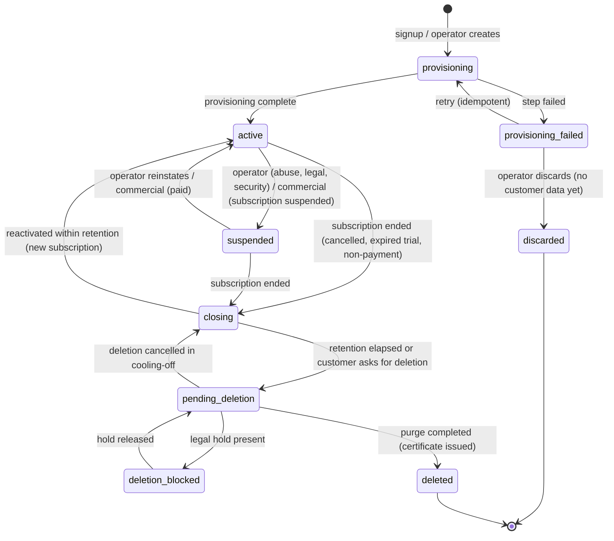
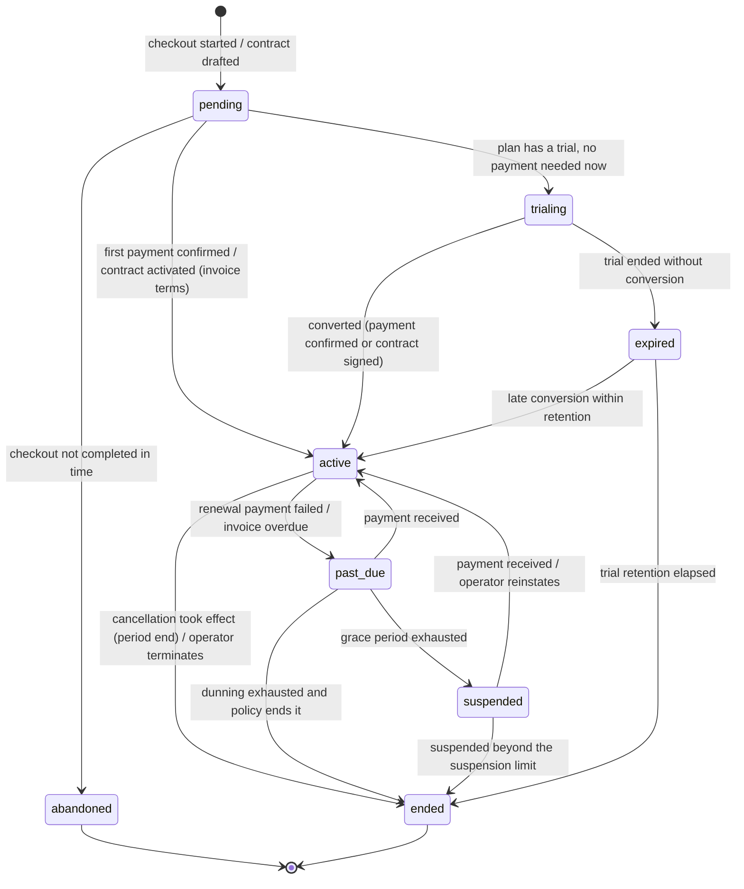
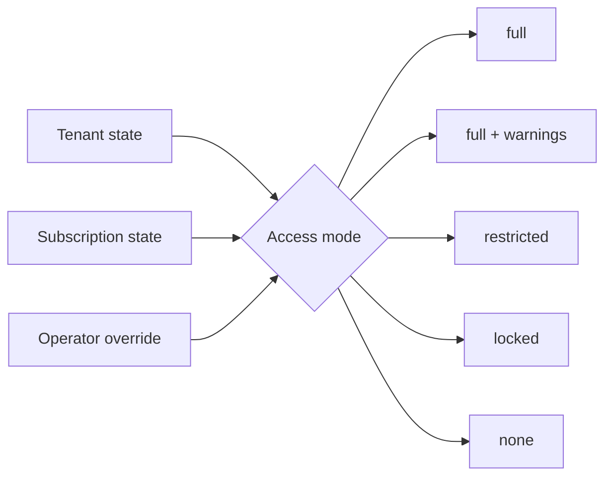
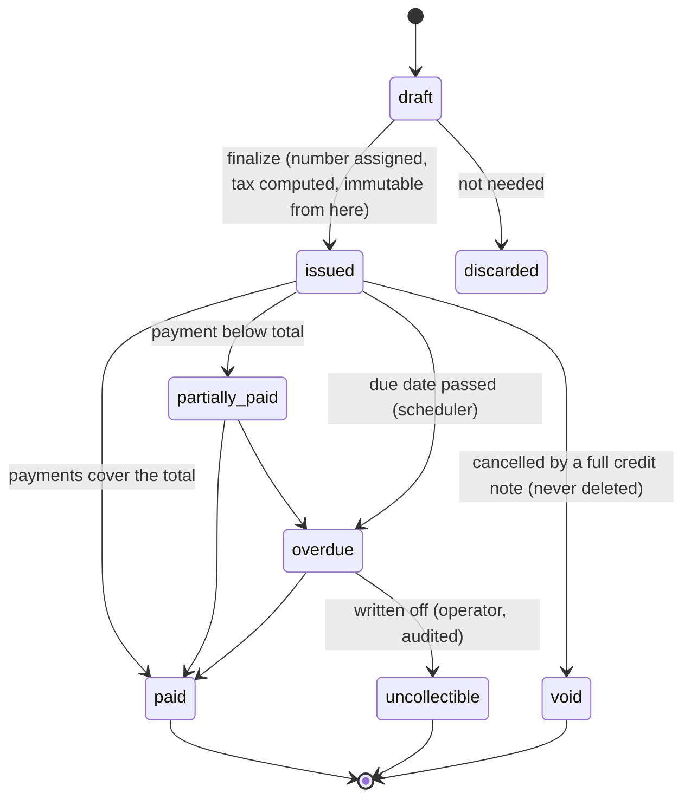
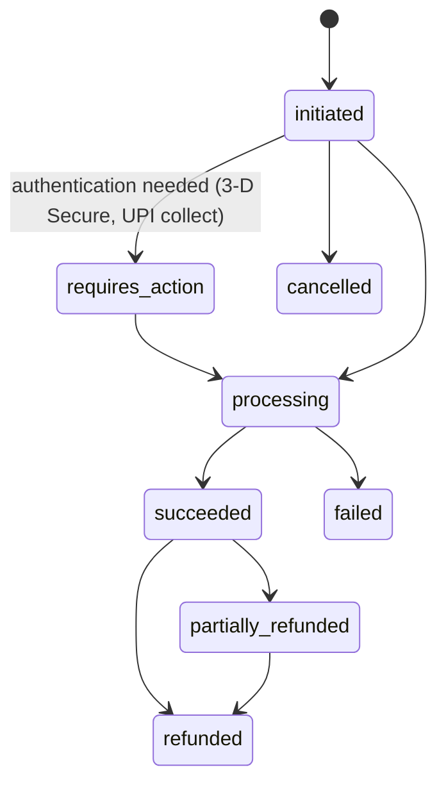

# SaaS.1 — Lifecycle State Machines

**Status:** Proposed (SaaS.1, architecture only; nothing here is implemented) · **Date:** 6 October 2026 · **Part of:** [SaaS.1 Commercial Architecture & Gap Analysis](SaaS-1-Commercial-Architecture-Gap-Analysis.md)

This document defines the commercial and tenant lifecycles that later phases implement. Each machine lists:
- its states;
- the allowed transitions;
- what triggers each transition (customer, operator, payment event, scheduler, system);
- what each transition must record.

**Conventions shared by every machine** (borrowed from the existing lifecycle engine, `LifecycleEngine` + `employee_lifecycle_transitions`):

- **One owner per machine.** Each machine is owned by exactly one domain service. Nothing else writes its `status` column; an architecture test enforces this, as it does for `LifecycleEngine` today.
- **Transitions are configuration-free and code-owned.** Commercial lifecycles are protected platform logic (blueprint §101: "Hardcode/protect … platform subscription/billing logic").
- **Every transition writes three things in one transaction:**
  1. the new status;
  2. an append-only transition row (`from`, `to`, `trigger`, `actor`, `reason`, `correlation_id`, `occurred_at`, `effective_at`);
  3. an audit event through the existing `AuditRecorder`.

  There is no second audit system ([ADR-0024](../architecture/decision-register.md#saas1-proposed-decisions)).
- **Transitions are idempotent.** Asking for a transition the record has already made is a no-op that returns the existing transition. An impossible transition is refused, not coerced.
- **Concurrency.** A transition takes a row lock (`lockForUpdate`) on the record, then re-reads the status. This is the payroll-run and inbound-event pattern.
- **Time.** Scheduled transitions (trial end, grace end, renewal) are made by the scheduler. A sweep finds due records by indexed `*_at` columns and transitions each one under its own lock. A missed run catches up on the next run, because the due condition is "at or before now", never "exactly now".

## 1. Why there are separate machines

Today one column, `tenants.status`, carries `trial`, `active` and `suspended` (`app/Domain/Platform/Enums/TenantStatus.php`). It mixes three different questions:

| Question | Owner | Machine |
|---|---|---|
| Does this workspace exist, and in what operational condition? | Platform | **Tenant lifecycle** (§2) |
| What has the customer bought, and is it paid? | Commercial / Subscriptions | **Subscription** (§3), with **Trial** (§4) as part of it |
| May people use the workspace right now, and how much? | Derived, never stored as truth | **Access mode** (§5) |

The machines are kept separate because they change for different reasons:
- an operator can suspend a fully paid tenant for abuse;
- a tenant can be past due without being suspended;
- a cancelled subscription leaves the tenant existing, in retention, until deletion.

Folding them into one status is exactly the ambiguity `trial` creates today. A tenant in `trial` with an expired `trial_ends_at` is still fully usable, because nothing reads that column for enforcement.

## 2. Tenant lifecycle (Platform)

| State | Meaning | Data | Who can sign in |
|---|---|---|---|
| `provisioning` | Being created by the provisioning workflow | Seed data only | Nobody |
| `provisioning_failed` | A provisioning step failed after retries | Partial seed data | Nobody; operators see the failed step |
| `active` | Normal operation. Access depends on the subscription (§5) | All | Per access mode |
| `suspended` | Operator or commercial suspension | All, unchanged | Billing contacts and tenant owners: billing, export and support pages only; platform operators |
| `closing` | Subscription ended; retention window running | All, read-only | Tenant owners: export and reactivation only |
| `pending_deletion` | Deletion requested or retention elapsed; cooling-off period running | All, read-only | Tenant owners: cancel deletion, download the final export |
| `deletion_blocked` | A legal hold prevents deletion | All, read-only | As `closing` |
| `deleted` | Tenant data purged per the deletion policy; tombstone kept | Tombstone plus commercial and audit records the law requires (Billing §4, Target Architecture §9) | Nobody |
| `discarded` | A provisioning attempt abandoned before any customer use | Removed | Nobody |

**Triggers:**
- **Operator transitions** (suspend, reinstate, legal hold, discard) need a platform permission and a reason, and are audited as platform actions.
- **Commercial transitions** come only from the Subscription service (§3) through a domain event (`subscription.suspended`, `subscription.reinstated`, `subscription.ended`). The tenant machine never reads provider data.
- **Retention elapsed** is a scheduled transition.
- **Deletion** is executed by the offboarding workflow (Target Architecture §9), never by a request handler.

**Migration from today:**

| Today | Target |
|---|---|
| `trial` | `active`, plus a subscription in `trialing` |
| `active` | `active`, plus a subscription per the default-plan strategy (Gap Analysis §20) |
| `suspended` | `suspended`, with suspension reason `operator`, unless a subscription says otherwise |

The column stays a string; enum cases are added, not renamed. `BindTenantContext` and `TenantRunner` already skip suspended tenants. They must treat `closing`, `pending_deletion`, `deletion_blocked` and `deleted` the same way, retention purge excepted. Today that logic is keyed on the `Suspended` case, so this is a P0 detail of the lifecycle phase (Gap Analysis G-LC-3).

## 3. Subscription (Commercial)

| State | Access mode it implies (§5) | Notes |
|---|---|---|
| `pending` | none (tenant still `provisioning`), or unchanged for a plan change | Created at checkout or contract entry |
| `trialing` | `full` within trial entitlements | `trial_starts_at`, `trial_ends_at` on the subscription; trial limits come from the plan version |
| `active` | `full` | `current_period_start` / `current_period_end` |
| `past_due` | `full` with banners during the grace period | `past_due_since`, `grace_ends_at` (from the plan version's dunning policy) |
| `suspended` | `restricted` (read-only plus billing, export and employee self-service) | Commercial suspension. Mirrors into tenant `suspended` only if the policy says so (decision D-6) |
| `expired` | `restricted` until trial retention elapses | Trial without conversion |
| `ended` | none; tenant moves to `closing` | Terminal for this subscription. Reactivation creates a **new** subscription for the same tenant and billing account, so history is never rewritten |
| `abandoned` | none | Checkout not completed; nothing to bill |

**Not states, but attributes:**
- `cancel_at_period_end` (a scheduled cancellation);
- `scheduled_change` (a downgrade or plan change at the next renewal);
- `collection_method` (`automatic` card or mandate, or `invoice` for enterprise bank transfer).

Making these states would multiply the machine without adding behaviour. They are evaluated by the renewal sweep.

**Triggers:**

| Trigger | Transitions |
|---|---|
| Customer (tenant owner with `billing.manage`, §5 of the Entitlement doc) | start checkout; cancel (sets `cancel_at_period_end`); undo cancellation before period end; upgrade (immediate, prorated); downgrade (scheduled at renewal) |
| Payment event (verified provider webhook → inbound event → `SubscriptionService`) | `pending → active`, `trialing → active`, `past_due → active`, `suspended → active`, `active → past_due` |
| Scheduler | trial end; grace end; renewal; scheduled change; cancellation at period end; abandonment timeout; trial retention |
| Operator (platform permission, reason required) | extend trial; terminate; reinstate; comp (100 % discount); move to invoice collection |

**Rules:**
- **No provider event mutates a subscription directly.** The webhook handler verifies and stores the event. The domain service decides, idempotently on the provider event id, whether a transition follows. An event for a state the subscription has already passed is recorded and ignored, never applied backwards. This is the out-of-order delivery rule.
- **The commercial terms in force are pinned.** `plan_version_id` is set on each subscription item. A plan change creates new item rows effective from the change date; existing rows are end-dated, never edited (Domain Model §3).

## 4. Trial (part of the subscription)

A trial is not a field on the tenant. It is a subscription in `trialing`, with dates and limits taken from the plan version:

| Concern | Design |
|---|---|
| Start | `pending → trialing` when the plan version has `trial_days > 0` and the customer is eligible. Eligibility: one trial per verified company identity and per verified domain. Duplicate detection is in Target Architecture §5 |
| Duration | `trial_ends_at = trial_starts_at + plan_version.trial_days`, fixed at start (a later plan edit does not move it) |
| Entitlements | The plan version's trial entitlement set (for example a maximum of 25 employees, AI capped), evaluated like any entitlement (Entitlement doc §4) |
| Reminders | Notifications at T-7, T-3 and T-1 days, through the existing notification pipeline (platform channel, not tenant rules) |
| Conversion | Payment confirmed (automatic) or contract activated → `active`. The entitlements switch to the paid plan version at that instant |
| Expiry | Scheduler at `trial_ends_at` → `expired` → access mode `restricted`: read-only, data export, billing page to convert |
| Grace and retention | `expired` lasts `plan_version.trial_retention_days` (proposed 30) → `ended` → tenant `closing` (retention, then deletion with notices) |
| Extension | Operator only, with a reason, up to a configured maximum. `trial_ends_at` moves forward; a transition row records old and new dates |
| Reactivation | `expired → active` on conversion within retention; all data intact |

**What enforcement means for a trial:** the trial end is acted on by the scheduler, and the resulting access mode is checked on every request. An expired trial cannot reach a restricted capability through the UI, the API, imports or jobs, because the check lives in the entitlement gate (Entitlement doc §6), not in the trial date.

## 5. Access mode (derived)

| Mode | Derived when | What works |
|---|---|---|
| `full` | tenant `active` and subscription `trialing` / `active` | Everything the entitlements allow |
| `grace` | tenant `active` and subscription `past_due` within grace | As `full`, plus persistent banners for administrators |
| `restricted` | subscription `suspended` / `expired`, or tenant `suspended` for commercial reasons | Read-only HCM. Employee self-service reads (own payslips, documents, letters). Data export. Billing pages. **In-flight statutory work may complete** (decision D-7). No new hires, no payroll calculation, no AI, no outbound integrations |
| `locked` | tenant `suspended` by an operator (abuse, legal, security) | Nobody but platform operators |
| `none` | tenant `closing` / `pending_deletion` / `deletion_blocked` | Tenant owners: export, reactivation and deletion controls only |

**Rules:**
- **The mode is computed by one service** (`TenantAccess`), memoised per request. It is enforced:
  - in `ResolveTenant` (sign-in and route-level refusal);
  - in `AuthenticateApiKey` (API);
  - in `BindTenantContext` (jobs);
  - in the entitlement gate (capability refusal).
- It is **never** enforced by hiding navigation.
- Statutory safety: restricting a tenant must never leave a payroll run, statutory return or exit settlement half-done. These flows check the mode at their **start**, not at every step.

## 6. Invoice

**Rules:**
- **An issued invoice is immutable.** Corrections are credit notes (reduce) or debit notes (increase), each with its own number series (Billing doc §4).
- **The number is assigned once, in a gap-free sequence per financial year and series**, inside the finalize transaction. This reuses the `NumberSequences` primitive (`app/Support/Numbering`).

## 7. Payment and refund

**Rules:**
- **A payment is keyed by `(provider, provider_payment_id)`, unique.** A second webhook for the same payment updates nothing that is already final.
- **Refunds are their own records** (`requested → processing → succeeded | failed`), keyed the same way. A refund never edits the payment row's amount.

## 8. Dunning (inside `past_due`)

Proposed schedule, configurable per plan version's dunning policy and pinned like other terms:

| Day after failure | Action |
|---|---|
| 0 | Notify the billing contact; the provider retries per its own smart retry if enabled |
| 3 | Retry the charge (automatic collection) or send a reminder (invoice collection) |
| 7 | Retry or remind; banner to administrators |
| 14 | Final notice; `grace_ends_at` reached → `suspended` |
| 30 (suspension limit) | `ended`, unless paid; tenant → `closing` |

Each step is a row in `dunning_attempts` (unique `(invoice_id, step)`), so a re-run of the sweep never sends twice.

## 9. Provisioning, export and deletion workflows

These are resumable step workflows, not entity lifecycles. Each step is idempotent and checkpointed in a run row.

| Workflow | Steps | States |
|---|---|---|
| Provisioning (Target Architecture §6) | reserve slug → create tenant (`provisioning`) → seed roles and permissions → seed settings, features and organisation defaults → create owner user and invite → apply plan entitlements (subscription item) → onboarding state → `active` | `requested → running → completed / failed` (resume from the failed step) |
| Tenant export (Target Architecture §8) | snapshot point in time → per-domain exporters → package → encrypt → upload → notify | `requested → approved → running → ready → expired` / `failed` |
| Tenant deletion (Target Architecture §9) | verify no legal hold → final export offered → cooling-off → per-domain purge (documents, search, caches, integrations, webhooks) → database purge → certificate | `requested → scheduled → running → completed` / `blocked` / `failed` |

## 10. Payment-provider event (the `inbound_events` machine, on a platform-level store)

The existing inbound event machine, `received → processing → succeeded | failed → retrying → dead_letter → reprocessed` (ADR-0012), is reused for payment-provider webhooks, with one addition: `ignored`, for events PeopleOS does not act on (recorded, never retried).

The **table is not reused.** `inbound_events` is tenant-owned and authenticated by a tenant's API key bound to an integration system. Provider webhooks arrive at Markedge's merchant account, platform-wide, before any tenant is known. The tenant is found only after the signature is verified, through the provider customer → billing account mapping.

The store is therefore the platform-level `billing_provider_events` (Domain Model §6). It keeps the same states, claims, backoff and dead-letter rules, and the same encrypted payload with a SHA-256 hash. The Billing Provider Abstraction document §5 covers the details.
