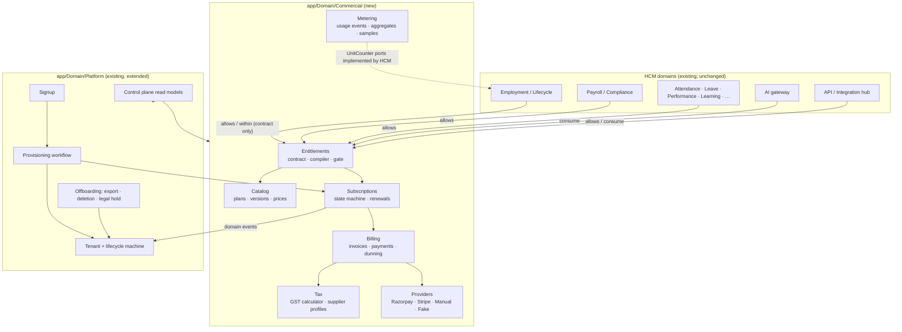

# SaaS.1 — Target Commercial Architecture

**Status:** Proposed (SaaS.1, architecture only) · **Date:** 6 October 2026 · **Part of:** [SaaS.1 Commercial Architecture & Gap Analysis](SaaS-1-Commercial-Architecture-Gap-Analysis.md)

**Companion documents:**
- [Commercial Domain Model](SaaS-1-Commercial-Domain-Model.md)
- [Lifecycle State Machines](SaaS-1-Lifecycle-State-Machines.md)
- [Entitlement Architecture](SaaS-1-Entitlement-Architecture.md)
- [Billing, Provider Abstraction and GST](SaaS-1-Billing-Provider-Abstraction.md)
- [Security Threat Model](SaaS-1-Security-Threat-Model.md)
- proposed ADR-0017 to ADR-0026 in the [decision register](../architecture/decision-register.md#saas1-proposed-decisions)

## 1. Shape: commercial bounded contexts inside the modular monolith

PeopleOS is a modular monolith. Domain modules live under `app/Domain/{Module}`, delivery under `app/Filament` and `app/Http`, and cross-cutting primitives under `app/Support`. There is one MySQL database with a tenant key on every tenant-owned table (architecture contract §1, §15).

The commercial layer follows the same shape. It is **not** a separate service ([ADR-0017](../architecture/decision-register.md#saas1-proposed-decisions)):
- entitlement checks on count limits must commit in the same transaction as the HCM write they guard (Entitlement doc §6.3);
- the tenancy, audit, queue, notification and integration primitives already exist and are tested;
- a second service would need its own tenancy, auth and audit before doing anything useful.

The boundaries below are drawn so that billing could be extracted later, behind its contracts, if scale demands it.



**Dependency rules.** Each is an architecture test, like the existing RMS-boundary and tenant-trait tests:

| Rule | Why |
|---|---|
| HCM namespaces may import only `App\Domain\Commercial\Entitlements\Contracts\*` (the `Entitlements` contract and the `Decision`, `ModuleMode` and `LimitReached` value objects) | HCM never learns about plans, prices, subscriptions or providers |
| `App\Domain\Commercial\*` does not import HCM models | Counts come through `UnitCounter` ports implemented by the HCM modules (e.g. `Employment\Commercial\ActiveEmployeeCounter`). Commercial depends on a contract, not on `Employee` |
| Provider SDKs and payment field names exist only under `Commercial\Billing\Providers\*` | Provider independence (Billing doc §1) |
| Only `SubscriptionService` writes `subscriptions.status`; only `TenantLifecycle` writes `tenants.status`; only `InvoiceService` issues and voids invoices | One owner per state machine (State Machines conventions) |
| Commercial models are read only by commercial services, the tenant billing read model and the control plane | Platform-owned, tenant-keyed records without the tenant trait (Domain Model §2) |
| No RMS concepts anywhere in Commercial | Product independence (security invariant 19). A recruitment integration stays behind the Integration Hub |

## 2. Domain boundaries and ownership

| Context | Owns | Publishes | Consumes |
|---|---|---|---|
| **Catalog** | plans, plan versions, prices, plan entitlements; plan migrations | `catalog.plan_version_published` | — |
| **Entitlements** | the capability catalogue (config), overrides, snapshots, the gate | `entitlements.changed` (cache version bump) | subscription items, overrides, access mode, operational flags |
| **Subscriptions** | subscriptions, items, transitions, trials, renewals, scheduled changes | `subscription.*` (activated, past_due, suspended, reinstated, ended…) | payment outcomes (normalised), scheduler |
| **Billing** | billing accounts, tax profiles, mandates, invoices and notes, payments, allocations, refunds, dunning, checkout sessions, provider events | `invoice.*`, `payment.*` | subscription periods, metering aggregates, tax results |
| **Tax** | supplier profiles, tax rules, the calculator; later the e-invoice adapter | — | — (pure) |
| **Metering** | usage events, aggregates, daily samples; the `UnitCounter` port | `usage.threshold_crossed` | HCM counters, AI gateway, API middleware, storage ledger |
| **Platform: tenant lifecycle** | `tenants.status` machine, lifecycle transitions, access mode | `tenant.*` | `subscription.*` events, operator actions |
| **Platform: signup and provisioning** | signups, provisioning runs, tenant domains | `tenant.provisioned` | — |
| **Platform: offboarding** | tenant exports, deletion requests, legal holds | `tenant.export_ready`, `tenant.deleted` | lifecycle |
| **Platform: control plane** | read models only | — | everything above, read-only |
| **Identity (existing)** | users, roles, permissions | — | entitlement filter on permissions (Entitlement doc §6.1) |

## 3. Plan and pricing model architecture

These are the capabilities the catalogue must be able to express. **No price is decided here** (decision D-1).

| Requirement | Supported by |
|---|---|
| Monthly and annual billing | `plan_prices.billing_period` (`month`, `year`); a subscription has one billing period; switching period is a plan change at renewal |
| Per-employee pricing | Price component `per_active_employee` with `unit = employees.active` (the recommended metric: one lifetime record, one unit) |
| Per-user pricing | Component `per_user` / `per_admin_seat` with `unit = users.active` / `users.admin` |
| Minimum seats or employees | `minimum_quantity` on the price; `min_commitment` on the plan version |
| Module pricing and add-ons | Add-on plans (`plans.kind = add_on`) with their own prices and entitlements (e.g. "Payroll for India", "AI Plus") |
| Usage pricing | Components with `unit = ai.tokens`, `api.requests` etc., `pricing_model = per_unit` or `tiered`, `included_quantity` |
| Hybrid | Several price components on one plan version: base fee + per employee + usage overage |
| Free plan | A plan version with zero-priced components and tight limits. A subscription without payment collection is `active`; no checkout needed |
| Trial | `trial_days` and trial entitlement values on the plan version (State Machines §4) |
| Enterprise / custom | `visibility = private` plan versions created per deal, plus entitlement overrides; `collection_method = invoice` |
| Currency | Every price has a currency; a plan version may carry INR and USD prices; the billing account's currency selects. GST is computed in INR (Billing doc §4) |
| Regional pricing | `plan_prices.market` (e.g. `IN`, `INTL`); the billing account's country selects the market |
| Tax handling | Prices are **exclusive** of GST; tax is added at invoice time by the Tax context, never baked into prices (decision D-10 if tax-inclusive display is wanted) |
| Grandfathering | Items pin `plan_version_id` and `plan_price_id`; nothing changes until an explicit plan migration (§4) |

## 4. Plan versioning: v1, v2, v3 without breaking anyone

```
Plan "Growth"
  v1  published 2027-01-01  sold 2027-01-01 … 2027-06-30   ₹X/employee, AI 10k tokens, payroll included
  v2  published 2027-07-01  sold 2027-07-01 … (open)        ₹Y/employee, AI 25k tokens, payroll as add-on
  v3  draft
```

1. **Publishing v2 ends v1's sale window** (`effective_until`) for **new** subscriptions only. Existing subscription items still point at v1, so their prices, entitlements, trial and dunning terms are unchanged. Their entitlement snapshots do not move, because snapshots are compiled from pinned items.
2. **Price and limit changes for existing customers** are an explicit, audited **plan migration**:
   - choose the subscribers (all v1, or a list);
   - choose the target version;
   - choose the effective date, which must be a renewal boundary, with the notice period as policy (D-5).

   The migration end-dates v1 items and starts v2 items at that date. It compiles future snapshots at once, notifies owners and records a transition per subscription. Nothing retroactive: invoices already issued keep their lines and snapshot.
3. **Module changes** (v2 moves payroll to an add-on): a migration either adds the payroll add-on at no cost for grandfathered customers (an override or a zero-priced add-on item) or lets it lapse into `read_only` (Entitlement doc §9). Both are explicit choices recorded in the migration.
4. **Effective-dated end to end:**
   - plan versions (sale window);
   - items (`effective_from` / `until`);
   - snapshots (`effective_from` / `until`);
   - overrides (`effective_from` / `until`);
   - tax rules and supplier profiles.

   No destructive update anywhere. "What did this customer have on 3 March, and at what price" is answerable from rows, not logs.

## 5. Self-service signup (future; not implemented)

```mermaid
sequenceDiagram
    actor V as Visitor
    participant S as Signup (Platform)
    participant P as Provisioning workflow
    participant C as Commercial (subscription)
    V->>S: e-mail, company name, country, plan intent (rate-limited, CAPTCHA if abused)
    S->>V: verification e-mail (signed, expiring link; neutral wording)
    V->>S: verifies e-mail
    S->>S: duplicate checks (domain, company identity), slug proposal, region/timezone/currency/locale defaults from country
    V->>S: confirms company details, accepts Terms vX + Privacy vY (versions + time + IP stored)
    S->>P: start(idempotency_key = signup.reference)
    P->>P: create tenant (provisioning) → seed (transaction) → owner user (password set by the owner)
    P->>C: create subscription (trialing on plan version, or pending → checkout)
    P->>V: welcome + set-password / sign-in link
    V->>V: onboarding checklist in the product
```

| Concern | Design |
|---|---|
| E-mail verification | A signed link (Laravel signed URL) with a 24 h expiry, before any tenant exists. Neutral responses ("if this address can be used, we have sent a link") so existence is never disclosed |
| E-mail already used | `users.email` is globally unique today (Threat Model W10). Signup with an existing login says "this address already has a PeopleOS account: sign in instead" in the e-mail, never on the page. Whether one person may hold logins in several tenants is decision D-17 |
| Duplicate company detection | Same verified domain as an existing tenant's verified `tenant_domains` row → route the visitor to "ask your administrator" (e-mailed, never disclosed on screen). Same GSTIN as an existing billing tax profile → the operator reviews before a trial is granted (trial abuse) |
| Domain verification | Optional at signup; required for SSO home-realm discovery and auto-join. DNS TXT record, re-checked periodically |
| Initial admin | The verified e-mail becomes the tenant owner (`tenant-super-admin` + the new `billing.*` permissions). The password is set by the owner through the link; provisioning never sets a password, unlike today's operator form |
| Tenant slug | Proposed from the company name; unique (exists); reserved words blocked; changeable later only by an operator (URLs and SSO slugs depend on it) |
| Region, country, timezone, currency, locale | Defaults from the country (IN → `Asia/Kolkata`, INR, `en`), editable. Region is the residency commitment (§10); at launch only `in` is offered (decision D-11) |
| Plan selection, trial | Public plan versions for the visitor's market. Trial if the plan version has one and the company and domain are eligible (State Machines §4) |
| Terms and privacy | Stored as accepted versions with time and IP on the signup and copied to the tenant. A new Terms version requires re-acceptance by an owner at next sign-in |
| Abuse | Rate limits per IP and per e-mail; disposable-domain blocklist (decision); CAPTCHA only when the rate is exceeded; signups expire after 7 days unverified |

**Prerequisites from the current state:** password reset, a password-set (invite) flow and e-mail verification do not exist today (Threat Model W2). They come first, in the identity foundation (Gap Analysis §23).

## 6. Tenant provisioning (idempotent workflow)

**Today.** `ProvisionTenantAction::handle()` runs one database transaction:
- creates the tenant (7 attributes; `tier`, `region` and `trial_ends_at` are dropped);
- seeds roles, permissions, 8 features, 44 settings and organisation and module defaults;
- creates the first admin with a password typed by the operator;
- audits `TENANT_PROVISIONED`.

It is atomic: a failure rolls everything back (tested). It is **not** idempotent: a retry fails on the unique slug. It sends no e-mail.

**Target:** the same transactional core, wrapped in a resumable, idempotent workflow:

| Step | Transactional? | Idempotent by | Notes |
|---|---|---|---|
| 0. Claim | Yes (insert) | `provisioning_runs.idempotency_key` UNIQUE (signup reference or operator request id) | A retry finds the run and resumes from its step. A double submit gets the same run |
| 1. Core | **One transaction** (today's action, fixed to keep tier/region/trial) | Tenant slug UNIQUE + the run's `tenant_id` | Tenant (`provisioning` status), system roles and permissions, features, settings, organisation and module defaults, owner user (no password), `tenant_domains` row (unverified), audit. All-or-nothing, as today |
| 2. Commercial | One transaction in Commercial | `subscriptions.live_tenant_id` UNIQUE | Billing account, tax profile (from signup), subscription (`trialing` or `pending`), items pinned to plan versions, first entitlement snapshot |
| 3. Provider customer | External call, **after** commit | `billing_accounts.provider_customer_id` set once; provider idempotency key = account reference | Can be deferred to first checkout; a failure does not block activation for trials |
| 4. Activate | Transaction | Status check (`provisioning → active`) | Lifecycle transition + audit + `tenant.provisioned` event |
| 5. Welcome | Queued, after commit | Notification dedupe key (`DeliverNotification`) | Set-password link (signed, single use), getting-started guide |
| 6. Onboarding state | Transaction | Upsert | Checklist rows: company created, employees imported, payroll configured… (product UX, later) |

**Failure handling:**
- Each step records its outcome in `provisioning_runs.steps`.
- Steps 1–2 are database-only, so a crash rolls back and the retry repeats them.
- Steps 3–6 are idempotent.
- A run failed for more than 15 minutes alerts operators; they can resume or discard it (`provisioning_failed → discarded` only before the owner has signed in).
- The browser waits on a status page that polls the run; closing it changes nothing, because the e-mail carries the next step.

## 7. Tenant lifecycle and access mode in the request path

Today `tenants.status` is enforced in four places, each keyed on `Suspended`:
- `User::canAccessPanel`;
- `ApiKeys::resolve`;
- `BindTenantContext`;
- `TenantRunner`.

Also, today:
- `ResolveTenant` does no status check;
- download and attachment routes bypass `canAccessPanel` (Threat Model W5);
- suspension does not end sessions.

**Target:**
1. **One service, `TenantAccess::mode(tenant)`** (State Machines §5), cached with the entitlement snapshot.
2. **`ResolveTenant` refuses `locked` and `none`** (403 with a neutral message). It routes `restricted` to read-only behaviour through the permission filter.
3. **Download and attachment routes join the same guard** (add `EnforceSecurityPolicy` and the access check).
4. **Suspension invalidates sessions.** A per-tenant session epoch, compared by `ResolveTenant`, avoids scanning the sessions table.
5. **API, jobs and the scheduler ask the same service.** `ApiKeys::resolve`, `BindTenantContext` and `TenantRunner` ask `TenantAccess` instead of `isAccessible()`. Retention purge keeps running for every tenant, and the offboarding workflow runs for tenants in `closing` / `pending_deletion`.

## 8. Tenant data export (future; not implemented)

| Concern | Design |
|---|---|
| Who | The tenant owner with `tenant.export` (new), with a reason; MFA required once MFA works (W1). Or a platform operator on a deletion workflow. All owners are notified |
| What | Per-domain exporters behind one `TenantExporter` contract, each declaring what it exports: employees and people (with satellites), organisation, attendance, leave, payroll (runs, entries, payslips), compliance outputs, documents (files), performance, learning, assets, service desk, audit (the existing `peopleos:audit:export` CSV), configuration (the existing blueprint export), integrations (definitions, never secrets) |
| Reuse | The warehouse feed (`WarehouseExport`) already writes JSONL per dataset with a manifest. The dataset layer already enforces sensitive-field permissions. A tenant export uses the same datasets **with** sensitive fields (the owner's export), plus files |
| Format | A ZIP of JSONL per dataset + CSV mirrors for spreadsheets + files under their original names + `manifest.json` (dataset, row counts, checksums, schema version, export time, `as_of` point in time) |
| Encryption | Archive encrypted with a per-export key; the key is shown once to the requester (or derived from a passphrase they set). Stored on a private disk under a platform prefix, outside the tenant's file tree, so it survives deletion steps until it expires |
| Delivery | Signed URL, expiry 24 h (proposed), download count limited, every download audited |
| Large tenants | Generated asynchronously by a chunked job per dataset (`lazyById`, as payroll does). Multi-part archives above a size threshold. Progress in `tenant_exports`. Resumable by dataset checkpoint |
| History | `tenant_exports` rows kept with the archive hash after the file expires |
| Point in time | Rows are read with `as_of` = export start. Effective-dated tables make this exact; live tables (counters, statuses) are exported as of the read |

## 9. Offboarding, retention and deletion (future; not implemented)

**The flow:**

```
active → (cancellation takes effect / trial expires unconverted / non-payment) → closing
closing: read-only, export available, reactivation possible               [retention window, decision D-8]
closing → pending_deletion: retention elapsed, or the owner asks for deletion (with platform confirmation)
pending_deletion: cooling-off (proposed 14 days), owners notified, final export offered; cancel possible
pending_deletion → deletion_blocked if any legal hold exists
pending_deletion → deleted: purge executed step by step, certificate issued
```

**What happens to each kind of data:**

| Data | Rule | Today's constraint |
|---|---|---|
| HCM operational data (people, attendance, leave, performance…) | Purged at deletion (hard delete) | 274 tenant FKs `cascadeOnDelete`: deleting the tenant row would cascade. Deletion must **not** rely on that blind cascade; it runs an ordered purge per domain with counts (evidence), then removes the tenant row |
| Payroll and statutory records | The tenant, as employer, has statutory retention obligations **[verify per act]**. The default is to give them the export, and Markedge deletes on the tenant's instruction after the retention window agreed in the contract. Retaining beyond that only under a legal hold. Never deleted "casually": the purge requires the cooling-off, the final export and no hold | — |
| Audit events (the tenant's hash chain) | Tenant data: exported with the archive. Deleted at the end of the purge as the **one sanctioned exception** to "audit is never purged" (contract §14), only through the deletion workflow, with the platform chain recording the purge (counts, final chain hash) | `audit_events.tenant_id` is `restrictOnDelete`: the tenant row cannot be deleted while audit rows exist. That is correct and stays; the purge deletes them explicitly at the end |
| Markedge's commercial records (invoices, payments, tax) | **Retained** for Markedge's own tax retention **[verify years]**. They are Markedge's books (Domain Model §2). Personal data inside them is limited to billing contacts; anonymised where law allows once retention ends | — |
| Platform audit of operator actions on the tenant | Retained (Markedge's accountability record) | Platform chain exists |
| Documents and files (object storage) | Purged by prefix and by the storage ledger | Prefixes are inconsistent today (six under `tenants/{id}`, others under `learning/…/{tenant}`, `statutory-exports/{tenant}`, `compliance-evidence/{table}/{tenant}`, `warehouse/{slug}`). The storage ledger and uniform prefixes come first (G-OFF-4) |
| Search indexes | None exist today (search runs on scoped DB queries) | — |
| Caches | `tenant:{id}:*` keys deleted | Keys are tenant-prefixed today (features, settings) |
| Queues | `BindTenantContext` skips jobs for `none`-mode tenants; pending jobs drain harmlessly | — |
| Webhooks and integrations | Endpoints deactivated, API keys revoked, SSO connections disabled, inbound systems disabled (in `closing`). Provider mandates cancelled | — |
| Backups | Cannot be surgically edited. Deleted data ages out with the backup retention (35 daily / 12 monthly per the operations doc). The deletion certificate states the date the last backup containing the tenant expires. Restores must re-apply a **deletion tombstone list** before going live | DR runbook marks tenant-level restore "deferred"; add tombstone handling to it |
| Anonymisation | For records Markedge keeps (commercial) after their purpose ends; usage aggregates keep tenant id, no personal data | — |
| Soft delete | Not used (no `SoftDeletes` anywhere; contract §14). Status-based lifecycle (`closing`, `pending_deletion`) plays that role | — |
| Legal hold | `legal_holds` rows block deletion and the purge of covered data; placed and released only by platform operators with a reason (dual control) | — |

**The deletion certificate** is a platform-signed PDF with:
- tenant name and id;
- request and execution times;
- per-domain row counts purged;
- file counts and bytes purged;
- the final audit-chain hash;
- the backup expiry date;
- the operator ids.

## 10. Data residency

**Verified current state:** `tenants.region` (`in`, `eu`, `us`, `ae`, `sg`, `au`) is a label on the tenant form. Nothing routes on it: no connection, disk, queue or AI provider choice. It is also dropped on create (W14). The architecture contract says so ("connection routing per tier" deferred). **PeopleOS does not provide data residency today and must not claim it.**

**Recommendation for launch:** single region, India (decision D-11):
- `region = in` for every tenant;
- database, object storage, backups and queue in one Indian region;
- AI external calls governed by the existing tenant AI data policy (`ai.external_data_policy`), with the provider's processing region documented in the DPA.

**What a multi-region future requires** (the "cell" model; P3):

| Layer | Change |
|---|---|
| Global control plane | Tenants directory (slug → region), platform users, catalogue, billing. Global e-mail uniqueness lives here, or becomes per region (decision D-17) |
| Regional data planes | One database, object storage, queue and backup set per region. Each tenant's HCM data lives only in its region |
| Request routing | Tenant resolution moves earlier: hostname (`{slug}.peopleos…` per region) or a global login that redirects to the regional app. `TenantContext::set` selects the connection |
| Jobs and scheduler | Workers per region; jobs carry the region; `TenantRunner` iterates only local tenants |
| Storage | Disks per region; the storage ledger records the disk |
| Backups and DR | Per region; cross-region replication only within the residency boundary |
| AI and other processors | Endpoint per region, or the processing location disclosed per tenant |
| Migration | Moving a tenant between regions = export + import with id preservation, a planned operation. The design must avoid global auto-increment ids leaking across regions (ULID references for cross-region objects) |

**What to do now to keep that door open:**
- keep the region on every tenant;
- never assume one connection in new commercial code: commercial tables are control-plane tables by design;
- keep uniform tenant storage prefixes (G-OFF-4).

## 11. Platform control plane

**Who.** Platform operators (`users.is_platform_admin`, `tenant_id = null`), with the single flag split into platform permissions (Threat Model T9):

| Permission | Allows |
|---|---|
| `platform.tenants.view` | List and inspect tenants: lifecycle, plan, subscription, billing state, entitlements, usage, health |
| `platform.tenants.lifecycle` | Suspend, reinstate, close, place and release legal holds (dual control) |
| `platform.commercial.manage` | Extend trials, overrides (dual control above threshold), plan migrations, comp, refunds (dual control above threshold), manual payments |
| `platform.catalog.manage` | Draft and publish plan versions, tax rules (verified), supplier profiles |
| `platform.data_access` | Enter a tenant (reason required, time-boxed, audited) |
| `platform.tenants.delete` | Execute deletion after cooling-off (dual control) |
| `platform.audit.view` | Read the platform audit chain |

**What they see** (read models over existing and new tables; no new writes outside the services):

| Panel | Source |
|---|---|
| Tenants list | `tenants` + lifecycle + subscription status + plan + trial end + billable units (daily sample) + last activity |
| Tenant 360 for operators | Lifecycle timeline (`tenant_lifecycle_transitions`), subscription timeline, invoices and payments, entitlements (snapshot with sources), overrides, usage (aggregates), health (failed jobs, dead letters, webhook failures **per tenant**), exports, deletion requests, legal holds, operator access log |
| Commercial events | Transition tables + platform audit, filterable by tenant and type |
| Health | The existing `HealthChecks` and `PlatformReadiness`, plus per-tenant breakdown. Failed jobs carry the tenant id in their serialised Context; inbound and webhook dead letters are per tenant |
| Reconciliation queue | Billing exceptions (Billing doc §6) |
| Provisioning runs | Failed and stuck runs, with resume and discard |

**Separation (Threat Model §5).** The control plane is a distinct Filament panel (e.g. `/platform`) with its own navigation and middleware, used only by platform users. Operators enter a tenant only through the audited, reasoned "enter" action. Today's single panel with a "Platform" navigation group is fine for HCM operators, but the commercial powers need the stronger boundary.

## 12. Audit and change intelligence

The existing `AuditRecorder` is reused ([ADR-0024](../architecture/decision-register.md#saas1-proposed-decisions)):
- per-tenant hash chains;
- the platform chain for tenant-less events;
- operation ids;
- immutability;
- verifier and export.

| Commercial event | Audit action (new names) | Chain |
|---|---|---|
| Plan version published / retired; tax rule verified | `CATALOG_PUBLISHED`, `TAX_RULE_VERIFIED` | platform |
| Subscription created, trial started / extended, plan changed, cancelled, reinstated, ended | `SUBSCRIPTION_*` | **platform**, with `subject_tenant_id` in metadata (the tenant owner can still see "their" events through the tenant billing read model) |
| Entitlement override granted / revoked; snapshot compiled | `ENTITLEMENT_OVERRIDE_*`, `ENTITLEMENT_COMPILED` | platform |
| Tenant suspended / reinstated / closed / deletion requested / executed; legal hold | `TENANT_LIFECYCLE_*`, `LEGAL_HOLD_*` | platform. Today's suspend/reactivate write to the tenant chain; moving them is a deliberate change |
| Invoice issued / voided / written off; payment received / failed; refund issued | `INVOICE_*`, `PAYMENT_*`, `REFUND_*` | platform |
| Tenant exported / export downloaded | `TENANT_EXPORTED`, `DOWNLOAD` | tenant chain (tenant data access) + platform |
| Operator entered / left a tenant | `PLATFORM_ACCESS_STARTED` / `_ENDED` (new; today not audited, W4) | platform **and** the tenant chain (so the tenant sees who entered) |

**Why commercial events go on the platform chain:**
- They are Markedge's actions on Markedge's records.
- A tenant's chain must not be able to hold, or lose, Markedge's financial history when the tenant is deleted.

The transition tables answer the state questions. Audit answers who, why, from where and with which correlation id. No separate "commercial event store" is created (Domain Model §10).

## 13. Background jobs

All commercial jobs follow the existing rules (queue doc; ADR-0013):
- `$tries`, `$timeout` and `$backoff` declared;
- timeout below `retry_after`;
- work claimed inside the job;
- failures logged through the redacted channels.

**Platform jobs vs tenant jobs:**
- **Platform jobs** (provider events, reconciliation, catalogue) are not `TenantAwareJob`s. They resolve the tenant from their own record, then `runAs` for tenant-owned side effects. The architecture test's job allow-list gains these, with the reason.
- **Tenant jobs** (usage aggregation per tenant, exports, deletion steps) are `TenantAwareJob` + `BindTenantContext`. Because they must still run when the access mode is `none`, `BindTenantContext` takes an explicit per-job "runs for closing tenants" marker, like retention purge.

| Job | Trigger | Idempotency / claim | Concurrency | Failure |
|---|---|---|---|---|
| `ProcessBillingProviderEvent` | Webhook receipt | Unique provider event id; leased claim | One per event | Backoff `min(60, 2^n)` minutes, dead letter at 5, operator reprocess (audited) |
| `ReconcileProviderPayments` | Hourly | Checkpoint per gateway | `withoutOverlapping()->onOneServer()` | Alert; next run resumes |
| `RenewSubscriptions` (sweep) + `ChargeInvoice` | Every 15 min | Subscription row lock + period check; charge idempotency key `invoice:{id}:{attempt}` | Per subscription | Dunning schedule (not tight retries) |
| `ExpireTrials`, `EndGracePeriods`, `ApplyScheduledChanges` | Hourly | Transition idempotency (status + `*_at` ≤ now under row lock) | Per subscription | Next run catches up |
| `DunningStep` | Daily | Unique `(invoice_id, step)` | Per invoice | Next run |
| `SampleBillableUnits` | Daily per tenant (`TenantRunner`) | Unique aggregate `(tenant, meter, day)`, upsert | Per tenant | Recomputable from transitions |
| `AggregateUsage` | Every 15 min per tenant | `last_event_id` watermark | Per tenant | Recomputable from events |
| `CompileEntitlements` | On change (sync, in-transaction) + daily integrity | Hash comparison | Tenant row lock | Alert on mismatch |
| `ProvisionTenantStep` | Signup or operator | `provisioning_runs` key + step checkpoint | Per run | Resume / discard |
| `GenerateTenantExport` | Owner request | Export row status + dataset checkpoint | One running export per tenant | Resume per dataset |
| `ExecuteTenantDeletionStep` | Scheduled after cooling-off | Step checkpoint | One per tenant | Resume; never skip a step |
| `GenerateInvoicePdf`, `IssueEInvoice` | After finalize commit | Invoice status / IRN set once | Per invoice | Backoff; alert |

## 14. Observability

**Must be answerable:**

| Question | Answered from |
|---|---|
| Why was this tenant suspended? | `tenant_lifecycle_transitions` (trigger, reason, actor) → if commercial, the subscription transition → the invoice and dunning attempts → the provider events |
| Why did this tenant exceed their employee limit? | `LimitReached` decisions are logged with tenant, limit, usage and snapshot version; `usage_aggregates` daily samples; the lifecycle transitions that consumed units |
| Why was this invoice generated? | `invoices.subscription_id` + period + `invoice_lines` (with `subscription_item_id`, `plan_price_id`, `usage_aggregate_id` evidence) + the `INVOICE_ISSUED` audit (actor or scheduler, correlation id) |
| Why was payment marked failed? | `payments.failure_code` + `billing_provider_events` (event id, type, received time) + the transition it caused |
| Why did the trial expire? | Subscription transition `trialing → expired` (trigger scheduler, `trial_ends_at`) + extensions in transitions |
| Why is this feature disabled? | `Entitlements::decide()` reason + the snapshot `sources` (plan version, add-ons, overrides) + operational flag state + access mode |
| Why was provisioning incomplete? | `provisioning_runs.steps` with per-step error |
| Why did an entitlement change? | The snapshot version history (sources and hash per version) + `ENTITLEMENT_*` audit |

**Logs.**
- A JSON log channel for production, with the redaction tap: today `monthly` and `slack` lack it (W11).
- Context keys on every commercial log line: `request_id` (exists), `tenant_id` (exists, hidden Context), `user_id` (missing today), `subscription_ref`, `billing_account_ref`, `invoice_ref`, `provider`, `provider_event_id`, `job_id`.
- References, never internal amounts with personal data.
- **Never logged:** provider payload bodies, payment instrument details, GSTIN with name pairs in error messages, signature headers.

**Metrics** (counters and timers; a metrics backend is absent today, decision on tooling):
- webhooks received, verified, rejected and dead-lettered by provider;
- payments succeeded and failed by code;
- dunning steps;
- subscriptions by state;
- trials converted and expired;
- provisioning duration and failures;
- entitlement denials by reason and capability;
- limit-reached events;
- reconciliation exceptions;
- invoice integrity failures.

**Correlation.** Every webhook gets a correlation id at receipt. It flows into the processing job, the transition rows, the audit events and any notifications, as inbound integration events do today.

## 15. Failure and recovery

| Failure | Retry | Idempotency | Reconciliation | Manual recovery | Customer-facing state |
|---|---|---|---|---|---|
| Payment provider outage | Checkout: user retries. Renewal: dunning schedule | Provider idempotency keys | Hourly pull | Operator records manual payment | "Payment could not be started, try again" / past-due banner within grace |
| Webhook outage | Provider retries | Event id unique | Hourly pull catches up | — | "Confirming payment…" until either arrives |
| Billing provider timeout | Same idempotency key retried | Yes | Pull | — | "Confirming payment…" |
| Duplicate webhook | — | Unique event id → no-op | — | — | None |
| Duplicate signup | — | Signup reference; `provisioning_runs` key; slug unique | — | Operator merges or discards | "Check your e-mail": the same tenant, never two |
| Provisioning failure | Resume from failed step | Step checkpoints | Stuck-run alert | Resume / discard | Status page: "We are setting things up…", then an e-mail |
| Subscription renewal failure | Dunning | Invoice + attempt key | Pull | Operator extends grace, records payment | Past due → restricted after grace |
| Database transaction failure | Request or job retry | All commercial writes idempotent by unique keys | — | — | Error message; nothing half-written |
| Queue failure (workers down) | Jobs wait; the scheduler sweeps re-find due work (status + `*_at`) | Claims | Health check (queue backlog) alerts | Restart workers | Delays only; no wrong state |
| Redis / cache failure | — | — | — | — | Entitlement gate falls back to the snapshot row (one indexed query) and the request memo. Rate limiter: the API throttle fails closed (429) by design. No commercial decision depends on Redis |
| E-mail failure | `DeliverNotification` backoff | Dedupe key | — | Resend from control plane | Billing page shows invoices and status regardless |
| Invoice generation failure | Finalize is one transaction; on failure the invoice stays `draft` | Number assigned only on commit | Integrity check | Operator re-finalizes | Invoice appears when finalized; no gap in numbering |
| Tax rule missing or unverified | — | — | — | Operator verifies the rule version | Invoice delayed (draft), never issued with a guessed tax |
| Tax service (e-invoice IRN) failure | Backoff | IRN set once | — | Operator | Per D-10 (Billing doc §7) |

## 16. Performance

Summarised from the Entitlement doc §7. Commercial checks add, per HCM request:
- **one cache read**, or one indexed row on a cold cache (snapshot and access mode);
- **zero per permission check** (the filter runs once when permission keys load);
- **zero counts on reads.**

Count limits cost one row lock and one indexed count **per write that increases a count**. Usage dashboards read daily aggregates.

**Regression guards** that must keep passing:
- the UX.18 interleaved measurement method (`docs/ux/ux18/evidence/perf-interleave.sh`);
- the query-count tests (`Ux18PerformanceTest`, `PlatformScaleTest`, the module scale tests).

## 17. Compatibility with the HCM modules

| Rule | Mechanism |
|---|---|
| HCM modules ask "is capability X available?" and nothing else | `Entitlements` contract only (§1 dependency rules) |
| Commercial logic does not leak into payroll, attendance, leave, performance, learning, career, compensation, employee experience, engagement, documents or lifecycle | No commercial import outside contracts (architecture test). The only HCM hook points are: `LifecycleEngine::transition` (employee limit), `User::permissionKeys` (module filter), `AiGateway::ask` (AI consumption), `AuthenticateApiKey` (API), upload paths (storage), payroll calculation start (population), organisation create actions, the user creation paths |
| Statutory work is never broken by a commercial state | Checks at the **start** of payroll calculation and statutory returns, never inside finalisation (decision D-7) |
| Payroll compliance and SaaS tax never mix | Separate domains, tables and rule packs (Billing doc §4) |
| One person, one lifetime record | The employee limit counts states, not records; rehire reuses the record; no commercial rule may create a second identity (Entitlement doc §8.1) |
| RMS independence | Nothing commercial references recruitment; pre-employees from the RMS hand-over do not count until they join |
