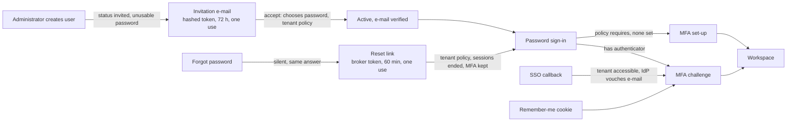

# SaaS.2 — Foundation Hardening Report

**Date:** 6 October 2026 · **Branch:** `feature/oct_1_phase_1` · **Starting commit:** `349ae1d` (SaaS.1) · **Scope:** fix the identity, tenant-governance and correctness defects SaaS.1 found, before any commercial work. No billing, plans, subscriptions, payments, metering, signup or entitlement enforcement was built.

Status words used throughout:
- **FIXED**: implemented and covered by automated tests;
- **DEFERRED**: known, outside this phase, recorded with an owner;
- **UNRESOLVED**: needs a decision that is not an engineering choice;
- **NOT IN SCOPE**: commercial work SaaS.2 must not start.

Supporting document: [SaaS-2 Baseline](SaaS-2-Baseline.md) (the state at `349ae1d`, re-verified before any change).

## 1. Executive Summary

Every foundation finding SaaS.1 handed to this phase is **FIXED**, with tests on the server-side rule, not on screens.

| Area | Before SaaS.2 | After SaaS.2 |
|---|---|---|
| MFA | The tenant's "MFA required" never applied; nobody could enrol; remember-me and SSO sessions skipped the challenge | Enforced per request for every page, Livewire call and protected download; enrolment, recovery codes, administrator reset; SSO and remember-me sessions are challenged; operators must use MFA (production refuses otherwise) |
| Password reset | None | Silent, non-enumerating, rate-limited, one-time, expiring, policy-checked; ends every session; MFA untouched |
| Invitations | Administrators typed users' passwords | Users are invited by e-mail: hashed, expiring, one-time, revocable, tenant- and user-bound links |
| E-mail verification | None | Required for local sign-ins whose address is unproven; proven by invitation, reset or SSO; changed addresses re-verify |
| Operator access | "Enter" any tenant: no reason, no audit, no end | Reason (plus optional ticket), 60-minute window, audited start, exit, sign-out and expiry on both the platform chain and the tenant's chain; every action inside carries the access id |
| Suspension | Panel refused, but downloads worked and sessions survived (and came back on reactivation) | Every entry point refused; existing sessions signed out at their next request (session epochs); SSO, reset and invitation links do nothing; API keys stop |
| Provisioning | Tier, region and trial end silently dropped; operator chose the owner's password | Persisted and validated; the first administrator is invited |
| Payroll | Pre-joining employees could be paid; two non-existent states referenced | Positive list of joined states |
| Other | Admin Centre checked keys that do not exist; API rate-limit setting undefined; seeders held passwords (one real-looking); workflow webhooks unsigned; idempotency keys kept forever | All fixed; the class of each defect closed by a test where possible |

SaaS.2 also closed five problems it found itself while fixing these:
- tenant users effectively held platform `tenant.*` keys;
- a `Tenant` record edit was audited into whichever tenant an operator had entered;
- SSO would link to an address the identity provider marked unverified;
- Filament's default reset pages enumerated accounts;
- Filament's reset e-mail would have put the token into the queue table.

**What remains** (§19, §20):
- SSO protocol hardening (ID-token and nonce validation, PKCE, the stored-but-unused `enforce` flag);
- a read-only operator mode;
- one e-mail address across tenants;
- the commercial layer;
- the production-readiness gates that SaaS.2 does not touch.

**Verdict:** see §22.

## 2. Starting State

| Item | Value |
|---|---|
| Branch / HEAD | `feature/oct_1_phase_1` at `349ae1d`, clean working tree |
| Prior verdicts | UX.1–UX.19 complete; SaaS.1 complete (architecture only); commercial implementation not started |
| Test baseline | The UX.19 suite (1,105 tests) plus SaaS.1 (documentation only) |
| Showcase server | `127.0.0.1:8090` serves this working tree against `hcm_ux_showcase`; left running, its database not touched (see §21) |

## 3. SaaS.1 Findings Reviewed

The SaaS.1 report (§5.2 gap register, §5.3 HCM defects) and the threat model (§4, W1–W14) were read in full. The proposed decisions ADR-0017 to ADR-0026 remain **Proposed**; nothing in SaaS.2 depends on them or converts them. Findings in this phase's scope:

| SaaS.1 id | Finding | SaaS.2 section |
|---|---|---|
| W1 / G-ID-1 | MFA requirement ineffective; no enrolment | §6 |
| W2 / G-ID-2 | No reset, invitation or verification | §7 |
| W4 / G-PLAT-1 | Operator entry unaudited, reasonless | §8 |
| W5 / W6 / G-LC-3 | Suspension gaps (downloads, sessions, edit form) | §9 |
| W14 / G-PROV-1 | Provisioning drops tier, region, trial; operator sets owner password | §10 |
| H-1 | Payroll population includes pre-joining employees; non-existent states | §11 |
| H-2 | Admin Centre checks non-existent keys | §11 |
| H-3 | API rate-limit setting undefined | §11 |
| H-5 | Hard-coded seeder credentials | §14 |
| W12 / H-6 | Workflow webhook unsigned | §12 |
| W9 / H-7 | Idempotency keys never cleaned | §13 |

Out of this phase's scope and left as SaaS.1 recorded them: W3 (SSO hardening, partly addressed, §19), W7, W8 (role editor), W10 (D-17), W11, W13, G-JOB-1.

## 4. Findings Confirmed

All eleven were confirmed in the code at `349ae1d` (evidence in the [baseline](SaaS-2-Baseline.md)). Verification also found:

| New finding | Severity | Status |
|---|---|---|
| Remember-me and SSO sessions never passed the MFA challenge (Filament challenges only inside its login form) | High (MFA bypass) | FIXED §6 |
| SSO linked or provisioned accounts and recorded a login for a suspended tenant before the panel refused | Medium | FIXED §9 |
| Filament's default reset pages reveal whether an address exists (request and reset steps) | Medium (enumeration) | FIXED §7 |
| Filament's reset e-mail is a queued notification: the token would sit in the `jobs` table | Medium | FIXED §7 (own, non-queued notification) |
| Tenant super-admins held platform `tenant.*` keys through the `*` template (no code checked them; latent) | Medium (latent escalation) | FIXED (keys never effective for tenant users) |
| `succession.read` (an API scope) checked as a permission | Low (always false) | FIXED |
| Seeded demo administrator used a real-looking password for an address on the owner's domain, also printed in `docs/architecture/phase-1-foundation.md` | High (credential in repository) | FIXED in the repository; **rotation outside the repository required** (§14) |
| `users.email` uniqueness reveals, to a tenant administrator inviting someone, that the address exists in another tenant | Low (W10) | UNRESOLVED (D-17) |

## 5. Findings Already Resolved

None. HEAD was the SaaS.1 commit itself, and no finding had been fixed since SaaS.1.

## 6. MFA Architecture and Fix

**Root cause.** Filament evaluates `multiFactorAuthentication(isRequired: …)` once, when routes are registered, with no tenant bound. The tenant closure therefore always returned false: no set-up route existed and no page carried the requirement. Separately, the challenge exists only inside Filament's password login form, so a session opened any other way (remember-me cookie, SSO) was never challenged.

**Fix.**
- **Request-time enforcement.** `EnforceAccountSecurity` sits in the panel's persistent auth middleware, so it runs on page loads and every Livewire update, and on the protected download routes. It runs after the tenant is resolved and checks, in order:
  1. a user who has an authenticator must have proved it **in this session**;
  2. a user who must use MFA and has none is sent to set one up;
  3. an unverified e-mail is sent to verification (§7).
  Only the set-up, challenge, verification and sign-out routes stay reachable meanwhile.
- **Who must use MFA** (`MultiFactor::requiredFor`):
  - a tenant user, when their tenant's `security.mfa_required` is on;
  - a platform operator, when `peopleos.security.platform_mfa_required` is on (default on; `ProductionConfigValidator` refuses production with it off).
  An operator inside a tenant follows the platform rule, never the tenant's.
- **Proof per session.** Every login (`Login` event: password, remember-me, SSO) stamps the session as unproven. The proof comes from one of:
  - the password login challenge (`App\Filament\Auth\Login`);
  - the new challenge page (`ConfirmMultiFactorAuthentication`: same codes, recovery codes and rate limit);
  - setting up an authenticator, which proves possession.
- **Enrolment and self-service.** An "Account security" profile page (`App\Filament\Auth\EditProfile`) offers:
  - change password (current password required, tenant policy);
  - set up or remove the authenticator;
  - regenerate recovery codes.
  The set-up page is always registered.
- **First set-up wins.** `User::saveAppAuthenticationSecret` claims the secret with a conditional update, so a second set-up (another tab, a replayed request) cannot silently replace an authenticator in use.
- **Administrator reset.** A user with `security.manage` (and `user.update` over that user) resets a lost authenticator from the user record:
  - a reason is required;
  - their own authenticator is refused (use the profile);
  - another tenant's user is refused.
  The person's sessions end everywhere. Operators who have lost everything are reset from the console: `peopleos:mfa:reset {email} --reason=…` (audited, no actor, source console).
- **Audit.** `MFA_CHANGED` with `event` = `enabled`, `disabled`, `recovery_code_used`, `recovery_codes_regenerated` or `reset_by_administrator`. Never a secret, code or recovery code (asserted against every stored audit row).

| Case | Behaviour |
|---|---|
| New user, tenant requires MFA | After accepting the invitation and signing in: set-up page before anything else |
| Existing user, policy switched on | Next request: set-up page |
| MFA already enabled | Challenged at password sign-in; remember-me and SSO sessions challenged on the next request |
| MFA not enrolled, not required | Signs in normally; can enrol from Account security |
| Recovery | Recovery code at the challenge (one use each, audited); regenerate from Account security |
| Administrator reset | Reasoned, audited, sessions ended; set-up again at next sign-in if required |
| Suspended user | Refused at the password step, before any challenge (Filament checks panel access first) |
| Platform operator | Platform policy (default required); console reset as last resort |
| Two tenants | One tenant's policy never applies to another's users (tested) |

## 7. Identity Lifecycle

**Authentication paths and their controls** (no path bypasses the new controls):

| Path | Session created? | Controls now applied |
|---|---|---|
| Password sign-in (Filament) | Yes | Panel access (active user, accessible tenant) before the challenge; MFA challenge; login rate limit; session stamped |
| Remember-me cookie | Yes (new session) | `Login` event → stamped, unproven → challenge; cookie dies on password change (session password check), sign-out-everywhere and suspension (token cleared) |
| SSO / OIDC | Yes | Tenant must be accessible before the code exchange; an address the IdP marks unverified never links or provisions; MFA enforced; e-mail verification not asked (IdP vouches) |
| MFA challenge / set-up pages | — | Open only to signed-in users; rate-limited; audited state changes |
| Password reset | No (redirects to sign-in) | Silent request; one-time token; policy; all sessions ended |
| Invitation acceptance | No (redirects to sign-in) | Hashed one-time token; refuses signed-in visitors; tenant must be accessible |
| E-mail verification | — | Signed, expiring link usable only by the signed-in owner; throttled |
| Protected downloads | Uses the web session | Full stack: session password check, session validity, tenant, IP and idle policy, MFA and verification |
| Livewire updates | Uses the page's session | The same persistent middleware as the page |
| API keys / SCIM | No session | Machine credentials: tenant must be accessible; MFA not applicable (documented) |
| Operator tenant access | Existing operator session | Reasoned, time-boxed grant (§8) |

**Password reset (FIXED):**
- **Request.** `App\Filament\Auth\RequestPasswordReset` + `PasswordResets::request`.
  - The answer is always the same sentence.
  - The e-mail and its audit event are sent after the response (`defer`), inside a `Timebox`.
  - Rate-limited per IP (page) and per address (broker).
  - Only an active account in an accessible tenant (or an operator) gets a link. Unknown, suspended, invited and suspended-tenant addresses get nothing, silently.
- **Token.** Laravel's broker token: random, stored hashed, 60 minutes, one per user, deleted on use.
- **Completion.** `App\Filament\Auth\ResetPassword` + `PasswordResets::reset`.
  - Runs under a lock on the user row, so a double submission changes the password once (MySQL race test).
  - The link is proved before the tenant password policy runs; a policy message never reveals that an address exists.
  - Every bad link gets one message: unknown address, wrong, used or expired token, another tenant's user.
  - On success: e-mail verified, remember token cleared, session epoch raised (every session ends), `PASSWORD_CHANGED` (`method: reset_link`).
  - MFA is untouched.
- **Notification.** Our own `PasswordResetLink`, not Filament's queued one, so the token never sits in the `jobs` table.

**Invitations (FIXED):**
- **Creation.** `UserForm` no longer has a password field. A new user is `invited` with a random password nobody knows. `UserInvitations::issue` stores the SHA-256 of a 64-character token, expiry `peopleos.identity.invitation_hours` (72), and e-mails the link (`InvitationLink`, not queued).
- **Acceptance.** `AcceptInvitation` (guest page `admin/invitation/{token}`, throttled):
  - locks the invitation, then the user;
  - checks still pending, same user, same tenant, user still `invited`, tenant accessible;
  - applies the tenant password policy;
  - activates the account and verifies the e-mail;
  - records `INVITATION_ACCEPTED`.
  The person then signs in normally (and sets up MFA if required).
- **Limits on what a link can do.**
  - It carries no role: roles come only from the administrator's authorised form.
  - It works for exactly one invited user.
  - A signed-in visitor is refused, so an invitation never attaches to another account.
- **Revocation.** A new invitation revokes the previous one. An administrator can revoke one. Correcting an invited user's e-mail re-invites at the new address and kills the old link.
- **The first administrator of a new tenant** is invited the same way; the operator no longer chooses their password.
- **Distinct from password reset.** An invitation only activates an `invited` account; a reset link is only ever sent to an `active` one.

**E-mail verification (FIXED):**

| Account | Verification |
|---|---|
| Invited user | Proven by accepting the invitation |
| Password reset | Proves the mailbox |
| SSO user | Not asked locally (the IdP vouches); JIT accounts are marked verified only when the IdP says so |
| Administrator changes an active user's e-mail | Cleared, link sent; the user is held at the prompt until verified |
| Accounts that existed before SaaS.2 | Back-filled as verified at their creation time (the migration states this). They were administrator- or seeder-created; they re-verify on their next e-mail change |
| Platform operators | Same rule as tenant users |

Links are Filament's signed, expiring, throttled verification route, usable only by the signed-in owner (tested with another user's session).

**Interactions recorded, not invented:**
- **SSO-only users.** There is still no "SSO only" account type: `sso_connections.enforce` is stored but unused (W3). So password reset works for SSO users too. **UNRESOLVED**, with SSO enforcement.
- **One person in two tenants.** Impossible while `users.email` is globally unique (W10, D-17). **UNRESOLVED.**

## 8. Platform Operator Governance

The smallest secure model, chosen over enterprise workflow:
- **Grant.** `PlatformTenantAccess::enter(operator, tenant, reason ≥ 10 characters, optional ticket or case reference)` creates a grant in the operator's own session:
  - id;
  - tenant;
  - reason and reference;
  - mode `full_support`;
  - entered and expires times, from `peopleos.platform.tenant_access_minutes` (60).
  The session id is regenerated.
- **Binding.** `ResolveTenant` binds an operator to a tenant **only** through a valid, unexpired grant. The old bare session key is no longer honoured (and is removed if present).
- **Ending.** An expired grant ends on the next request, audited as `expired` with the end time set to the expiry. Explicit exit (`exit`), sign-out (`sign_out`), switching tenants (`switched`) and a vanished tenant (`tenant_missing`) are audited too.
- **Audit on two chains.** `PLATFORM_ACCESS_STARTED` and `PLATFORM_ACCESS_ENDED` go to the platform chain and to the tenant's own chain. They answer:
  - **who** (actor);
  - **which tenant** (subject id and slug);
  - **when** (entered, expires, ended, duration);
  - **why** (reason; ticket as the approval reference);
  - **under what authority** (`platform_operator`);
  - **in what mode** (`full_support`);
  - **how it ended** (cause).
- **Linking.** Everything audited during the access carries `platform_access_id`, so the tenant can see exactly what the operator changed.
- **Suspended tenants.** Operators may still enter a suspended tenant through the same governed flow (support and investigation stay possible).
- **Separate identity.** No tenant user, employee, role or membership is created (tested). The operator keeps `tenant_id = null`.
- **Tenant records.** Edits to a `Tenant` record are audited in that tenant's own chain, whatever tenant the operator has entered (fixes W4's chain mix-up). Suspend and reactivate are audited on both chains.

**Evaluated and not built:**
- **Read-only support mode (DEFERRED).** Operators pass every authorisation through `Gate::before` and `User::hasPermission`, and several screens check `isPlatformAdmin()` directly. A read-only mode that missed one write path would be worse than none. It needs the platform permission catalogue (SaaS.1 G-PLAT-1).
- **Sensitive-field restriction for operators (DEFERRED).** Same dependency.
- **Dual control and approval workflow for emergency access (DEFERRED).** Every access is reasoned, time-boxed and visible to the tenant, which is the proportionate control today.

## 9. Tenant Suspension Architecture

**What "suspended" means now (FIXED):**

| Entry point | Behaviour |
|---|---|
| New password sign-in | Refused (panel access) |
| Existing sessions (panel, Livewire) | Signed out and invalidated at the next request (`EnsureSessionIsValid`, before authentication), not merely refused, so reactivation never revives them |
| Remember-me cookies | Cleared for every user of the tenant |
| Protected downloads (documents, certificates, ticket, grievance and announcement attachments) | Same stack as the panel; refused |
| API keys and SCIM | Refused (existing, re-tested) |
| SSO | Stops before the code exchange: no account linked or created, no login recorded |
| Password reset | No e-mail (silently, same answer) |
| Invitation acceptance and new invitations | Refused |
| Queued jobs and scheduled work | Skipped (existing `BindTenantContext` / `TenantRunner`); retention purge still runs |
| Platform operators | Platform pages unaffected; governed entry still possible |
| Health / readiness | Unaffected (no tenant context) |

**Session invalidation design.**
- Each tenant and each user carries a **session epoch**. A session is stamped with the pair at login; a request whose stamp no longer matches is signed out.
- Raising a tenant's epoch ends all its users' sessions (suspension). Raising a user's epoch ends that user's sessions everywhere (MFA reset, password reset, "sign out everywhere").
- No session rows are deleted, so it works with any session driver.
- The check costs no query: the user and tenant are already loaded.
- Epochs are read leniently, so a database that has not migrated reads 0.
- **Concurrency.** The status changes through a conditional update, never a lock on the tenants row (which every child insert share-locks). Two operators suspending at once produce one transition, one epoch change and one audit trail (MySQL race test). A request already past the check when the epoch changes completes; the next one is signed out.
- **Edit form.** The tenant edit form can no longer change the status (disabled and stripped server-side); only Suspend and Reactivate can.

## 10. Tenant Provisioning Fix

- **Root cause.** `ProvisionTenantAction::handle` copied seven attributes into `Tenant::create`; `tier`, `region` and `trial_ends_at` from the form were dropped.
- **Fix.** The action validates and persists them:
  - unknown tier or region refused, never stored;
  - trial end parsed as a date.
  They also appear in the `TENANT_PROVISIONED` audit metadata.
- **Remain metadata.** They are **metadata only**: no trial, tier or region is enforced (commercial work, NOT IN SCOPE).
- **First administrator.** The operator no longer types a password: the first administrator is invited (§7). The seeder and tests may still pass one.
- **Authorisation.** Tenant records stay platform-only: `TenantPolicy` denies tenant users, the edit URL answers 403, and `tenant.*` keys are no longer effective for tenant users.
- **Tested end to end** through the real Filament create form: metadata persisted, owner invited, role assigned.

## 11. HCM Correctness Fixes

| Defect | Fix | Test |
|---|---|---|
| Payroll population excluded `pre_employee`, `alumni`, and two non-existent states (`offer_accepted`, `candidate`); `preboarding` and `onboarding` (pre-joining: "Mark as joined" is offered from both) passed; RMS pre-employees have no joining date, which also passed the date filter | Positive list `LifecycleState::isPayrollEligible()`: joined, probation, confirmed, active, on leave, suspended, notice period, exited (exited by exit date, as before). Alumni stay with full and final settlement. A future state is excluded until classified | Every real state, an RMS pre-employee, preboarding with a joining date inside the period, a rehire, and the calculation itself; proven to fail on the old code |
| Admin Centre checked `customfield.view` and `feature.view` | `custom_field.view`, `features.view` | Behavioural test plus an architecture test refusing any permission key outside the catalogue (proven to fail on the old code). It also found `succession.read`, an API scope, checked as a permission (always false), now removed |
| `peopleos.api.rate_limit_per_minute` undefined | Defined: 120 (the value that always applied), env `PEOPLEOS_API_RATE_LIMIT_PER_MINUTE`; a technical default, not a commercial quota. The unused named `ai` limiter was removed (AI is limited per user inside `AiGateway`) | Limit applied per key; another tenant's key has its own bucket |

## 12. Webhook Security

**Outbound workflow webhooks (W12, FIXED).** Every request from a workflow webhook node is signed with the PeopleOS scheme:

| Header | Content |
|---|---|
| `X-PeopleOS-Event` | `workflow.webhook` |
| `X-PeopleOS-Delivery` | A ULID fixed at dispatch, the same on every retry, so receivers can drop duplicates |
| `X-PeopleOS-Timestamp` | Unix seconds |
| `X-PeopleOS-Signature` | `sha256=` HMAC-SHA256 of `timestamp.body` |

- **What is signed.** The exact bytes sent; the body is encoded once.
- **Header protection.** Configured headers cannot override the signature headers (a forged `X-PeopleOS-Signature` in the node configuration is replaced).
- **Secret.** Each workflow has its own secret, encrypted at rest and hidden from serialisation. It is created once (first writer wins) when its first webhook is sent. It is shown only to people who can edit workflows (each viewing audited) and rotated with a reason (`SIGNING_SECRET_ROTATED`).
- **Delivery.** Retries, backoff and the SSRF guard are unchanged.
- **Receivers** verify in constant time, refuse timestamps older than 5 minutes and remember delivery ids. The instructions are shown next to the secret.

**Inbound.** Already signed and verified (Phase 14): integration events and BGV callbacks (HMAC over `timestamp.body`, constant-time, replay window; BGV forces signatures). Re-checked, unchanged. Payment-provider webhooks are NOT IN SCOPE.

## 13. Idempotency

**Before.** Rows were scoped by (tenant, API key, key) and stored the encrypted response; a 24 h `expires_at` was written. Nothing purged them, and the middleware ignored the expiry, so a key was replayed or blocked forever.

**Now (FIXED).**
- **Window.** A key is remembered for `peopleos.api.idempotency_ttl_hours` (24).
  - Inside the window: replay of the stored response, refusal for another body, 409 while in flight; a 5xx releases the key.
  - After the window: the key is reusable. The expired row is released with a conditional delete (only if it is still the expired one), then the key is claimed afresh. Two requests racing on one expired key run the action once (MySQL race test).
- **Purge.** `retention:purge` deletes expired rows in batches of 1,000 per tenant, so the table is bounded.
- **Isolation.** Tenant isolation unchanged and tested: the same key string in two tenants never replays across them, and one tenant's purge never touches another's rows.
- **No Redis.** MySQL's unique key is the arbiter.

## 14. Security Review

Each fix was followed by a review of its class, not only the instance:

| Question (brief §17) | Answer and evidence |
|---|---|
| Can MFA be bypassed through another login path? | No. Every way into a session fires `Login`, which leaves it unproven. The persistent middleware covers pages, Livewire and downloads (§7 table) |
| Can reset tokens cross tenants? | No. A token is bound to one user's address; another tenant's address with it is an invalid link (tested) |
| Can an invitation create higher privileges? | No. It carries no role, works for one invited user, never for a signed-in visitor (tested) |
| Can a suspended tenant reach data through signed URLs? | No. Signed download URLs now run the full session stack (tested for documents; the five routes share it) |
| Can operator access happen without audit? | No. The only way to bind an operator to a tenant is a grant, whose start and end are audited on both chains; the old key is ignored (tested) |
| Can tenant metadata be modified by unauthorised users? | No. Platform-only policy; `tenant.*` keys ineffective for tenant users; status not editable (tested) |
| Can forged webhook requests be accepted? | Inbound: no (existing signatures). Outbound: receivers can now verify |
| Can one tenant reuse another's idempotency key? | No (tested) |

**Hard-coded credentials (H-5, FIXED in the repository):**
- **`DatabaseSeeder`**:
  - refuses production;
  - contains no password: every seeded account uses `PEOPLEOS_SEED_PASSWORD`, or a password generated per run and printed once;
  - the demo administrator is now `admin@demo.local` (synthetic).
- **`UxShowcaseSeeder`** keeps a fixed persona password as an explicit test-only fixture. The visual and browser suites sign in with it, and the seeder refuses any database not named `*_showcase`.
- **Test fixtures** contain deterministic test-only values.
- **Pattern scan.** A scan of the repository (outside vendor) for passwords, tokens, keys and private keys found nothing else.
- **Rotation required outside the repository.** The real-looking password that the seeder gave the demo administrator, on an address at the owner's domain, is still in **git history** and in any database seeded before this change (for example the development database `hcm`). It must be changed wherever it is used. History was not rewritten (not authorised).

**Logging hygiene.** No password, MFA secret, recovery code, reset token or invitation token is logged or audited. Invitation tokens are stored only as SHA-256. Audit rows were checked for the secret and a recovery code.

**Residual.** The development `log` mail transport writes e-mails, links included, to the application log. Production refuses `log` and `array` mailers (existing validator check).

## 15. Tenant Isolation Validation

| Tenant A cannot… | Evidence |
|---|---|
| authenticate into Tenant B | Users are bound to their own tenant; SSO connections resolve to their own tenant (existing); sessions stamped per user and tenant |
| use Tenant B's invitation | Signed-in visitors refused; links bound to one user (tested) |
| use Tenant B's reset token | Invalid link (tested) |
| access Tenant B's MFA state | Reset of another tenant's user refused (tested); proof bound to the user id |
| access Tenant B's sessions | Epochs per tenant; suspending A leaves B's sessions valid (tested) |
| access Tenant B's downloads | Existing cross-tenant signed-link test, now with the full stack |
| access Tenant B's idempotency keys | Tested (replay and purge) |
| access Tenant B's operator context | A forged grant in a tenant user's session is ignored (tested) |
| affect Tenant B's suspension | Tested |
| access Tenant B's webhook state | Workflow secrets per workflow, tenant-scoped model, editor restricted (tested) |

`CrossTenantAccessTest` and `TenantIsolationTest` pass (§17).

## 16. Audit Validation

New actions:
- `INVITATION_ISSUED`, `INVITATION_ACCEPTED`, `INVITATION_REVOKED`;
- `PASSWORD_RESET_REQUESTED`;
- `EMAIL_VERIFIED` (Laravel's `Verified` event, recorded by the existing authentication audit listener);
- `SESSIONS_REVOKED`;
- `PLATFORM_ACCESS_STARTED`, `PLATFORM_ACCESS_ENDED`;
- `SIGNING_SECRET_ROTATED`.

Existing actions reused: `MFA_CHANGED`, `PASSWORD_CHANGED`, `TENANT_SUSPENDED`, `TENANT_REACTIVATED`, `SETTING_CHANGED` (MFA policy changes), `LOGIN` / `LOGOUT` / `LOGIN_FAILED`.

Everything goes through the existing hash-chained `AuditRecorder`. One addition: a `platform: true` flag to write to the platform chain explicitly, plus the `auditTenantId()` model hook. Chains verify after every MySQL race (the suite's `afterEach`).

## 17. Test Results

Final runs on the finished code (SQLite in-memory suite with `--parallel --processes=2`; MySQL suite on a disposable `hcm_saas2_concurrency` database):

| Run | Result |
|---|---|
| Full suite | **1,178 tests: 1,113 passed, 65 skipped by design, 0 failed; 14,014 assertions** |
| Skipped tests | 60 Playwright browser and visual tests (run against a served showcase, not in this suite) and the 5 new MySQL race tests (they only run against MySQL) |
| MySQL concurrency suite | **65 / 65 passed** (60 earlier races plus 5 new) |
| Pint | PASS (no file left to fix) |
| PHP syntax | PASS (every changed file linted) |
| Static analysis | Not configured in this project (no PHPStan or Psalm), so not run |

**New and changed tests by area:**

| Area | Tests |
|---|---|
| MFA | `MultiFactorAuthenticationTest` (12): required and not required; tenant-to-tenant; remember-me and SSO challenge; recovery code once; password login challenge; second set-up refused; administrator reset with reason and session end; self- and cross-tenant reset refused; operator policy; downloads; suspended account; console reset |
| Password reset, invitations, e-mail verification | `IdentityLifecycleTest` (13): same answer for every address; rate limit; suspended tenant; valid link once plus replay; one message for every bad link incl. expired and another tenant's; policy only after a proven link; invite instead of password; acceptance once plus replay; expired, revoked, superseded, suspended-tenant; signed-in visitor and cross-tenant refused; e-mail correction re-invites; verification for the owner only; SSO not asked |
| Identity pages | `IdentityPagesRenderTest` (3) |
| Operator access | `PlatformOperatorAccessTest` (6): reason required; who / which / when / why / authority / mode on both chains; actions linked to the access; exit, expiry, sign-out; no tenant identity; forged grant ignored |
| Suspension and sessions | `TenantSuspensionTest` (7): sessions end and stay ended after reactivation; downloads; API keys and SSO; simultaneous suspension; other tenants untouched; one user's sessions; operators unaffected |
| Provisioning | `TenantProvisioningMetadataTest` (7): metadata kept and audited; defaults; unknown values refused; status not editable and tenant chain correct; tenant users refused; the real create form invites the owner |
| Payroll | `PayrollEligibilityTest` (2): every state, RMS pre-employee, preboarding in the period, rehire, calculation; fails on the old code |
| Permissions | `AdminCentreAccessTest` (3), `FoundationArchitectureTest` (1, fails on the old code), `PermissionTest` (updated) |
| API | `ApiFoundationHardeningTest` (4): rate-limit contract and per-key buckets; idempotency window and reuse; tenant-by-tenant purge; no cross-tenant replay |
| Credentials | `DatabaseSeederTest` (+3): refuses production; configured password; no fixed password |
| Webhooks | `WorkflowWebhookSigningTest` (5): verifiable signature over the exact body; forged header replaced; same delivery id across retries; secret encrypted, per workflow, created once; rotation, audit, editor-only; other tenant kept out |
| Settings memo | `SettingsMemoTest` (2): long-lived holders see changes; flushed at request and job boundaries |
| Concurrency (MySQL) | `IdentityConcurrencyTest` (5): invitation accepted once; reset link used once; first authenticator kept; one suspension, one epoch change, one audit; expired idempotency key re-claimed once. Lock-removal proofs: without the row locks, the invitation and reset races fail; with them, they pass |
| Tenancy | `CrossTenantAccessTest` and `TenantIsolationTest` pass; cross-tenant cases in every new file (§15) |
| Audit | Chains verified after every MySQL race; secrets and codes asserted absent from stored audit rows |

**Existing tests updated because behaviour changed on purpose:**
- `AdminPanelAccessTest`: a suspended session is signed out, not 403; the old session key no longer enters a tenant.
- `PermissionTest`: `tenant.*` keys are ineffective for tenant users.
- `EnterprisePagesRenderTest`, `EnterpriseTest`, `Ux16RoleJourneysTest`: switching MFA on now sends a user without an authenticator to set-up.
- `ProductionConfigurationTest`: operator MFA is part of a complete production configuration.
- `ArchitectureTest`: the invitation lookup and model are on the allow-lists, with reasons.

**A test-harness finding.** The first MySQL run showed two simultaneous resets of one link both succeeding. Instrumentation showed the cause was the harness, not the product: a password broker resolved before `fork()` keeps the parent's connection object, and its reconnect dropped the child's live connection, along with its transaction and row lock. Each child now resolves its own broker. In a normal request the broker and the transaction share one connection. The lock-removal proof above shows the test now depends on the lock.

**Not run (documented, not claimed):**
- Playwright browser and visual suites. They need the showcase served from a migrated database (see §21) and are resource-heavy on this workstation.
- Real e-mail delivery (tests use the array mailer; development uses the log mailer).
- A live identity provider.

## 18. Performance Results

**Method.** The same test data was measured at the baseline commit (`349ae1d`, in a separate worktree with its own vendor copy) and at the finished code, interleaved (baseline, head, baseline, head…), 3 final rounds after 8 exploratory ones. Each figure is the median of 9 requests after a warm-up.

| Surface | Queries, in-memory cache (base → now) | Queries, database cache (base → now) | Median time (base → now, final rounds) |
|---|---|---|---|
| Home (HR admin) | 45 → 45 | 58 → **56** | 145.6 → 154.7 ms (in-memory); 156.3 → 150.8 ms (database). Within run-to-run spread: baseline alone ranged 139.7–165 ms across rounds |
| Employees list | 32 → 32 | 41 → **40** | 198.1 → 199.3 ms; 204.7 → 212.1 ms (within spread) |
| Document download | 11 → 11 | 11 → 12 | 5.4 → 6.2 ms; 5.9 → 6.9 ms: **+0.8–1.0 ms**, the deliberate new checks (session validity, IP and idle policy, MFA and verification) that downloads previously skipped |
| API employees | 9 → 9 | 9 → 9 | unchanged |

**Direct measurement of the two new middleware together:** 0.11 ms per request, 0 queries (2,000 iterations).

**Decisions taken to keep performance:**
- **Session check.** It uses rows already loaded (user, tenant), so it adds no query.
- **Platform-key filter.** The `tenant.*` filter is applied once when a user's permissions load, not on every check. The first version filtered on every check and showed up in the measurements.
- **Settings memo.** Tenant settings are read once per request, through a process-wide memo cleared by every settings change and flushed at each request, job and application boundary. The security policy (IP, idle timeout, MFA) is read on every request, so with a database-backed cache this now costs fewer queries than before SaaS.2.
- **Idempotency purge.** It runs in batches of 1,000.
- **Webhook delivery.** It stays asynchronous.

The UX.18 query-count guards (`Ux18PerformanceTest`) and the MySQL scale test pass unchanged.

## 19. Remaining Risks

| Risk | Status | Owner / next step |
|---|---|---|
| SSO protocol: identity from userinfo only (no ID-token signature or JWKS check, no PKCE); nonce generated but not verified; `enforce` stored but unused; providers that omit `email_verified` can still link by e-mail | DEFERRED (W3, P1) | Before selling SSO to enterprise customers |
| Trusting the IdP's own MFA (`amr`) instead of a local authenticator for SSO users | UNRESOLVED (product and security decision) | Today SSO users must use a local authenticator when their tenant requires MFA |
| Read-only operator mode; operator sensitive-field restriction; dual control | DEFERRED (needs the platform permission catalogue, G-PLAT-1) | Commercial control-plane work |
| `users.email` globally unique (one person, one tenant; invitation errors reveal an address exists elsewhere) | UNRESOLVED (D-17) | Before self-service signup |
| Rotation of the leaked demo password outside the repository; git history still contains it | Action required by the owner | §14 |
| Showcase database `hcm_ux_showcase` not migrated (code is live on 8090) | Action required (approval) | §21 |
| Role editor still lists platform keys (now ineffective); company-scoped grants; sync re-adds removed permissions | DEFERRED (W8) | Entitlements work |
| Inbound integration events are unique on the idempotency key, not the external event id | DEFERRED (H-7 second half, P2) | Integration hardening |

## 20. Deferred Commercial Work

NOT IN SCOPE and not started:
- plans and plan versions;
- subscriptions and trials as a commercial state;
- billing, invoices and GST;
- payment gateways and provider webhooks;
- metering;
- self-service signup;
- entitlement enforcement;
- dunning and checkout.

`tenants.tier`, `region` and `trial_ends_at` are persisted metadata only. SaaS.1's roadmap (WS2 onwards) and proposed ADR-0017 to ADR-0026 are unchanged.

## 21. Production Readiness Impact

**Stronger now:**
- MFA can be required and is enforced;
- operators must use MFA in production;
- accounts are invited, reset and verified without administrators handling passwords;
- suspension is complete;
- operator access is accountable;
- webhooks are verifiable;
- seeders cannot run in production.

**Still not production-ready.** Unchanged gates:
- statutory rules 0/24 verified;
- DR target not verified;
- staging, real-device browsers, network and load not validated;
- the commercial layer absent.

**Deployment notes:**
1. Run `php artisan migrate`. It is additive:
   - session epochs;
   - `user_invitations`;
   - the workflow secret column;
   - the e-mail verification back-fill, recorded as the account's creation time.
2. Set mail transport (already required).
3. Keep `PEOPLEOS_PLATFORM_MFA_REQUIRED` on.
4. Operators set up an authenticator at their next sign-in.
5. Existing remember-me cookies keep working until the next password change, sign-out-everywhere or suspension.

**Development notes:**
- The 8090 showcase serves this working tree, but `hcm_ux_showcase` has **not** been migrated. Its personas have no verification date, so they are sent to the verification prompt. Running `DB_DATABASE=hcm_ux_showcase php artisan migrate` (additive) restores normal sign-in. It was not run without approval.
- The development database `hcm` is likewise unmigrated.
- The seeded platform operator must set up an authenticator, unless `PEOPLEOS_PLATFORM_MFA_REQUIRED=false` is set locally.

## 22. Final Verdict

**Success criteria (brief §30):**

| Criterion | Result |
|---|---|
| MFA: tenant requirement enforced; users can enrol; recovery works safely; no bypass through another path | Met (§6, §7; 12 tests; remember-me and SSO paths closed) |
| Identity: secure password reset; secure invitation lifecycle; e-mail verification where required; no enumeration introduced | Met (§7; 16 tests; Filament's own enumeration closed) |
| Operator governance: controlled access; reason captured; audited; identities separate | Met (§8; 6 tests) |
| Suspension: protected paths refused; download bypass closed; sessions invalidated; API and token behaviour addressed; operator access still controlled | Met (§9; 7 tests plus a MySQL race) |
| Provisioning: tier, region, trial persisted; end to end tested | Met (§10; 7 tests including the real form) |
| HCM correctness: payroll excludes pre-joining employees; non-existent states removed; Admin Centre keys valid; API rate limit wired | Met (§11) |
| Security: development credentials out of production-capable seeders; webhooks signed; idempotency bounded; isolation intact | Met (§12–§15); credential rotation outside the repository remains for the owner (§14) |
| Testing: every changed area tested; security and tenancy suites pass; no unexplained regression | Met (§17: 0 failures; every changed expectation explained) |
| Documentation: report exists; remaining issues listed; commercial work deferred | Met (this report, the baseline, `docs/architecture/saas-2-foundation-hardening.md`, `security-invariants.md` 32–38) |

**No critical security finding in scope remains unresolved.**

What remains is recorded in §19:
- deferred SSO protocol hardening (W3), which is not in this phase's list;
- product decisions (IdP-MFA trust, D-17);
- owner actions: rotating the leaked demo password; migrating the showcase database.

**SaaS.2 — COMPLETE**

| Statement | Status |
|---|---|
| UX.1–UX.19 | Complete |
| SaaS.1 | Complete (architecture and gap analysis) |
| SaaS.2 | **Complete** (foundation hardening) |
| Commercial SaaS implementation | **Not started** |
| Production readiness | **Not achieved** |
