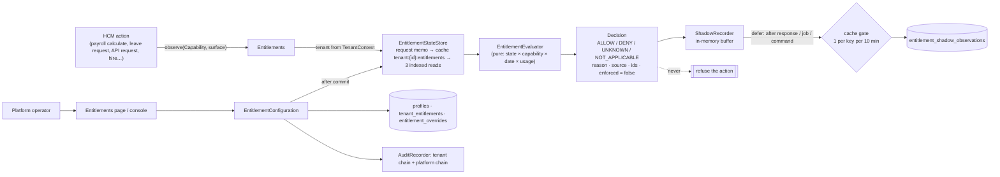

# SaaS.3 — Entitlement Architecture & Shadow Enforcement Report

**Date:** 6 October 2026 · **Branch:** `feature/oct_1_phase_1` · **Starting commit:** `71c5f7f` (SaaS.2) · **Scope:** the entitlement engine, in shadow mode only.
- No billing, plan, subscription, price, payment, invoice, checkout, signup or metering billing was built.
- No commercial restriction is enforced anywhere.

Status words:
- **IMPLEMENTED**: built and tested in this phase;
- **DEFERRED**: known, later phase;
- **UNRESOLVED**: needs a decision that is not an engineering choice;
- **NOT IN SCOPE**: excluded by the brief.

Supporting documents:

| Document | Content |
|---|---|
| [SaaS-3 Baseline](SaaS-3-Baseline.md) | The state at `71c5f7f` |
| [Capability Catalogue](SaaS-3-Capability-Catalog.md) | Every capability: purpose, controls, permissions, surfaces, enforcement class |
| [Entitlement Model](SaaS-3-Entitlement-Model.md) | Entities, keys, history rules, precedence, decision states, cache |
| [Decision register](../architecture/decision-register.md#saas3-decisions) | ADR-0027 to ADR-0030 |
| [Architecture note](../architecture/saas-3-entitlements.md) | The developer's map |

## 1. Executive Summary

PeopleOS can now answer, for any tenant, capability and business date: **"is this tenant entitled to this capability?"** The answer has an explicit state (`ALLOW`, `DENY`, `UNKNOWN`, `NOT_APPLICABLE`), a reason, the layer that produced it and the rows behind it.

**Answering versus acting:**
- The engine answers only. Thirteen business actions across payroll, attendance, leave, performance, learning, analytics, AI, the API, webhooks and the employee lifecycle record what the answer *would* have been.
- Not one of them can be refused by it. `Decision::enforced()` is always false, and there is no enforcing mode to switch on.

**Five guarantees, each proven by tests:**

| Guarantee | Evidence |
|---|---|
| **Existing tenants are untouched** | They have no commercial configuration and evaluate to `UNKNOWN`. No plan, package or default was invented |
| **Payroll is protected** | A tenant configured without payroll, and a broken entitlement engine, both still run payroll through open, calculate, approve and finalise, with payslips |
| **Failures fail open, visibly** | A failing cache falls back to the database. A failing database, a malformed row or a missing tenant gives `UNKNOWN` with a reason and a log line. The HCM action continues. Authorisation is untouched and stays fail-closed |
| **Isolation** | Configuration, decisions, cache keys, observations and queued jobs are tenant-isolated (tests). Only platform operators can configure, in the service and on the page. Every change is audited on the tenant's chain and Markedge's platform chain |
| **No measurable cost** | Query counts are identical before and after on every measured surface (in-memory cache). One business action adds about 17 µs. Shadow observations are written after the response, at most once per distinct observation per 10 minutes |

**Verdict:** §26.

## 2. Starting Baseline

Recorded in the [baseline](SaaS-3-Baseline.md):
- HEAD `71c5f7f`, clean tree, no work after SaaS.2.
- No commercial layer existed.
- Eight feature flags (five read in code).
- `tier`, `region`, `trial_ends_at` persisted but read by nothing.
- 254 permissions with 51 key prefixes; 37 API scopes.

Proposed decisions ADR-0017 to ADR-0026 were reviewed:
- None is converted to a final commercial policy.
- ADR-0017 is deliberately not adopted for entitlement configuration (§17).
- ADR-0026's "Legacy plan backfill" is **not** done (§17, §23).

## 3. Architecture Implemented



| Component | Role | Status |
|---|---|---|
| `Capability` enum | The catalogue: 31 capabilities (19 modules, 4 features, 8 limits) with type, module, enforcement class, unit, permission prefixes and API scopes | IMPLEMENTED |
| `EntitlementEvaluator` | Pure precedence and type rules | IMPLEMENTED |
| `Entitlements` | The contract HCM uses: `evaluate`, `evaluateFor` (operators), `observe`, `observeLimit`; never throws | IMPLEMENTED |
| `EntitlementStateStore` | Request memo, cache, database | IMPLEMENTED |
| `EntitlementConfiguration` | The only write path: configure, set, end, grant and revoke override | IMPLEMENTED |
| `ShadowRecorder` | Buffered, deferred, gated, aggregated observations | IMPLEMENTED |
| `EntitlementDiagnostics`, `peopleos:entitlements:explain`, `peopleos:entitlements:shadow-report`, Platform › Entitlements page | Operator diagnostics | IMPLEMENTED |
| `BillableUnits::activeEmployees()` | The single commercial count of active employees (SaaS.1 §8.1) | IMPLEMENTED |

**Authorisation is independent and untouched:**

```
User action  = AUTH → TENANT → ROLE → PERMISSION → ORGANISATION SCOPE → RELATIONSHIP SCOPE → FIELD SECURITY → RECORD   (decides, fail-closed)
Tenant right = TENANT → COMMERCIAL ENTITLEMENT → CAPABILITY                                                          (observes only, fail-open)
```

No permission, policy, gate, scope or navigation item reads an entitlement. The catalogue's permission-prefix mapping documents what a module would narrow later; it changes nothing today.

### Feature flags versus entitlements (analysed, not migrated)

| Flag | What it is | Read in code | Relation to entitlements |
|---|---|---|---|
| `ai.llm` | Operational switch: external model on or off | `AiGateway` | Stays the switch. `ai.external_model` records the commercial question beside it. Once enforced: allowed = flag ∧ entitlement |
| `ai.payroll_auditor`, `ai.workforce_intelligence` | Product rollout switches | Yes | Stay flags. They could become features of `ai` later, only if sold separately (D-1) |
| `ai.assistants` | Rollout switch | Not read (assistant availability comes from permissions) | Stays; candidate for clean-up |
| `configuration.approval` | Governance choice of the tenant | Yes | **Never** an entitlement: governance is not sold |
| `audit.sensitive_access` | Security control | Yes | **Never** an entitlement (security is never an upsell). SaaS.1 recommended making it a security setting; not done here |
| `organisation.designer`, `security.mfa` | Never read | No | Dead flags (SaaS.1 W13); not migrated |

**Rule:**
- A flag is the tenant's or the product's operational choice.
- An entitlement is what the tenant bought.
- When enforcement comes, a capability is available only if both say yes. A flag never grants what the tenant has not bought.

### Tenant tier, region and trial fields

| Field | Current meaning | In SaaS.3 |
|---|---|---|
| `tier` | Infrastructure tier (`shared` / `dedicated`), tenant metadata | Not read by the engine. Not a pricing tier |
| `region` | Data residency label | Not read |
| `trial_ends_at` | Trial end, metadata (SaaS.2) | Not read. Trials, and their expiry, are subscription state (SaaS.1), NOT IN SCOPE. The field will be superseded by the subscription model, and deprecated without silent repurposing (SaaS.1 §20) |

## 4. Capability Catalogue

Full table: [Capability Catalogue](SaaS-3-Capability-Catalog.md).

| Type | Capabilities |
|---|---|
| Not commercial | `core` (people, organisation, documents, workflows, users, roles, audit, security…) |
| Modules | onboarding, attendance, leave, payroll, compensation, performance, learning, talent, workforce, assets, service_desk, engagement, exit, analytics, ai, integrations, enterprise_identity, warehouse |
| Features | `ai.external_model`, `analytics.scheduled_reports`, `integrations.api`, `integrations.webhooks` |
| Limits | `active_employees.max`, `users.max`, `admin_users.max`, `legal_entities.max`, `locations.max`, `storage_bytes.max`, `api_requests_monthly.max`, `ai_requests_monthly.max` |
| Protected (statutory or lifecycle-critical) | payroll, onboarding, exit, `active_employees.max` |

**Derived from the code, not from a template:**
- every permission-key prefix and API scope belongs to exactly one capability (tested);
- no UI button is a capability;
- only actions the code can observe are capabilities.

## 5. Entitlement Model

Detail: [Entitlement Model](SaaS-3-Entitlement-Model.md).

| Table | Purpose |
|---|---|
| `tenant_entitlement_profiles` | Commercial state, configured-from date, version; the lock row |
| `tenant_entitlements` | The configuration, effective-dated |
| `entitlement_overrides` | Exceptions, effective-dated, revocable |
| `entitlement_shadow_observations` | Aggregated shadow decisions |

No definition table: the catalogue is code. No per-check decision table. No plan or subscription table.

## 6. Precedence Rules

**Order:** catalogue → override → configuration → unconfigured. Then a feature's module gate, and a limit's comparison with usage ([Model §4](SaaS-3-Entitlement-Model.md#4-precedence-deterministic)).

The precedence is deterministic:
- the evaluator is a pure function of the loaded state;
- the configuration service keeps one active row (and one active override) per capability per day;
- a generated-column unique index backs that up in the database;
- every decision names its source and the row ids, so "why ALLOW?" always has one answer.

## 7. Effective Dating

| Rule | Value |
|---|---|
| Dates | Business dates, inclusive at both ends, evaluated against the UTC date (the existing `HasEffectiveDates` convention) |
| Earliest change | Today. No back-dating, so history is stable |

Tested edges:
- begins today; begins later;
- ends today (still effective) and ended;
- adjacent rows;
- a bounded change over an open-ended value (it resumes afterwards);
- duplicates (idempotent);
- overrides over the base;
- the midnight boundary (23:59:59 vs 00:00:00 UTC);
- historical evaluation (payroll granted 1 January, removed 1 April, still `ALLOW` on 15 February).

Tenant-local dates are UNRESOLVED (§23).

## 8. Override Model

| Property | How |
|---|---|
| Explicit | A separate table and source `override`; the reason is required, the ticket or contract reference is optional |
| Auditable | Granted and revoked on the tenant chain and the platform chain |
| Effective-dated | From today or later, optional last day |
| Tenant-scoped | `BelongsToTenant`; written in the tenant's own context |
| Precedence | Above the configuration. It also applies to an unconfigured tenant (an explicit decision) |
| Revocable | From today: a started override ends yesterday (history kept), a future one is cancelled |
| Deterministic | No overlapping overrides per capability (refused: "revoke it first"); unique index backstop |
| Limits | `set` semantics: the override's value replaces the configured limit for its period (e.g. 500 → 750 this quarter). Incremental ("add 250") overrides are DEFERRED |
| Who | Platform operators only, refused in the service for anyone else (§13) |

## 9. Shadow Mode

**What a call does:**
- `observe()` evaluates for the bound tenant, records the decision against the business surface, and returns the decision.
- The calling code ignores the decision; there is no code path that reads it to refuse.

**Modes:**

| Mode | Behaviour |
|---|---|
| `shadow` (default) | Evaluate and record |
| `off` | Record nothing |
| Anything else (e.g. `enforce`) | Treated as `shadow` (tested) |

| State | Shadow behaviour |
|---|---|
| ALLOW | Recorded; action runs |
| DENY (would have been denied) | Recorded, logged once per window; **action runs** |
| UNKNOWN | Recorded; **action runs** |
| NOT_APPLICABLE | Not recorded; action runs |

**Storage strategy (high volume handled safely):**
- **Buffer.** Each request or job counts its decisions in memory: one entry per tenant, day, capability, outcome, reason and surface.
- **Deferred flush.** The buffer is flushed by Laravel `defer` after the HTTP response, at the end of a queued job or at the end of a command.
- **Gate.** A cache gate lets at most one database write per entry per 10-minute window across all processes. The write is an upsert that adds this request's count, so the database sees roughly one write per distinct observation per 10 minutes, whatever the traffic.
- **Exact rates.** `occurrences` is a lower bound. Exact rates belong to a metrics backend, which PeopleOS does not have yet (SaaS.1 G-OBS-1).

**What is recorded:**
- **Kept:** what would have been denied, for which tenant and capability, when (first and last seen), why (reason), from which layer (source and the last configuration or override id) and at which business action (surface).
- **Never kept:** users, employees, values, salaries, tokens or secrets.

## 10. Failure Behaviour

| Failure | Behaviour | Observable as |
|---|---|---|
| Cache unavailable (read) | Falls back to the database | `entitlements.cache_unavailable` warning |
| Cache unavailable (gate) | The observation is written (no sampling) | — |
| Database unavailable / store cannot be built | `UNKNOWN`, `EVALUATION_FAILED`; the action continues | `entitlements.evaluation_failed` warning; observation reason |
| Malformed configuration (e.g. an unknown capability key in a row) | The whole state fails to load: `UNKNOWN`, `EVALUATION_FAILED` for that tenant; the action continues | Same |
| Configuration missing | `UNKNOWN`, `TENANT_UNCONFIGURED` / `BEFORE_CONFIGURATION` / `LIMIT_NOT_CONFIGURED` | Observation |
| Stale cache | At most until the next change's after-commit invalidation (cross-process, tested on MySQL) or the 10-minute TTL | — |
| Observation write fails | Logged and dropped | `entitlements.shadow_write_failed` |
| Usage count fails (limits) | Decision stays `UNKNOWN`, `USAGE_UNAVAILABLE` | `entitlements.usage_failed` |
| Tenant context missing | `UNKNOWN`, `NO_TENANT_CONTEXT` | `entitlements.shadow.no_tenant` warning |
| Malformed date argument | `UNKNOWN`, `EVALUATION_FAILED` | — |

**Commercial vs security failure (mandatory distinction):**
- **Authorisation failure** denies access: unchanged, fail-closed. Tenant scope, permissions, policies, MFA and suspension are never relaxed by an entitlement.
- **Commercial entitlement failure in shadow mode** is observed and logged, and the HCM operation continues: fail-open, commercial only.

## 11. Cache Architecture

| Property | How |
|---|---|
| Tenant-aware | Key `tenant:{id}:entitlements`; memo keyed by tenant id; the HCM contract reads only the bound tenant |
| Capability-aware | The whole tenant state is cached once and any capability is evaluated in memory |
| Effective-date-aware | The state holds date ranges; any date is evaluated without another read |
| Deterministic | Pure evaluator; the state survives the cache round trip unchanged (tested) |
| Invalidatable | Forgotten after commit by every configuration change (profile, configuration, override); TTL 10 minutes |
| Safe against leakage | Separate keys per tenant; no global key; a forget for tenant A never touches B (tested) |

**Separate from authorisation.** The entitlement cache is separate from every authorisation cache: permission keys stay cached per user instance, untouched.

**Request memo:**
- The store is request-scoped, with no static or global state.
- It is forgotten at the end of each handled request and per queued job (Laravel resets scoped instances per job).
- Callers resolve it at call time, so long-running workers cannot carry one job's state into the next (tested: three consecutive jobs for B, A, B).

## 12. Observability

| Need | Where |
|---|---|
| What would have been denied? | Platform › Entitlements (shadow table, all tenants or one); `peopleos:entitlements:shadow-report --by-surface` |
| Why did tenant X get Y? | `peopleos:entitlements:explain {tenant} {capability} --at=YYYY-MM-DD`; the page's decision table (source and row id per capability) |
| Rates (`entitlement.allow` / `deny` / `unknown`) | `entitlement_shadow_observations` summed by outcome (lower bounds) |
| Failures | Structured warnings (`entitlements.*`) |

**Recommended metric dimensions** (when a metrics backend is chosen):
- **Use** outcome, reason, capability (31 values), surface (about 15 values) and source: low cardinality.
- **Keep tenant out of metric labels.** It lives in the observation rows, not in a time-series label: thousands of tenants × capabilities × reasons would damage the backend.

## 13. Security

| Requirement | How | Tested |
|---|---|---|
| A tenant administrator cannot grant themselves, configure, or touch another tenant | `EntitlementConfiguration` refuses any non-operator actor, whatever their roles (`*`); no tenant-facing page, API or permission exists for entitlements | Yes |
| Platform definitions cannot be modified by tenants | Definitions are code (the enum) | By construction |
| Platform commercial operators are explicitly authorised | Today a platform operator (the `is_platform_admin` identity with operator MFA required since SaaS.2) is the authorisation: the page's `canAccess` and the service guard both require it, and every change needs a reason and is audited on both chains. Granular platform roles (e.g. "commercial operator" distinct from "support") are DEFERRED to the platform permission catalogue (SaaS.1 G-PLAT-1) | Yes |
| Shadow logs cannot be manipulated by tenants | Written only by `ShadowRecorder`; no tenant-facing read or write; tenant-scoped rows | Yes |
| Audit records protected | `AuditEvent` is append-only (`ImmutableAuditRecordException`) | Yes |
| No sensitive data in decisions, logs or observations | `Decision::toArray()` carries keys, ids and counts only | Yes (column list) |
| Authorisation chain unchanged | No permission, policy or scope reads an entitlement | Code review + full suite |

## 14. Tenant Isolation

| Tenant A cannot… | Evidence |
|---|---|
| read Tenant B's entitlements | Tenant-scoped models (A sees 0 rows while B has configuration) |
| create Tenant B's overrides | Service refuses non-operators; operators act per tenant explicitly |
| invalidate Tenant B's cache | Per-tenant key; `forget(A)` leaves B's cached state |
| read Tenant B's shadow decisions | Tenant-scoped observations (A sees 0; B sees its own) |
| influence Tenant B's configuration | Same as above |
| use Tenant B's state in a queued job | Consecutive jobs B, A, B each see their own tenant's decision |
| manipulate configuration through API or Filament | No API exists; the page refuses tenant users (403) |

## 15. HCM Integration

**Contract:**

```php
app(Entitlements::class)->observe(Capability::Payroll, 'payroll.run.calculate');
```

One line at the start of each business action; the result is ignored.

**Instrumented (13 surfaces):**

| Area | Surfaces |
|---|---|
| Payroll | open, calculate, finalise |
| Attendance | punch, day processing |
| Leave | request |
| Performance | goal, cycle launch |
| Learning | enrolment |
| Analytics | report run, scheduled report |
| AI | ask, external model |
| Integrations | every API request (API feature plus the module of each scope), outbound webhooks |
| Employee lifecycle | the active-employee limit (`LifecycleEngine::transition`: hire, mark joined, rehire, lifecycle API) |

**Not touched:**
- no navigation, page, resource, button or permission;
- no HCM module changes behaviour.

## 16. Payroll Safety

**Tested** (`PayrollEntitlementSafetyTest`):
- **Would-deny tenant.** A tenant whose configuration says payroll is *not available* runs open → calculate → validate → approve → finalise, with payslips generated. The three observations record `DENY`.
- **Broken engine.** With the entitlement engine broken (the store cannot be built), the same run completes.

**Why it holds:**
- `observe()` cannot throw and its result is never read;
- statutory processing and payslip generation sit inside these steps and are never conditioned on an entitlement.

**For later:** payroll is in the protected class. Any future enforcement against it needs its own approved rollout, which never touches a run already started (§24).

## 17. Database/Migrations

**One migration**, `2026_10_22_100001_create_entitlement_tables` (four tables, [Model §2](SaaS-3-Entitlement-Model.md#2-entities)):
- every table has `tenant_id` with a cascade foreign key;
- indexes match the access paths;
- the generated-column unique index enforces one active row per capability and start date;
- it is additive and reversible (`down()` drops the four tables).

**Tested on MySQL:** `migrate:fresh` runs in the concurrency suite; rollback and re-migrate are covered in §18.

**No commercial table** (plans, subscriptions, invoices, payments, billing accounts, checkout) was created.

**Bootstrap of existing tenants:**
- nothing is written;
- no profile means unconfigured, so `UNKNOWN`;
- no Legacy plan or fake paid plan is assigned (ADR-0026's backfill stays proposed).

## 18. Test Results

Final runs on the finished code:

| Run | Result |
|---|---|
| Full suite (SQLite in-memory, `--parallel --processes=2`) | **1,221 tests: 1,150 passed, 71 skipped by design, 0 failed; 14,341 assertions** |
| Skipped by design | 60 Playwright browser and visual tests; 11 MySQL-only race tests (they run in the MySQL suite) |
| MySQL concurrency suite (disposable `hcm_saas3_concurrency`, dropped afterwards) | **71 / 71 passed** (65 earlier races plus 6 new) |
| Migration on MySQL | `migrate:fresh` in the suite; rollback removes the four tables and their unique indexes; re-migrate restores them |
| Pint | PASS |
| PHP syntax | PASS (every new and changed file) |
| Static analysis | Not configured in this project |

**New tests (39 Feature + 6 MySQL):**

| Area | Tests |
|---|---|
| Entitlement | `EntitlementEngineTest` (12): allow, deny, unknown, not applicable; history (granted 1 January, removed 1 April, still allowed in February); effective-date edges incl. midnight; bounded changes resuming; override precedence and revocation history; refusals (overlap, back-dating, wrong value type, core, inverted dates); idempotency (one row, one audit); features need their module; limits (within, exceeded, unlimited, unmeasured, not agreed, override uplift); determinism without a database; no cross-tenant evaluation through the HCM contract |
| Catalogue | `CapabilityCatalogTest` (4): every permission prefix and API scope mapped exactly once; types and modules; core and security never commercial, protected set; no raw capability strings outside the domain |
| Shadow | `ShadowModeTest` (8): a would-be denial does not block; unknown does not block; engine failure does not block and is logged; cache failure falls back; malformed configuration fails open; no tenant / off / "enforce" treated as shadow; aggregation and the write gate; API observation without changing the response; the active-employee limit observed only with a finite limit, never refusing a hire |
| Payroll | `PayrollEntitlementSafetyTest` (2): payroll runs to finalisation with payslips when entitlement would deny, and when the engine is broken |
| Security and tenancy | `EntitlementSecurityTest` (4): tenant admins refused in the service and on the page; operator changes through the page audited on both chains, audit append-only; isolation of configuration, decisions, observations and cache; queued jobs each see their own tenant |
| Performance | `EntitlementPerformanceTest` (4): 3 reads cold, 0 for the rest of the request; 0 on a warm cache; 1,000 observations with 0 queries and 1 deferred write; 1 read for an unconfigured tenant |
| Operations | `EntitlementOperationsTest` (3): console explain and shadow report; page for operators only; retention purge |
| Architecture | Existing suites extended: allow-lists for the four models (explicit audit) and the diagnostics service (cross-tenant counts) |

## 19. Concurrency Results

`tests/MySql/EntitlementConcurrencyTest.php`, real forked processes on MySQL, with the database cache store so cache invalidation and the shadow gate are shared between processes:

| Race | Result |
|---|---|
| Two operators set one capability for the same day at once | Both succeed in turn. Exactly one active row (the other cancelled); version +2; no overlap |
| The same change submitted twice at once | One row, one audit (idempotent under the lock) |
| Two overlapping overrides granted at once | One granted, the other refused ("Revoke it first") |
| Two first-time writers configure a new tenant | One profile, version 1, one audit, no deadlock (profile created outside the transaction) |
| Two processes change configuration while a third has the old state cached | The parent's next request sees both changes: after-commit invalidation of the shared cache |
| Two processes flush the same observation at once | One row; one writer passes the gate per window (`occurrences` is one writer's count) |

Audit chains (tenant and platform) verify after every race.

**Lock-removal proof.** With the profile and row locks removed, the "same day" race fails (two writers both commit), and the overlapping-override race is stopped only by the generated-column unique index (duplicate-key error). With the locks, both pass cleanly. Code restored afterwards.

## 20. Performance Results

**Method.** The same data measured at the baseline (`71c5f7f`, separate worktree with its own vendor copy) and at the finished code, interleaved, 3 rounds. Each figure is the median of 7 operations after a warm-up.

| Operation | Queries, in-memory cache (base → now) | Queries, database cache (base → now) | Median time, final rounds (base → now) |
|---|---|---|---|
| Payroll calculation (15 employees; instrumented) | 790 → 790 | 790 → 790 | 310.6 → 342.8 ms in-memory; 447.7 → 313.7 ms database. Within spread (baseline alone ranged 303–499 ms) |
| Leave request (instrumented) | 55 → 55 | 55 → 55 | 23.0 → 22.9 ms; 29.2 → 21.8 ms |
| API employees, HTTP (instrumented: API plus scope module) | 9 → 9 | 9 → **11** | 12.8 → 13.9 ms; 16.0 → 12.7 ms |
| Home, HTTP (not instrumented; control) | 51 → 51 | 62 → 62 | 176.5 → 171.3 ms; 186.2 → 171.1 ms |

**Reading the numbers:**
- **The two extra API queries** with a database-backed cache are the shadow write gate (`Cache::add`), run after the response by `defer`. With an in-memory or Redis cache there are none.
- **The state itself** costs 3 queries once per cache lifetime per tenant; with a database cache store it is one cache read per request.
- **Direct measurement:** `observe()` costs about 17 µs per call and `evaluate()` about 9 µs on a warm memo.
- **No regression:** all page and action timings are within this workstation's run-to-run spread.

The UX.18 query-count guards and the MySQL scale test pass unchanged.

## 21. Browser/UX Validation

**What changed in the UI:** one platform-only page (Platform › Entitlements), built with existing Filament components and the PeopleOS theme. Tenant users never see it, and no tenant navigation changed.

**How it was validated:** by HTTP and Livewire tests (render as operator, 403 for tenant users, actions through the page).

**Not run:**
- **The Playwright browser and visual suites.** The UI change is a platform-only internal page; the brief makes browser tests optional unless the UI changed materially.
- **The 8090 showcase.** It still serves an unmigrated database (SaaS.2 §21). No local migration process has been approved for it, so it was not migrated.

**Effect on 8090.** Its HCM screens keep working: shadow observation on a database without the new tables is exactly the "entitlement engine fails" case, which fails open and logs. The Platform › Entitlements page fails there until the database is migrated.

## 22. Remaining Risks

| Risk | Status | Next step |
|---|---|---|
| A malformed configuration row makes every capability of that tenant `UNKNOWN` (whole state fails to load) | Accepted for shadow (observable, fail-open) | Row-level validation before enforcement |
| `occurrences` is a lower bound; no metrics backend | DEFERRED (SaaS.1 G-OBS-1) | Choose the metrics stack |
| Platform operators are all-powerful (no separate commercial-operator role, no dual control for large overrides) | DEFERRED (G-PLAT-1) | Platform permission catalogue |
| Business dates follow UTC, not the tenant's time zone | UNRESOLVED (§23) | Decide before enforcement |
| Only `active_employees.max` has a measured usage | DEFERRED (metering, SaaS.1 §8) | Usage events and samples |
| Incremental ("add") overrides and dual control above thresholds | DEFERRED | With plans and enforcement |
| A same-day change alters today's answer for the rest of the day | Accepted (documented) | — |

## 23. Decisions Still Required

| # | Decision | Why it matters |
|---|---|---|
| D-1 / D-13 / D-14 / D-16 (SaaS.1) | Packaging, billable unit, seats, limit modes | The catalogue is ready, but which capabilities form which plan, and every limit value, are undecided. SaaS.3 configures nothing by default |
| D-4 (SaaS.1) | Trials | Trial expiry is subscription state, not an entitlement; not built |
| New: tenant-local business dates | Should "1 April" mean 1 April in the tenant's time zone? | Today UTC, consistent with every effective-dated record in PeopleOS |
| New: operator roles for commercial configuration | Who at Markedge may grant overrides, and above what threshold a second approver is needed | Today any platform operator, reasoned and audited |
| New: what an unconfigured tenant becomes at enforcement time | Proposed ADR-0026 suggests a "Legacy" plan equal to today's behaviour | Not decided here; tenants stay UNKNOWN |
| ADR-0017 | Platform-owned commercial records | Kept open for billing; not used for entitlements (ADR-0027) |

## 24. Future Enforcement Plan

```
SHADOW (SaaS.3) → OBSERVE → VALIDATE → CLEAN UP CONFIGURATION → APPROVE COMMERCIAL DEFAULTS
  → ENFORCE LOW-RISK CAPABILITIES → ENFORCE HIGH-RISK CAPABILITIES (separately approved) → FULL COMMERCIAL ENFORCEMENT
```

| Stage | Exit criterion |
|---|---|
| **Observe** | Shadow running on every instrumented surface for at least one full payroll cycle and one month of normal use |
| **Validate** | The shadow report shows, per capability, which tenants would be denied, and each one is explained (a configuration gap, not a code bug) |
| **Clean up configuration** | Every tenant is configured (no `TENANT_UNCONFIGURED` left). Migrations of existing tenants follow an approved default, for example the proposed Legacy plan |
| **Approve commercial defaults** | Packaging and limits decided (D-1, D-13, D-14, D-16); plans and subscriptions compile into the configuration layer (SaaS.4+) |
| **Enforce low-risk capabilities** | Per-capability switch (not global), `eligible` class only, starting with features such as `analytics.scheduled_reports` and `ai.external_model`, never core. Enforcement must be added at the permission layer (module licensing, SaaS.1 §6.1), the API layer and the action, with a clear message. A refusal always says why, and a platform override can lift it immediately |
| **Enforce high-risk capabilities** | `protected` class (payroll, onboarding, exit, active-employee limit) only with a separately approved rollout. Work in progress always completes: a calculated run may be finalised, a started statutory return completed, an exit already open finished, and a hire already approved joins (SaaS.1 D-7). Statutory deadlines are never blocked |
| **Full commercial enforcement** | All eligible capabilities enforced with zero unexplained would-denials for a full cycle |

**Rollout switch.** Enforcement will need a per-capability switch, decided and built in that phase. SaaS.3 deliberately contains none, so it cannot be turned on by configuration.

**Never enforced:**
- the core and security;
- payroll, statutory compliance, employee lifecycle and critical documents, without that later approved strategy.

## 25. SaaS Readiness Impact

SaaS.1 scored entitlements 1 / 5 (flags only).

| Now available | Still missing |
|---|---|
| A tested entitlement contract | Plans, subscriptions |
| A catalogue mapped to every permission and scope | Metering beyond one count |
| Effective-dated configuration and overrides | Enforcement |
| Shadow observability | Billing |
| Operator tooling | — |

Entitlements: **2 / 5** (architecture and shadow done; nothing enforced, nothing configured by default). Every other SaaS.1 score is unchanged. Production readiness is unchanged: **not achieved**.

## 26. Final Verdict

**Stop condition (brief §47):**

| Criterion | Result |
|---|---|
| Entitlement architecture exists | Yes (§3) |
| Capability catalogue documented | Yes (§4, Capability Catalogue) |
| Tenant entitlement resolution exists | Yes (`EntitlementStateStore` + `EntitlementEvaluator`) |
| Effective dating exists | Yes (§7) |
| Overrides exist | Yes (§8) |
| Deterministic precedence | Yes (§6) |
| Shadow mode exists | Yes (§9) |
| Shadow mode never blocks HCM operations | Yes (shadow and payroll tests) |
| Entitlement failures do not block HCM operations | Yes (engine, cache and malformed-configuration tests) |
| Authorisation remains independent | Yes (§3, §13; no authorisation code reads entitlements) |
| Tenant isolation proven | Yes (§14) |
| Queue isolation proven | Yes (§11, §14) |
| Cache isolation proven | Yes (§11, §14) |
| Audit exists for configuration changes | Yes (both chains) |
| High-volume decision logging handled safely | Yes (§9: buffered, deferred, gated, aggregated; §20) |
| Payroll explicitly protected | Yes (§16) |
| Performance impact measured | Yes (§20) |
| Automated tests pass | Yes (§18, §19) |
| Documentation complete | Yes (this report, Catalogue, Model, Baseline, ADR-0027 to ADR-0030, architecture note, invariants 39–41) |
| Future enforcement strategy documented | Yes (§24) |
| No billing, no payment gateway, no subscription billing, no customer signup, no commercial enforcement | Confirmed: none was built or enabled |

**SaaS.3 — COMPLETE**

| Statement | Status |
|---|---|
| UX.1–UX.19 | Complete |
| SaaS.1 | Complete (architecture and gap analysis) |
| SaaS.2 | Complete (foundation hardening) |
| SaaS.3 | **Complete** (entitlement architecture and shadow mode) |
| Commercial enforcement | **Not enabled** |
| Billing | **Not started** |
| Production readiness | **Not achieved** |
